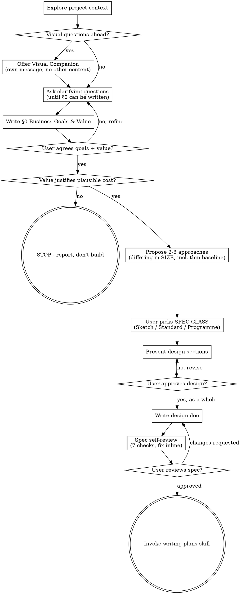

# Brainstorming Ideas Into Designs

Help turn ideas into fully formed designs and specs through natural collaborative dialogue.

Start by understanding the current project context, then ask questions one at a time — **first to nail the objective, only then to shape a solution.** The business goals and the business value they deliver are the first thing established and agreed. Everything after that is detail, and every detail is judged by whether it helps achieve them.

<HARD-GATE>
Do NOT propose approaches, sketch a design, or explore solutions until **§0 Business Goals & Value** is written and the user has explicitly agreed it. The objective is the first thing nailed, never the first thing assumed. A design discussed against an unstated goal produces a §0 that is reverse-engineered to fit the design — which is how a spec ends up correct in every respect and aimed at the wrong thing.
</HARD-GATE>

<HARD-GATE>
Do NOT invoke any implementation skill, write any code, scaffold any project, or take any implementation action until you have presented a design and the user has approved it. This applies to EVERY project regardless of perceived simplicity.
</HARD-GATE>

## Anti-Pattern: "This Is Too Simple To Need A Design"

Every project goes through this process. A todo list, a single-function utility, a config change — all of them. "Simple" projects are where unexamined assumptions cause the most wasted work. The design can be short (a few sentences for truly simple projects), but you MUST present it and get approval.

## Checklist

You MUST create a task for each of these items and complete them in order:

1. **Explore project context** — check files, docs, recent commits, AND read project memory (`MEMORY.md` and any handover/pickup-card files it links) for known landmines in the area the spec will touch. Project memory captures lessons learned from past PRs (e.g., "TYPE_CHECKING string forward-refs don't survive LangGraph's `get_type_hints`", "agent_description is rendered verbatim into the planner LLM prompt"). These landmines MUST be reflected in the spec — either by avoiding the pattern entirely, or by flagging the workaround in §7 Risks with `Mitigation: avoid pattern X (see MEMORY.md entry Y)`.
2. **Offer visual companion** (if topic will involve visual questions) — this is its own message, not combined with a clarifying question. See the Visual Companion section below.
3. **Ask clarifying questions until you can write §0** — one at a time. You are not exploring the solution yet. You are nailing the objective: who benefits, what they cannot do today, what the change is worth to them, and what is explicitly out of scope. Stay here until you could write §0 without guessing a single field.
4. 🔴 **GOAL GATE — write §0 Business Goals & Value and get explicit approval.** Present §0 on its own, in its own message, and ask the user to confirm the goals, the value and the non-goals. **Nothing downstream may be discussed until this is agreed** — see the Goals hard-gate above and the §0 definition below. If the value does not justify a plausible cost, say so here and offer to stop: this process is allowed to conclude "not worth building."
5. **Propose 2-3 approaches that differ in SIZE, not only in mechanism, and agree the SPEC CLASS** — one approach MUST be the thinnest thing that satisfies §0: reuse what already exists, serve one case rather than all, generalise nothing. State it with an honest estimate even when you believe it inadequate. Lead with your recommendation and say **why the thin one loses**; that reason is recorded in §0.1 Decision Record, and self-review check 6 plus the user gate are what test it. In the same message, name the **spec class** your recommendation implies — Sketch / Standard / Programme — and let the user confirm it. **The user picks the class; you recommend it.** An agent left to self-assign will assign downward, and the class decides how much document and how much review this work owes (see Spec Classes below).
6. **Present design** — in sections scaled to their complexity, get approval after each section, **then ask for approval of the whole before writing it up**. Section-by-section approval sums to a design nobody ever approved as a whole.

   🔴 **If any part of this design is a user-visible surface, the mock comes FIRST and the mock IS the design for that surface.** Invoke `creating-screen-mocks` and get the mock approved before writing §1 for it. Do not describe a screen in prose here — §1's `ux` field expects a **mock path, route and states**, which presupposes one exists. A spec that describes a screen in words next to a mock that shows it has specified it twice, and the two will disagree; a spec that describes one where no mock exists has handed an implementer a screen to invent.
7. **Write design doc** — save to `docs/superpowers/specs/YYYY-MM-DD-<topic>-design.md` and commit. §0 goes in **as agreed at step 4** — if writing the design changed your understanding of the goal, that is a change to take back to the user, not a silent edit.
8. **Spec self-review — seven checks, run by the author.** See "Spec Self-Review" below. **No agent is dispatched.**
9. **User reviews the written spec — this is the ONLY review gate.** Ask them to read it before anything else happens. They were in the room when §0 was agreed, so they are the only reviewer who can actually answer *"is this aimed at the right thing?"*.
10. **Transition to implementation** — invoke writing-plans skill to create implementation plan

### Why there is no agent review gate

**Removed 2026-08-13, by Heiko's ruling.** This skill used to mandate three gates dispatched to
reviewing subagents — right thing / thing right / still the right thing — plus a disposition-and-verify
loop. They are gone. Do not reintroduce them, and do not dispatch a reviewing subagent as an
"informal" substitute; that is the same cost under a different name.

**What came out, honestly:** the gates did catch real defects, and the strongest of them was Gate 2's
**reuse check** — hunting for things the spec declares `ADDED` that already exist in the tree. That is
the most expensive spec failure there is, and an independent reader is genuinely better at it than the
author, who has just spent an hour convincing themselves the thing is new.

**What replaces it:** checks 6 and 7 of the self-review below. They are the same two questions, asked
by the author, with the tools named so the check is mechanical rather than a matter of attention.
**This is a real reduction in assurance and it is recorded as one.** The author checking their own
reuse claim is weaker than a second reader doing it. It is faster, it needs no agent, and the user
gate at step 9 is where a wrong aim actually gets caught.

**If a spec later turns out to have specced something that already existed, that is this trade
biting** — not a mystery. Note it and strengthen check 6 rather than re-adding the gates.

## Process Flow



**There are two terminal states: invoking writing-plans, or stopping at the goal gate** because the value does not justify a plausible cost. The second is a legitimate outcome, not a failure — a process that can only ever end in "build it" cannot help you decide whether to. Beyond those two, do NOT invoke frontend-design, mcp-builder, or any other implementation skill. The ONLY skill you invoke after brainstorming is writing-plans.

## The Process

**Understanding the idea:**

- Check out the current project state first (files, docs, recent commits)
- Before asking detailed questions, assess scope: if the request describes multiple independent subsystems (e.g., "build a platform with chat, file storage, billing, and analytics"), flag this immediately. Don't spend questions refining details of a project that needs to be decomposed first.
- If the project is too large for a single spec, help the user decompose into sub-projects: what are the independent pieces, how do they relate, what order should they be built? Then brainstorm the first sub-project through the normal design flow. Each sub-project gets its own spec → plan → implementation cycle.
- For appropriately-scoped projects, ask questions one at a time to refine the idea
- Prefer multiple choice questions when possible, but open-ended is fine too
- Only one question per message - if a topic needs more exploration, break it into multiple questions
- Focus on understanding: purpose, constraints, success criteria

**Exploring approaches:** (only after §0 is agreed)

- Propose 2-3 different approaches that **differ in SIZE, not only in mechanism**. Three approaches at the same scale is not a scope choice — and the one moment the thin option can actually be chosen is while the user is in the room.
- **One of them MUST be the thin baseline:** the smallest thing that satisfies §0 — reuse what exists, serve one case rather than all, generalise nothing, build no seam you don't need today. State it with an honest estimate **even when you believe it inadequate**. Believing it inadequate is exactly why it has to be written down and argued against.
- Present options conversationally with your recommendation and reasoning
- Lead with your recommended option and explain why — and say plainly **why the thin one loses**. That reason goes into §0.1 Decision Record, where the user can challenge it — as they should, because a rejection reason that was never tested is just an assertion.

**Presenting the design:**

- Once you believe you understand what you're building, present the design
- Scale each section to its complexity: a few sentences if straightforward, up to 200-300 words if nuanced
- Ask after each section whether it looks right so far
- Cover: architecture, components, data flow, error handling, testing
- Be ready to go back and clarify if something doesn't make sense

**Codebase grounding — every claim must be verifiable (applies to ALL spec content below):**

The spec is the source of truth that implementers read to learn WHAT to build and which existing pieces to consume. Every identifier the spec mentions — import paths, class names, method signatures, base-class contracts, env var names, ruff rule IDs, file paths — must be EITHER:

- **Verified against the actual codebase**, with a `path/to/file.py:LINE` reference inline (use your code-navigation tools before naming any pre-existing symbol — in prism-indexed repos that means `prism search`/`def`/`deps` rather than Grep/Read, which are blocked there; otherwise Grep / Read — never name from memory or expectation), OR
- **Explicitly marked as new** (introduced by this spec), in which case §1 carries it as an `ADDED` change — with the reuse check that justifies `ADDED` rather than `MODIFIED` — and, if it becomes a sole owner, its read / write contract is declared in §9 Ownership Boundaries.

Why this rule exists: the most common cause of spec→plan→implementation drift is the spec author writing pseudocode that uses imagined APIs. When the plan duplicates the pseudocode (writing-plans does this by default), the drift propagates to implementers who burn time discovering and correcting it. Grounding every claim at SPEC time means later artifacts (plan, implementer prompts, fix-loops) all read from a single trustworthy source.

**Concrete examples of grounding statements you MUST verify, not assume:**

- "`MobilityAgentV2.execute()` returns a `DomainAgentResult`" → verify the actual signature (prism-indexed repos: `prism def "MobilityAgentV2.execute"` / `prism body`; else `grep "def execute" path/to/v2/agent.py`) and quote it
- "Use `DataObjectTypeRegistry.resolve(blob)` for round-trip" → verify the symbol exists; if it doesn't, use the actual API (`deserialize_data_object()`) or escalate as a missing primitive
- "Place the new field below `USE_MOBILITY_V2` in Settings" → verify USE_MOBILITY_V2 is actually a Settings field; it may be an `os.getenv` read elsewhere
- "Inherit from `DomainAgentInterface`" → look up the class definition (prism-indexed repos: `prism def`/`prism search`; else grep); confirm whether it's an ABC and list its abstract members

If you can't verify a claim from the codebase, that's a signal: either escalate the gap (the codebase lacks something the spec assumes) or mark the claim as introducing new infrastructure. Never paper over the gap by writing aspirational code.

## Spec Classes — the document's weight follows the risk

**Every project gets a recorded design decision. Not every project gets the same document.**

The class is recommended by you and **confirmed by the user at checklist step 5**, in the same message as the approach recommendation. It is one sentence: *"That makes this a Standard spec — §0, the Decision Record, an artifact list and ACs."*

| Class | When | Owes |
|---|---|---|
| **Sketch** | one seam, one existing owner, no new contract, no new sole-owner entity | §0, §0.1, §0.2, §1 only. Half a page — **§1 is three lines, not a table.** |
| **Standard** | multiple files, one PR to a few, no new sole-owner entity | the above, plus §2 The Logic and §6 ACs; §3-§5 by trigger |
| **Programme** | a new subsystem, a new sole owner, a cross-component contract, or >3 PRs | all of the above, plus §7 Risks/Spikes and §9 Ownership Boundaries |

⚠ **This exists because the template was co-responsible for the failure the skill cites against itself.** Six mandatory heavyweight sections — Contracts, Ownership Boundaries with a five-option enforcement taxonomy, a BLOCKS/BLOCKED_BY graph — cannot produce a short document for a one-hour change, whatever §0 says. A one-route change was owing all six.

**Required content sections:**

§0, §0.1, §0.2 and §1 are **unconditional at every class**. Sections 2-9 each carry a **trigger**: if the trigger doesn't fire, write the single N/A line instead. State the reason, so a reviewer can check the trigger rather than demand the section.

**Every section is labelled `[handoff]` or `[review-only]`**, because an implementer and a reviewer need different halves of the same document. `[review-only]` — §0's Who/Today/Value/cost, §0.1, §7, §8 — is **excluded from an implementer's payload by construction, never by judgement**: one reading rejected alternatives will build one, and one reading risks will hedge. §0's **goal lines and their `UBER-AC` proofs are `[handoff]`**, along with §0.2, because an agent cannot serve a goal it cannot see. A section with no label is `[review-only]`; defaulting the other way leaks silently.

| Section | Trigger | If absent, write |
|---|---|---|
| 1 · Solution Design | **none — always owed.** For one seam it is three lines | — |
| 2 · The Logic | conditional behaviour with more than one outcome | "No rules — plumbing: `<one line>`." |
| 3 · Contracts & Data Models | a boundary is crossed (fe↔be, plugin↔host, svc↔svc, producer↔consumer) | "No boundary crossed — internal to `<module>`." |
| 4 · Failure & Ops | the change depends on anything that can be unavailable | "No external dependency — `<X>` is in-process." |
| 5 · Delivery | the change must reach state that already exists | "Code-only; no existing state to reach." |
| 6 · Acceptance Criteria | any user-visible behaviour change | "No behaviour change — refactor of `<X>`, covered by existing tests." |
| 7 · Risks & Spikes | an unknown you would actually spend a day on | "No spike needed." |
| 8 · Amendments | accumulates during the run | — |
| 9 · Ownership Boundaries | a new sole-owner entity, or a second writer to an existing one | "No ownership change — `<X>` remains sole owner." |

An N/A line is a **claim**, and the user — or the implementer who hits it — may check it. "No boundary crossed" against a diff that adds an API route is a false claim about the design, exactly like a false claim about the codebase.

0. **Business Goals & Value.** The objective, and what achieving it is worth.

   🔴 **This is the FIRST thing nailed and the FIRST thing approved (checklist step 4) — not a section written up afterwards.** It is the yardstick every later section, artifact, task, test and review is measured against, and it is the only section a reviewer can use to answer *"is this the most effective way to get there?"*. If it is vague, every downstream judgement is vague: "does this detail help?" has no answer when the goal is "improve the experience". Write it so a stranger could use it to **reject** a proposed feature.

   **1 to 3 goals, never more.** Each carries five fields. All five are mandatory — a missing one is not a formatting lapse, it is a goal that has not been nailed.

   - **`G-n` · Goal** — the outcome in one line, in the user's own words. An OUTCOME, not a mechanism: if it names a table, route, service, class or file, it is a requirement wearing a goal's clothes.
   - **Who benefits** — the named role that ends up measurably better off. "The operator", "an RM onboarding a client", "the on-call engineer", "whoever adds the next provider". Not "the system", not "the codebase", not "us". **If no one can be named, this is not a business goal** and it does not belong in §0.
   - **Today** — the concrete current pain, with a number or a specific incident, and **how you know**: `verified_by: read | executed | pinned | none_exists`. "Slow" is not a pain. "The operator learns the plan is exhausted only when a turn fails, roughly three times a week, and misreads it as a broken credential" is. **This §0 `Today` is what the BENEFICIARY experiences; §1's per-change `today` is what the CODE does.** Different altitudes — write one in each, or you will write the same paragraph twice and they will age apart.
   - **Value** — what the beneficiary can now do, stop doing, or stop paying for, and roughly what that is worth: time, money, risk retired, or a decision they can now make. **This field is what makes "the most effective way" a judgeable question.** Effectiveness is value over cost; a spec that estimates cost in a dozen places and value in none cannot be judged, only admired.
   - **Proof — `UBER-AC-n`** — one yes/no test anyone can run after it ships, without insider knowledge: a grep, a metric, a file check, a user test. The goal is what you want; the proof is how you check you got it. **Keep them as two lines** — collapsing them writes the goal in test-shape, which drags it toward mechanism.

   Then, once for the spec as a whole:

   - **Non-goals** — what this explicitly does NOT do, especially the adjacent things a reader would reasonably expect it to. **The cheapest scope control that exists:** a named non-goal kills a "shouldn't we also…" in one line — in review, and in every later conversation. Anything you discover while writing the spec that deserves building goes here, with a note that it needs its own spec.
   - **Rough cost** — an honest size estimate for the chosen approach, and for the thin baseline it beat (see the Decision Record). Two numbers, not precision. They exist so value and cost sit on the same page and the trade is visible rather than assumed.

   🔴 **THE GOALS IN §0 ARE THE USER'S GOALS. Nothing else may be one.**

   This is the single most load-bearing rule in the spec, because every
   later section, every artifact, every task and every review is aligned against
   these one-to-three lines. If a goal the user never asked for gets in here, the whole
   document faithfully serves it.

   Three admission tests, all of which must pass:

   - **Provenance.** Can you point at what the user said that this goal serves? If
     it came from *your* analysis rather than their ask, it is **not** a goal of
     this spec — it is a Non-goal with a note.
     A defect you discovered while writing the spec is a **finding to report**,
     and if it deserves building it deserves its **own spec** with its own
     business case — not a seat next to the user's goal, where it silently
     becomes co-equal and nobody can tell which one was asked for.
   - **It is a GOAL, not an invariant.** "The operator can see a limit before it
     bites" is a goal. "An unmeasured provider never renders as healthy" is a
     *correctness invariant* — a quality bar on how the goal is met. Invariants
     belong in Requirements as T-ACs. Putting one here dilutes the set and hides
     which lines are actually the point.
   - **It is an OUTCOME, not a mechanism.** If it names a table, a service, a
     route or a class, it is a requirement wearing a goal's clothes.

   ⚠ **Measured failure, Foundry 2026-07-29.** The user asked for a panel showing
   provider telemetry — about an hour of work, since the panel scaffold and the
   vendor's quota endpoint both already existed. Writing the spec surfaced a
   second, genuinely real defect (provider failures were mute about their cause).
   The spec judged it *"the more serious of the two"*, made it **UBER-AC-2**, and
   from that moment the document was correct in every respect and aimed at the
   wrong thing. The plan sequenced it first; the user's actual goal landed at
   **PR-7 of 10**. A day went to the goal nobody asked for. **The second defect
   should have been reported and specced separately.**

   Examples of well-formed **Proof** lines (`UBER-AC-n`) — each one is the *test*, and in a real §0 sits under a Goal, a Who, a Today and a Value:
   - "A code reader can take any provider ID seen in `provider_configs.api_schema` and find that same string used as a key in `data/llm-catalog.json` — no translation layer exists in the codebase" (tech-debt cleanup, verifiable by grep).
   - "p95 latency for `GET /api/products/:id` drops from 800ms (baseline 2026-03-01) to under 400ms" (perf, verifiable by metric).
   - "A new user can sign up, configure one provider, and dispatch a working agent in under 5 minutes without reading docs" (UX, verifiable by user test).
   - "The 8-row `PROVIDER_ID_MAP` translation function in `opencode-providerid-map.ts` is deleted; downstream code paths consume `cfg.apiSchema` directly" (cleanup, verifiable by file presence).

   **§0.1 Decision Record — the approach chosen, and what it beat.**

   Closing §0, record the approaches from checklist step 5 in three or four lines each: the chosen one, and **the thin baseline** — the smallest thing that could satisfy the goals — with its estimate and **the specific reason it loses**.

   This is not documentation for its own sake. It is what makes "the most effective way" checkable instead of re-derivable. Without it the reviewer has to invent a cheaper design blind, not knowing what was already considered or why it was rejected — redoing, with less information, work you and the author already did together. With it, the reviewer has one sharp question: **was that rejection reason true?** ("The panel scaffold doesn't exist yet" is a claim; it can be checked in thirty seconds, and when it turns out to be false the whole spec collapses back to the thin version.)

   A rejection reason must be falsifiable. "It doesn't scale", "we'll need more later" and "it's less complete" are not reasons — they are the sound of a decision that was never made.

   **Why this section is first:** every later section (the Solution Design, the Logic, the ACs) is in service of it. Alignment runs one way — changes serve goals — so if a change in §1 doesn't plausibly contribute to a goal in §0, the change is over-scope. The self-review and the user gate both use §0 as the yardstick, and a user handed a vague §0 has nothing to review against and will fall back to reviewing taste.

   **§0.2 Constraints — what ships with every task.** `[handoff]`

   The short list of things that make the feature fail if violated, written as instructions to whoever is building, and **repeated into every implementer's payload** because a constraint nobody was shown is a constraint nobody honours.

   ```
   HC-1  Do not add a synchronous call to profile-service inside the order path;
         the p95 budget is 200ms end to end.        source: NFR-07   breach: fatal
   ```

   Each one: the instruction, where it comes from, and whether breaching it is fatal or merely needs a decision. **Keep it short.** A list of twenty is a list nobody reads, and it is usually §1 wearing a constraint's clothes — a rule about *how this change works* belongs in §2, not here.

1. **Solution Design — the changes.** `[handoff]` **Unconditional at every class.** This is the section that answers *how should it work, and how does today's system become that.* A spec without it is a set of acceptance criteria, which is a description of the finish line and not a design.

   **The unit is a CHANGE IN BEHAVIOUR, not a file.** One entry per change in what the system *does*, at the size a reviewer would accept or reject on its own. Not "add a field" (too fine); not "implement suitability" (too coarse).

   ```
   C2 · MODIFIED · one line of behaviour

   today        what the code does now · anchors: path:line
                verified_by:  read | executed | pinned | none_exists
   tomorrow     the MUSTs that share this seam (1-3). Two seams ⇒ two changes.
   logic        → §2 RULE-n  +  evaluated_at · inputs bind from · recomputed · writes
   seam         path::symbol — why HERE, naming the obvious alternative it beat
   mechanism    in_place | wrap | sprout | extract_interface |
                branch_by_abstraction | strangler | delete | fill_scaffold
   call sites   every site this is reachable from — enumerated, not estimated
   pin          what must not move + which test holds it, or "none, because …"
                MANDATORY on MODIFIED and REMOVED
   ux           mock path · route · states · fixtures to replace ·
                GRAFT TARGET: the file this mock becomes, or "new: <path>"
                                                              (screens only)
   depends_on   C1 (data, not stubbable) · C3 (contract, stubbable)
   atomicity    must ship with C4 — reason
   ```

   **IDs keep the existing shape — `A1`, `C1`, `N1` — no hyphen.** `plan-check.sh` greps `\b[ACN][0-9]{1,3}\b` to match the spec's changes against the plan's tasks. A hyphenated `C-1` matches nothing, and the script then reports coverage over an empty set while printing PASS. Measured 2026-08-12, on the spec that introduced this section.

   **`kind` is `ADDED | MODIFIED | REMOVED`, and `MODIFIED` is the default suspicion.** A change that reads `ADDED` against a screen the mocks already approved has thrown the mock away.

   **Five rules that make the fields worth having:**

   - **`today` is baseline — the code is the only oracle.** A `today` that was never opened is a hypothesis wearing a fact's clothes. `verified_by: read` is allowed and *visible*, so "I read it" and "I ran it" stop being written identically. On a `MODIFIED` change against behaviour you depend on, `read` should be rare and should say why it wasn't run.
   - **A seam names why HERE, and the obvious alternative it beat.** A seam with no rejected alternative is a file path, not a decision.
   - **`mechanism` is the how-do-we-get-there.** `wrap` and `in_place` produce different diffs from the same `tomorrow`; leaving it unsaid is where the implementer improvises.
   - **Every field is read by an implementer holding only this change.** Write instructions, not commentary. Never "see C5" — that edge goes in `depends_on`, where the plan can act on it.
   - **The change points outward; nothing points back at it.** ACs name their changes, contracts name their changes, delivery items name their changes. Link once, in one direction, or two hand-maintained edges drift.

   🔴 **Ground every change against the real codebase — this is where the most expensive spec failure is caught.**

   - **Before writing an `ADDED` change, confirm it doesn't already exist.** In prism-indexed repos `prism check "<what it would do>"` (purpose-built for this) plus `prism search "<concept>"`; else grep. If an equivalent exists, the change is `MODIFIED` against it, or drops out. **An `ADDED` change with no recorded reuse check is not admissible** — name the near neighbour it beat and why reuse doesn't fit. Speccing a reimplementation of something that already lives elsewhere is one of the most common and expensive spec failures, and this is the cheapest place to catch it.
   - **`anchors` come from `prism def` / `body`, never from memory.**
   - **`call sites` come from `find-refs` on the SYMBOL and `prism deps` → `depended_on_by`** — never from a call-shaped grep. A dependency passed as a *value* rather than called is invisible to one. `depended_on_by` is the one-call, more-complete answer than running find-refs per exported symbol, and it is the blast radius of any change that moves, deletes or splits a module.
   - **Confirm the seam with `find-refs`:** if callers reach the behaviour without passing through it, it is the wrong seam. One call answers it.
   - **An empty result is evidence about the PATTERN, not about absence.** Widen before concluding. Where the repo is not indexed by prism, say so in the spec — a call-site list built by grep and one built by `find-refs` are not the same claim.

   🔴 **Alignment gate — ONE-DIRECTIONAL.** Every change must plausibly contribute to at least one goal from §0. An orphan means **the change is over-scope** — cut it, or spec it separately. It does **not** mean §0 is missing a goal: adding one to give an orphan a home is the exact escape hatch that produced the 2026-07-29 failure. If you believe an orphan is genuinely essential, that is a finding to report to the user, not a spec edit.

2. **The Logic.** `[handoff]` The rule bodies. **Trigger: any conditional behaviour with more than one outcome.** Straight-line plumbing writes `No rules — plumbing: <one line>` and moves on.

   **Prose is permitted only for an invariant**, which has one outcome by definition. Everything else takes a shape: **decision table · state machine · sequence · formula · invariant**. A rule in prose cannot be checked for a hole; a table can, and the check is mechanical.

   ```
   RULE-1 · Catalogue staleness on config entry          shape: decision table

   inputs                          (closed domains, or the table can't be checked)
     lastRefreshedAt   timestamp | null    null = no stored rows for this config
     refreshInFlight   true | false

   several rows match →  first match wins

     #   when                                then
     1   refreshInFlight = true              nothing — the batch path de-dupes
     2   lastRefreshedAt is null             refresh
     3   now − lastRefreshedAt > threshold   refresh
     4   otherwise                           do not refresh

   unknown
     null means "we have never stored rows for this config" — NOT "the copy is
     fresh". It refreshes. Reading null as fresh reproduces the staleness bug on
     every new config.

   outcome
     refresh → stored rows render immediately, updated in place       → C1, C4

   boundaries
     the threshold is ONE constant, shared with the query's staleTime.

   examples                                        → become AC cases in §6
     stored 3h ago → exactly one refresh · stored 30s ago → none
     no stored rows → refresh · refresh fails → rows still listed + marker
   ```

   **Six rules for the section:**

   - **Closed domains on every input**, or completeness is not computable.
   - **Any input that can be absent gets an `unknown` line, and it says what unknown MEANS** — not merely what to do about it. This is the single highest-value field here: it is the decision an engineer otherwise makes silently, at 2am, alone.
   - **One example per distinct outcome.** They are the AC cases; §6 lifts them rather than inventing edge cases.
   - **Classification and decision are two rules, not one.** One says *what this thing is*; another says *what that permits*. They change for different reasons and at different rates.
   - **A rule that already holds in the code is still written down** — marked as existing, and pinned rather than assumed. The invariant your design rests on is the one nobody wrote down.
   - **The change points at the rule; the rule never points back.**

   **Data fields — only those a rule reads**, four columns: `name · type · domain (closed) · what unknown means`. **Permissions — only when authz is in play**: `actor · action · condition · what a denial does`.

3. **Contracts & Data Models.** `[handoff]` Define every contract that crosses a component boundary, every data model that's persisted or shared, and every wire format used by APIs / streams / events: request/response shapes, table schemas (columns, types, constraints, indexes), event/SSE payloads, serialization rules, versioning policy. Include a small worked example for each non-trivial contract. Each entry carries `change_kind` (ADDED/MODIFIED/REMOVED), whether it is **breaking**, and the change that produces it. **Reference the machine-readable contract; do not paste it** — a pasted schema is verbose, mostly irrelevant to the design, and stale within a sprint. **Trigger: a boundary is crossed** (fe↔be, plugin↔host, svc↔svc, producer↔consumer).

4. **Failure & Ops.** `[handoff]` A fixed question set. Questions, not headings — a heading yields a paragraph, a question yields a table. **`"Not applicable, because…"` is a complete answer; silence is not.**

   | Question | |
   |---|---|
   | What happens when each dependency is unavailable or degraded? | required |
   | Which errors retry, which are poison, which page a human? | required |
   | What is the idempotency / delivery semantic on each boundary? | required |
   | What can race, and what enforces ordering? | before merge |
   | What still works when this feature is broken? | before merge |
   | How does an operator know it works, and know it is in use? | before merge |

   Every row names the changes it belongs to. **Trigger: the change depends on anything that can be unavailable.**

5. **Delivery.** `[handoff]` **A code-only change reaches no existing instance.** If a default, a seeded row, a stored value or an existing user's state is involved, *"it's in git"* is not delivery — name the channel and prove it re-runnable.

   Answer: does this reach state that already exists? If yes — which mechanism (migration / backfill / seed / config), is it idempotent, and which AC proves it re-runnable? Then: rollout, rollback procedure, and the point of no return. **Trigger: the change must reach state that already exists.**

6. **Acceptance Criteria — BOTH business and technical.** `[handoff]` Requirements come in two flavors and **both are required**:

   **Business requirements** describe what USERS can do, in user-facing terms — what value the system delivers. They map to user stories. Example: "User can switch focus from the Lead session to a subagent and converse with it directly", "When user asks a subagent to stop, the subagent escalates to the Lead instead of self-terminating".

   **Technical requirements** describe what DEVELOPERS need to be true — code quality, infrastructure, security, performance. Example: "TypeScript strict mode enforced in CI", "Polis HTTP API returns 401 on missing auth", "Module size capped at 300 lines".

   Both flavors use MUST / SHOULD / MAY / NFR normative language. Both have acceptance criteria in **Given / When / Then** form (BDD-style), numbered (AC-1, AC-2, ...), each mapping 1:1 to a future test case. Examples:
   ```
   Business AC:
   | B-AC-1 | Given a Lead is mid-task and the user has switched focus to a running subagent
            | When the user asks the subagent "what are you doing?"
            | Then the subagent replies in chat without terminating its task; the Lead's
              tool call is still pending; the subagent continues toward its Result. |

   Technical AC:
   | T-AC-1 | Given the service is running and Bearer auth is valid
            | When client calls GET /healthz
            | Then response is 200 with body {"status":"ok"}. |
   ```

   **Every MUST has at least one AC.** Every business AC is paired with at least one technical AC verifying the underlying mechanism works. Tests cover the ACs — this is the only way to prove the implementation delivers business value, not just technical correctness.

   **Make the pairing structural, not remembered.** Each technical AC **names the business AC it serves** — `T-AC-4 (serves B-AC-2)` — and every business AC appears in at least one such reference. This is one extra token per row and it converts a rule the author has to remember into one a reader can check by scanning a column. An unreferenced business AC is then visible rather than merely absent, and a technical AC that serves nothing is a scaffolding test that got written because it was easy.

   *Adopted from Foundry, whose artefact schema makes this a required field: its `technical_ac` element cannot be saved without a `business_ac_id`. A required field beats a remembered rule — the prose version of this instruction has been in this skill for months and specs still arrive with orphan technical ACs.*

   **Keep the AC set lean — high value, not high volume (this is the upstream control on test bloat).** Each AC must prove a *distinct* slice of business or technical value and map to a real risk or behavior. An AC that restates an implied or trivial behavior is ceremony — and because the plan and TDD skills enforce 1:1 AC↔test, every ceremony AC spawns a test-for-test's-sake downstream. The right number of ACs is the **minimum** that proves the MUSTs plus their important edge/failure cases — not one-per-method, not coverage theater. Litmus test: if you can't say what breaks in production when an AC fails, cut it. Lean ACs ⇒ lean, high-signal tests.

   **For scaffolding / foundation specs** that have no direct user-facing behavior, business requirements are typically *non-regression*: "user-facing workflow X still works after this change". User-visible feature work belongs to the sub-specs that build on top of the scaffolding; reference them so reviewers know where the business behavior is delivered.

   **Three fields that decide whether a test proves anything:**

   - **`observed_at` — WHERE the assertion is made.** *"The HTTP response at the order-service boundary and the `suitability_decision` row — not the rule engine's return value."* An AC asserting against the source constant, or against the function that computes the answer, proves the constant and not the behaviour. **If you cannot name the observation point, you cannot name the test.**
   - **`negative_cases` — at least one per AC.** The input that must NOT trigger it. A test that only ever sees the passing case cannot fail for the right reason.
   - **`invariants` — what must hold regardless.** *"No Order reaches `accepted` without a `suitability_decision` row."* These are the pins: they are asserted by every relevant test, not by one.

   **Each AC names the changes it verifies** (`T-AC-3 → C3`). The link lives here and only here — §1's changes do not point back at ACs. One direction, one place to maintain.

   **Lift the examples from §2 rather than inventing edge cases.** Each rule outcome already has one, and it was written by whoever decided the rule.

7. **Risks & Spikes.** `[review-only]` Known technical risks with concrete mitigations, and spikes needed before implementation. **A risk with no concrete mitigation is a worry. A risk that changes nothing about how the work is sequenced or gated is noise. A spike with no stop condition is an open-ended investigation.** Every mitigation must resolve to a real change, AC or delivery item — not to a good intention. Every spike carries a timebox, a stop condition, and what it blocks. **Trigger: an unknown you would actually spend a day on.**

8. **Amendments.** `[review-only]` What changed after the spec was agreed, and which goal forced it. **Accumulates during the run; never written up front.** See "The goal is the only fixed point" below.

9. **Ownership Boundaries.** `[handoff]` Required whenever the design names data, state or a workflow that is — or should be — owned by exactly one module. **The most common architectural failure in a mature codebase is "two writers, no router":** two modules independently writing the same conceptual data with no coordination, producing drift in production. Naming the owner before any code is written is what prevents it.

   Four lines, not a taxonomy:

   ```
   ### Ownership: person resolution + loading
   - Sole owner:      swisper/agents/memory/
   - Read contract:   state.resolved_persons[id] (preferred) OR resolve_person tool
   - Write contract:  memory subsystem internals (load_full_person service)
   - Enforcement:     ruff lint SW001 (no_person_outside_memory) + AGENTS.md section
   ```

   **Enforcement is one line naming a real mechanism** — a lint rule, a runtime guard, a package boundary, or agent guidance in `AGENTS.md`. Agent guidance pairs with one of the others; it does not substitute for one. **Documentation-only is a last resort and must be flagged as tech debt in §7.** If violations exist today, name them and the cutover path. **Trigger: a new sole-owner entity, or a second writer to an existing one.**

Each of §2-§9 is owed only when its trigger fires; when one doesn't, write the single N/A line **stating the trigger that did not fire**, so a reviewer can check the trigger rather than demand the section. **An N/A line is a CLAIM** — "no boundary crossed" against a design that adds a route is as false as a false claim about the codebase.

**§0, §0.1, §0.2 and §1 are NEVER skippable, never thin, and never N/A** — at any class, including a half-page Sketch. A spec without §0 is a solution looking for a problem. A spec without §1 is a finish line with no route to it, and it is the gap this section list exists to close: for a one-seam change §1 is three lines, not nothing.

## The goal is the only fixed point

**Once §0 is agreed, the goals are immutable. Everything else in the spec, and the whole plan, bends to them — on the record.**

A spec is not a contract to be complied with. It is the best current understanding of how to reach the goals, and mid-run you will sometimes learn it was wrong. Treating the document as fixed and the goal as negotiable is backwards, and it is how a team ships something that followed the plan and missed the point.

| Who | May change | On finding the spec wrong |
|---|---|---|
| **The user** | anything | — |
| **The lead session** — holds the goals and the whole graph | §0.1–§9, and the whole plan. **No gate, no approval, no round.** | amend · record · proceed |
| **An implementer** — holds one task | nothing outside its own task's internals | **stop and report** the element id and the goal it fails |
| **Anyone** | a **goal** | **stop and ask the user.** The only stop there is. |

The asymmetry is not distrust. The lead can judge whether a change is safe because it can see the other tasks; an implementer holding one task cannot. Naming, internal structure, helper decomposition and test fixtures are always the implementer's — a spec that treats every word as normative produces implementers asking permission to name a variable.

**The record — §8, one shape:**

```
AM-1 · 2026-08-12 · lead · during PR-2

target    §1 C2 seam
said      CopilotTab.tsx — the page
did       a shared hook at src/hooks/useCatalogueFreshness.ts
because   the roster quick-edit popover reaches the same surface without going
          through either page; a page-level trigger misses it
goal      G-1 — still met, and more completely than as specified
folded    §1 C2 rewritten · §2 RULE-1 unchanged · plan PR-2 authority widened
```

- 🔴 **`because` must name a goal.** An amendment that cannot is not an amendment — it is scope, and it stops and asks.
- **Implementation never blocks.** The record is not permission, it is memory.
- **Fold back in the same run**, not "later" and not at some future review. A spec is a live document while the session exists; convergence deferred is convergence skipped, and the artefact rots from the first PR onward.
- **Amend in place AND record it.** Both — so a claim that turned out wrong cannot be silently deleted and re-derived by the next reader.

**Design for isolation and clarity:**

- Break the system into smaller units that each have one clear purpose, communicate through well-defined interfaces, and can be understood and tested independently
- For each unit, you should be able to answer: what does it do, how do you use it, and what does it depend on?
- Can someone understand what a unit does without reading its internals? Can you change the internals without breaking consumers? If not, the boundaries need work.
- Smaller, well-bounded units are also easier for you to work with - you reason better about code you can hold in context at once, and your edits are more reliable when files are focused. When a file grows large, that's often a signal that it's doing too much.

**Working in existing codebases:**

- Explore the current structure before proposing changes. Follow existing patterns.
- Where existing code has problems that affect the work (e.g., a file that's grown too large, unclear boundaries, tangled responsibilities), include targeted improvements as part of the design - the way a good developer improves code they're working in.
- Don't propose unrelated refactoring. Stay focused on what serves the current goal.

## After the Design

**Documentation:**

- Write the validated design (spec) to `docs/superpowers/specs/YYYY-MM-DD-<topic>-design.md`
  - (User preferences for spec location override this default)
- Use elements-of-style:writing-clearly-and-concisely skill if available
- Commit the design document to git

**Spec Self-Review — seven checks:**

After writing the spec, look at it with fresh eyes. **This list is deliberately short.** It used to run to fifteen checks, twelve of which duplicated the spec review two steps later — and because the author's pass runs FIRST, those duplicates grew the spec *before* goal fit was ever judged, contaminating the very baseline the review measures against. Everything a reviewer does better has been removed.

⚠ **A fifth check — a `spec-check.sh` grep gate — was CUT on 2026-08-12 (Heiko).** It counted occurrences of the strings `Who benefits`, `Today`, `Value` and `UBER-AC-n` and failed when a count fell below the goal count. It could not read what it counted, so `Who benefits: the system` passed it — the exact thing check 2 below forbids. Measured on the spec that retired it: the gate passed on the first run and found nothing, while reading the document end to end found two real defects (a Risks entry citing an AC that did not exist, and an artifact table listing a dependency before its dependency). It had also been **green and wrong for an unknown period** — its own comment records a regex that failed to match heading-style goals, so a spec with `### G-2` counted as one goal and every per-goal check passed while a goal was missing all its fields. A gate that cannot fail on the thing it exists to catch is ceremony with a green tick. **Do not reintroduce it.** The `data-testid` set-comparison it also carried was genuinely useful and survives as `scripts/mock-cross-check.sh` — a tool you reach for when a mock exists, never a gate every spec must pass.

1. **Run `anchor-check.sh` — don't read for it.**

   ```bash
   bash skills/brainstorming/scripts/anchor-check.sh <spec.md> <repo-root>
   ```

   Every `path:line` in §1 resolves to a real file and a real line; every `path::symbol` seam names a symbol that exists in that file.

   ⚠ **This is not the gate that was cut**, and the difference is the whole rule: **it compares the SPEC against the REPO — two independent sources — so it can be visibly wrong.** `spec-check.sh` counted strings inside the document it was checking and could only ever report that the string was present, which is why `Who benefits: the system` passed it. Nothing of that shape goes back in.

   It reports existence only. Whether the code at the anchor *does what `today` says* is checks 2 and 7's job — a script cannot judge it, and one that pretended to would be the cut gate under a new name.

   **Positive-control it before you trust it:** break one anchor on purpose, watch it go red, restore. On its own first run it printed PASS while erroring on every line, because `mapfile` is a bash 4 builtin and macOS ships 3.2 — a false green, in the gate written to catch false greens. The control caught it in one command.

2. **Read it once, end to end, for contradictions.** Do any two sections disagree? Does §1's `today` match what you actually saw in the code? Could a requirement be built two different ways — and if so, pick one and make it explicit. This is the one check that needs a whole-document read and cannot be scripted.

3. **§0 completeness — the check that cannot be waved through.** Per goal: Goal (an outcome, not a mechanism), Who benefits (a named role, not "the system"), Today (a number or a specific incident, not "it's slow"), Value (what the beneficiary gains and roughly what it's worth), Proof (a yes/no test a stranger could run). Plus Non-goals; Rough cost for both the chosen approach and the thin baseline; and §0.1's **falsifiable** reason the thin baseline lost. Then the skip test — if you can't answer "would skipping this spec be cheaper?" with a clear no, §0 is incomplete.

   Everything downstream is measured against §0, so a thin §0 makes every later check unfalsifiable — and the user gate at step 9 has nothing to review against, so it falls back to reviewing taste.

4. **Goal alignment — ONE-DIRECTIONAL.** Walk §1's changes. For each: which goal from §0 does it serve, and through which part of that goal's stated Value? An orphan change means **the change is over-scope — cut it, or spec it separately.**

   A **deletion** inverts this check and is exempt: negative scope cannot be over-scope. What a deletion owes instead is a named reason, per the "nothing only ever gets added" principle below.

   🔴 **You may NOT resolve an orphan by adding a goal.** Alignment runs one way: artifacts serve goals, and goals come from the user. Adding a goal so that an artifact has a home is how a spec grows a second purpose while every check stays green — and it is exactly what happened on 2026-07-29, when an earlier version of this check offered *"(b) §0 is missing an Uber AC — add it"* as an option. **The check meant to prevent over-scope licensed it.** If you believe an orphan is genuinely essential, that is a **finding for the user**, not a spec edit.

5. **Memory landmines.** Re-read the relevant parts of `MEMORY.md` and the handover / pickup-card files it links, for the area this spec touches. For each landmine that applies (e.g. "TYPE_CHECKING strings break `get_type_hints`", "agent_description is rendered into the planner LLM prompt", "ruff format on this file pulls in pre-existing drift"), confirm the spec either avoids the pattern entirely or names the workaround in §7 Risks as `Mitigation: <how>`. **No dispatched reader could ever have done this one** — a subagent does not carry project memory. It is now one of seven the author owns outright.

Fix any issues inline. No need to re-review — just fix and move on.

6. **Reuse-before-build — walk every `ADDED` change and try to disprove it.** For each one, name the
   search you ran and the nearest existing thing it found. In prism-indexed repos:
   `prism check "<what it would do>"` then `prism search "<concept>"`; otherwise `grep`, and **name the
   binary** if your shell aliases it. An `ADDED` change with no recorded reuse check **is not
   admissible** — either it becomes `MODIFIED` against the neighbour it found, or the spec says which
   neighbour it beat and why reuse doesn't fit.

   🔴 **This is the check most likely to be waved through, and the one whose failure is most
   expensive.** You have just spent an hour convincing yourself the thing is new; you are the worst
   available reader of that claim. Compensate by making it mechanical: run the search, paste what came
   back, and let an empty result be evidence **about the pattern** rather than about absence — widen
   before concluding. This check used to belong to a dispatched reviewer and no longer does.

7. **Codebase reality — every `today` and every anchor.** Check 1 proved the anchors *exist*. This
   check asks the different question: **does the code at each anchor actually do what `today` says?**
   Open them. A `today` that was never opened is a hypothesis wearing a fact's clothes, and every
   later judgement — the seam, the mechanism, the call-site list — rests on it. Confirm the seam with
   `find-refs` (not a call-shaped grep: a dependency passed as a *value* is invisible to one), and
   confirm the call-site list is enumerated rather than estimated.

**Where the other ten checks went:** reuse-before-build → **check 6 above** · codebase reality →
**check 7 above** · simplify / elegant / robust → code review, at implementation time ·
abstraction & extensibility, design patterns → deleted outright · business-AC → §0's Value field ·
ownership boundaries → section 4's trigger · placeholder, consistency, scope and ambiguity → checks 1
and 2 above (and the placeholder grep, cut with spec-check.sh).

⚠️ **Checks 6 and 7 returned here on 2026-08-13** when the agent review gates were removed. They had
been delegated to Gate 2. Deleting a reviewer without re-homing what it owned is how a process loses
a check while every remaining step still reports green — so they are written out in full above rather
than assumed to be covered by "read it carefully".
**User Review Gate:**
After the self-review passes, ask the user to review the written spec. **This is the only review gate:**

> "Spec written and committed to `<path>`. Please review it and let me know if you want to make any changes before we start writing out the implementation plan."

Wait for the user's response. If they request changes, make them and re-run the self-review. Only proceed once the user approves.

**Implementation:**

- Invoke the writing-plans skill to create a detailed implementation plan
- Do NOT invoke any other skill. writing-plans is the next step.

## Key Principles

- **The objective first** - Business goals and their value are nailed and agreed before any solution is discussed. Everything else is detail, and every detail is judged by whether it helps achieve them.
- **One question at a time** - Don't overwhelm with multiple questions
- **Multiple choice preferred** - Easier to answer than open-ended when possible
- **YAGNI ruthlessly — over the DOCUMENT as well as the design.** A section that is not owed by this spec's class is scope, exactly like a feature nobody asked for. This principle was in this list for months while the skill mandated six heavyweight sections for a config change; a rule granted over the design and denied over the document does not hold.
- **Explore alternatives** - Always propose 2-3 approaches before settling, differing in SIZE and not only in mechanism
- **Incremental validation** - Present design, get approval before moving on
- **Nothing only ever gets added.** Every failure this skill has recorded produced a new rule and never a deletion — which is how it accumulated 31 finding-generators, two items numbered 11, and three different counts of its own checks. When you fix something here, say what comes out.
- **Be flexible** - Go back and clarify when something doesn't make sense

## Visual Companion

A browser-based companion for showing mockups, diagrams, and visual options during brainstorming. Available as a tool — not a mode. Accepting the companion means it's available for questions that benefit from visual treatment; it does NOT mean every question goes through the browser.

**Offering the companion:** When you anticipate that upcoming questions will involve visual content (mockups, layouts, diagrams), offer it once for consent:
> "Some of what we're working on might be easier to explain if I can show it to you in a web browser. I can put together mockups, diagrams, comparisons, and other visuals as we go. This feature is still new and can be token-intensive. Want to try it? (Requires opening a local URL)"

**This offer MUST be its own message.** Do not combine it with clarifying questions, context summaries, or any other content. The message should contain ONLY the offer above and nothing else. Wait for the user's response before continuing. If they decline, proceed with text-only brainstorming.

**Per-question decision:** Even after the user accepts, decide FOR EACH QUESTION whether to use the browser or the terminal. The test: **would the user understand this better by seeing it than reading it?**

- **Use the browser** for content that IS visual — mockups, wireframes, layout comparisons, architecture diagrams, side-by-side visual designs
- **Use the terminal** for content that is text — requirements questions, conceptual choices, tradeoff lists, A/B/C/D text options, scope decisions

A question about a UI topic is not automatically a visual question. "What does personality mean in this context?" is a conceptual question — use the terminal. "Which wizard layout works better?" is a visual question — use the browser.

If they agree to the companion, read the detailed guide before proceeding:
`skills/brainstorming/visual-companion.md`
