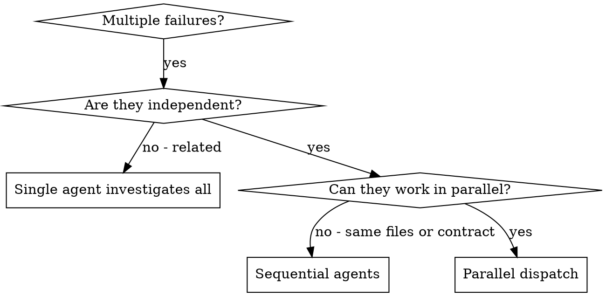

# Dispatching Parallel Agents

When several problems are independent (different test files, subsystems or bugs),
investigating them one after another wastes time. **Dispatch one agent per independent
problem domain and let them work at the same time.**

Each agent starts without your session's context or history: you write exactly what it
needs. That also keeps your own context free for coordinating.

## When to use



Use it when failures have different root causes, subsystems broke independently, and
each problem can be understood without the others.

Don't use it when the failures are related (fixing one may fix the others), when the
problem needs the whole system's state, or while you don't yet know what is broken
(investigate first, `swisper-superpowers:systematic-debugging`).

## One worktree per mutating agent

**Agents that write code each get their own worktree** (`swisper-superpowers:using-git-worktrees`).
Readers may share a checkout; two writers in one tree measure each other's half-made
edits and report them as their own result, with no conflict to warn you. Two tasks that
touch the same file or one task's contract run one after the other, not in parallel.
Each agent stays inside its own worktree and scratch directory.

## The pattern

1. **Find the domains.** Group the failures by what is broken, for example:
   tool approval flow (file A), batch completion (file B), abort (file C).
2. **Write one focused task per domain:**
   - scope: one test file or subsystem;
   - goal: make these tests pass;
   - constraints: what not to change;
   - output: what it found and what it changed.
3. **Dispatch them in one message**, so they run concurrently:
   ```
   Task("Fix agent-tool-abort.test.ts failures")
   Task("Fix batch-completion-behavior.test.ts failures")
   Task("Fix tool-approval-race-conditions.test.ts failures")
   ```
4. **Review and integrate** (below).

## The agent prompt

Focused on one domain, self-contained, specific about what comes back:

```markdown
Fix the 3 failing tests in src/agents/agent-tool-abort.test.ts:

1. "should abort tool with partial output capture" - expects 'interrupted at' in message
2. "should handle mixed completed and aborted tools" - fast tool aborted instead of completed
3. "should properly track pendingToolCount" - expects 3 results but gets 0

These look like timing issues. Your task:

1. Read the test file and understand what each test verifies.
2. Find the root cause: timing, or a real bug?
3. Fix it by waiting on events instead of timeouts, or by fixing the abort
   implementation, or by updating an expectation if the behaviour changed on purpose.

Do not just increase timeouts. Work only in your worktree: <path>.

Return: the root cause and what you changed.
```

| Weak | Better |
|---|---|
| "Fix all the tests" (too broad) | "Fix agent-tool-abort.test.ts" |
| "Fix the race condition" (no context) | paste the error messages and test names |
| no constraints | "Don't change production code" or "Fix tests only" |
| "Fix it" | "Return the root cause and the changes" |

## Review and integrate

When the agents return:

1. Read each summary: what changed and why.
2. Check for overlap: did two agents edit the same code or contract?
3. Merge their branches, then verify the combined result with
   `swisper-superpowers:verification-before-completion`: fresh evidence for the merged
   commit, from the scoped tests of every area touched or from CI's run on it.
4. Spot-check the diffs: agents make systematic errors a summary won't show.
