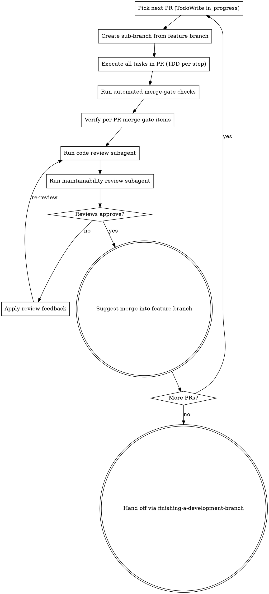

# Executing Plans

## Overview

Load plan, review critically, execute **PR-by-PR** (not just task-by-task) with the plan's per-PR merge gate as the binding checkpoint, then hand off completion.

**Announce at start:** "I'm using the executing-plans skill to implement this plan."

**Note:** Tell your human partner that Superpowers works much better with access to subagents. The quality of its work will be significantly higher if run on a platform with subagent support (such as Claude Code or Codex). If subagents are available, use superpowers:subagent-driven-development instead of this skill.

## The Process

### Step 1: Load and review plan

1. Read the plan file end-to-end.
2. Locate the **PR decomposition table** and the **per-PR merge gate**. If the plan was produced under the current `superpowers:writing-plans` skill, both will be present near the top of the plan.
3. If the plan has neither, treat it as a **legacy plan** and fall back to per-task execution (Step 2-legacy below); flag the gap to your human partner so the plan can be upgraded.
4. Review critically — identify any questions or concerns about the plan, the PR decomposition, the merge gate, or the contracts list. If concerns: raise them with your human partner before starting.
5. Create a TodoWrite list. The top-level items are PRs (one TODO per PR), not tasks. Tasks become sub-items the implementer expands during the PR's execution.
6. Confirm the feature branch exists (or create it per the plan's branching model). Never start implementation on `main` / `master` without explicit user consent.
7. **Multi-PR plan → create a Prism branch overlay (if the repo is Prism-indexed).** Count the PRs in the decomposition table. If there is **more than one PR**, the feature branch is long-lived (it accumulates multiple sub-branch merges before landing), so the default-branch index + per-edit auto-overlay is no longer enough — register a branch overlay ONCE on the feature branch so `search` / `find-refs` / `prepare-edit` reflect branch-only changes across all PRs:
   ```bash
   prism branch create <feature-branch>   # one-time, while the feature branch is checked out
   prism branch wait <feature-branch>      # block until the overlay is `active` (fail-fast if it failed)
   ```
   Once registered, the CLI auto-resolves this overlay for every later read (including sub-branch reads, via ancestry walk) — no per-PR or per-subagent config needed. Single-PR plans skip this; the default index + auto-overlay covers live edits. (The tool exists on both surfaces — CLI `prism branch create`, MCP `create_branch_index`; branch lifecycle is a CLI/setup op, so use the CLI. Non-Prism repos: skip this step.)

### Step 2: Execute PRs

For each PR in the plan's PR decomposition table, in order respecting dependencies (PRs may run in parallel only if the plan explicitly flags them as parallelizable):



#### 2.1 Create sub-branch

Use the sub-branch name from the plan's PR decomposition table. Branch from the feature branch (not from `main`).

```bash
git checkout <feature-branch>
git pull --ff-only origin <feature-branch>  # or skip if working locally with no remote
git checkout -b <pr-sub-branch-name>
```

#### 2.2 Execute all tasks in the PR

For each task the PR claims to cover (column "Scope (tasks / artifacts)" in the PR decomposition table):

1. Mark the task in_progress in your sub-TODO list.
2. Follow each step of the task exactly. The plan steps are bite-sized; follow them one at a time.
3. **TDD discipline (binding):** failing-test commit first, then passing-test commit. Test names include the AC ID verbatim (e.g., `test('T-AC-9: healthz returns 200 with body', ...)`). Run the test before writing the implementation; confirm it fails for the right reason; only then write the implementation.
4. Run all verifications the step specifies; do not skip them.
5. Mark the task completed.

Spike tasks (timeboxed investigations) are first-class: do not exceed the timebox. If the spike's stop condition flips a downstream decision, STOP and escalate to your human partner — do not proceed with downstream tasks until the decision is confirmed.

#### 2.3 Run automated merge-gate checks

Before requesting any review, run all automated checks the plan's merge gate lists. Typical (per the project's quality bar — Polis-bar, Foundry bar, etc.):

```bash
bun run typecheck          # or npm/pnpm equivalent
bun run lint --max-warnings 0
bun run test               # all tests, including the AC-named ones
bun run test --coverage    # if the project enforces coverage thresholds
bun run benchmark          # if the project tracks perf baselines (optional but green if present)
```

For Polis-bar projects also:

```bash
./scripts/check-license-headers.sh
./scripts/check-adr-required.sh   # if PR touches non-obvious code
! grep -rn "eslint-disable" packages/*/src/   # ban verifier
```

If any gate fails, fix it before requesting review. Never request review on a red sub-branch.

#### 2.4 Verify per-PR merge gate items (manual check)

Walk the merge-gate checklist in the plan and tick each box. The binding items (from `superpowers:writing-plans` PR decomposition discipline):

- All ACs the PR claims to verify have green tests, named after the AC ID
- TDD evidence: failing-test commit precedes passing-test commit (`git log -p` shows the order)
- All contracts the PR produces are exercised by at least one test from a consumer (or test fixture acting as a consumer) — not just isolated producer-side unit tests
- If the PR diff includes any frontend file: a Playwright (or equivalent E2E) test exists that drives the browser AND asserts the back-end effect (front-to-back). Frontend unit tests against a mocked backend do NOT satisfy this.
- No new `// @ts-ignore` / `// eslint-disable` in the diff (`git diff <feature-branch>...HEAD | grep -E '@ts-ignore|eslint-disable'` returns nothing)
- If the PR introduced a non-obvious decision: ADR file added under the project's ADR directory
- CHANGELOG.md updated for any user-facing change

If any item is missing or unverified, address it before review.

#### 2.5 Code review (mandatory)

Dispatch a code-review subagent using `superpowers:requesting-code-review` (template: `requesting-code-review/code-reviewer.md`). The reviewer evaluates:

- Plan / spec alignment (does the implementation match what the plan said?)
- AC coverage (every claimed AC has a test named after its ID; tests assert real behavior, not mocks)
- Contract integrity (contracts produced are exercised across the consumer boundary)
- Code quality (separation of concerns, error handling, type safety, DRY without premature abstraction)
- Architecture (sound design, scalability/perf, security, integration with surrounding code)
- Production readiness (migration strategy, backward compat, docs, no obvious bugs)

Apply the reviewer's Critical and Important findings before proceeding. If the reviewer is wrong, push back with technical reasoning per `superpowers:receiving-code-review`. Do not skip review because "the merge gate already passed" — the gate is automated checks; the review catches what automation can't.

#### 2.6 Maintainability review (mandatory)

Dispatch a separate maintainability-review subagent using the `requesting-code-review/maintainability-reviewer.md` template. The maintainability reviewer evaluates:

- **Structural consistency** — file size / complexity caps respected (per project quality bar); module-per-responsibility; single export point per package
- **Public vs internal API discipline** — internal modules not importable from outside their package; public surface curated and TSDoc-documented
- **Naming consistency** — terminology used the same way everywhere; canonical names from the project's glossary
- **Dead code / debt markers** — no untyped escape hatches (`any`, `unknown` cast without narrowing); no `TODO` / `XXX` / `FIXME` left in production code without a tracked issue; no commented-out code blocks
- **ADR debt** — non-obvious decisions documented as ADRs (per project convention); old ADRs marked superseded if the decision changed
- **Cross-component drift** — contract names / shapes consistent with their authoritative source; no rename mismatches across files

Apply the maintainability reviewer's High and Medium findings before proceeding. Low findings are recorded for follow-up but don't block the gate.

#### 2.7 Suggest merge — do NOT auto-merge

Once both reviews approve and all merge-gate items are green:

- Update the plan's PR decomposition table (or the TodoWrite item) to reflect the PR is complete.
- Suggest merge into the feature branch — do **not** auto-merge. The implementer / reviewer / project's review tooling makes the merge call.
- Provide a concise PR summary: ACs verified, contracts produced/consumed, files changed, review findings addressed, ADRs added.
- After human / reviewer / tooling approval: merge the sub-branch into the feature branch.
- Continue to the next PR.

### Step 3: Complete development (after all PRs land)

After every PR in the decomposition is merged into the feature branch:

- Announce: "I'm using the finishing-a-development-branch skill to complete this work."
- **REQUIRED SUB-SKILL:** `superpowers:finishing-a-development-branch`
- That skill verifies tests one more time, presents merge-upstream options, executes the choice. Note: per project policy, merging the feature branch upstream may require explicit user consent (e.g., Heiko's foundry repo: no merges to `main` without explicit OK).
- **If you created a Prism branch overlay in Step 1, delete it now** (after the feature branch has merged or been abandoned): `prism branch delete <feature-branch>`.

### Step 2-legacy (fallback for plans without PR decomposition)

If the plan does not include a PR decomposition table or per-PR merge gate, fall back to per-task execution:

For each task: mark in_progress → follow steps exactly → run verifications → mark completed.

After all tasks: dispatch a code review for the entire branch via `superpowers:requesting-code-review`, then dispatch a maintainability review using `requesting-code-review/maintainability-reviewer.md`. Apply findings. Then hand off to `superpowers:finishing-a-development-branch`.

Flag the missing PR decomposition to your human partner so the plan can be upgraded for future executions.

## When to stop and ask for help

**STOP executing immediately when:**

- A spike's stop condition fires (e.g., empirical validation fails) — escalate before proceeding with downstream PRs that the spike was gating
- Hit a blocker (missing dependency, test fails after legitimate effort, instruction unclear)
- Plan has critical gaps preventing PR-N from starting (e.g., contract producer hasn't shipped before consumer PR)
- You don't understand an instruction
- A merge gate fails repeatedly with the same root cause and you've exhausted the obvious fixes
- Code review or maintainability review is right and the fix would require materially different design — escalate rather than reshape silently

**Ask for clarification rather than guessing.**

## When to revisit earlier steps

**Return to Review (Step 1) when:**

- Partner updates the plan based on your feedback
- A spike outcome flips a downstream decision (re-plan affected PRs)
- Fundamental approach needs rethinking

**Don't force through blockers** — stop and ask.

## Remember

- Review plan critically first; PR decomposition + merge gate are the unit of execution
- Follow plan steps exactly within each PR
- TDD evidence in commit history is binding (failing-test commit before passing-test commit)
- AC IDs in test names — `test('T-AC-9: …', …)` / `test('B-AC-1: …', …)` — every claimed AC has a test
- Contracts must be exercised across the consumer boundary, not just by producer-side unit tests
- Frontend touched? Playwright front-to-back E2E is the gate, not frontend unit tests
- No new `// @ts-ignore` / `// eslint-disable` in any sub-PR's diff
- Code review + maintainability review are BOTH mandatory at PR boundary; they catch different things
- Suggest merge — don't auto-merge
- Stop when blocked, don't guess
- Never start implementation on `main` / `master` branch without explicit user consent

## Integration

**Required workflow skills:**

- `superpowers:using-git-worktrees` — Ensures isolated workspace (creates one or verifies existing)
- `superpowers:writing-plans` — Creates the plan this skill executes (PR decomposition + merge gates come from there)
- `superpowers:requesting-code-review` — Code review template at PR boundary
- `superpowers:test-driven-development` — TDD discipline applied per task
- `superpowers:finishing-a-development-branch` — Complete development after all PRs

**Maintainability review prompt:**

- `requesting-code-review/maintainability-reviewer.md` — companion to `code-reviewer.md`; runs alongside code review at every PR boundary
