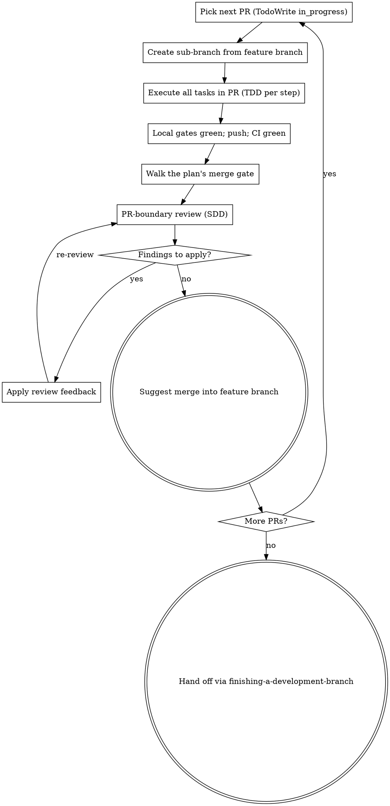

# Executing Plans

## Overview

Load the plan, review it critically, execute it **PR by PR** with the plan's per-PR merge gate as the binding checkpoint, then hand off completion.

**Announce at start:** "I'm using the executing-plans skill to implement this plan."

If subagents are available, use `swisper-superpowers:subagent-driven-development` instead of this skill, and tell your human partner that the work is much better with subagent support (such as Claude Code or Codex).

This skill shares its rules with `subagent-driven-development` (SDD) and points to them rather than repeating them: the Goals table, the gate discovery and pre-flight, the gate ladder (the full suite is CI's job), the branch overlay, the one-PR-per-wave and shared-files rules, and the PR-boundary review.

## Step 1: Load and review the plan

1. Read the plan end to end.
2. Read the **Goals table** first, as SDD "Read the plan's Goals table" describes; no Goals table → say so and lift the goals from spec §0.
3. Find the **PR decomposition table** and the **per-PR merge gate**. A Sketch plan has a task list and one merge gate: treat the whole branch as one PR. A plan with neither predates the current `writing-plans`: execute it per task (Step 2-legacy) and flag the gap to your human partner.
4. Review critically: questions or concerns about the plan, the decomposition, the merge gate or the contracts list go to your human partner before you start.
5. Create a TodoWrite list with one top-level item per PR; tasks are its sub-items.
6. Confirm the feature branch exists (or create it per the plan's branching model). Never start implementation on `main` / `master` without your human partner's explicit consent.
7. Before the first task, do SDD's "Before task 1": discover the gates, pre-flight the base, open the no-op draft PR, and register the Prism branch overlay if the plan has more than one PR.

## Step 2: Execute PRs

Take the PRs in the order their dependencies allow. Run PRs in parallel only if the plan flags them as parallelisable.


```dot
digraph pr_loop {
    "Pick next PR (TodoWrite in_progress)" [shape=box];
    "Create sub-branch from feature branch" [shape=box];
    "Execute all tasks in PR (TDD per step)" [shape=box];
    "Local gates green; push; CI green" [shape=box];
    "Walk the plan's merge gate" [shape=box];
    "PR-boundary review (SDD)" [shape=box];
    "Findings to apply?" [shape=diamond];
    "Apply review feedback" [shape=box];
    "Suggest merge into feature branch" [shape=doublecircle];
    "More PRs?" [shape=diamond];
    "Hand off via finishing-a-development-branch" [shape=doublecircle];

    "Pick next PR (TodoWrite in_progress)" -> "Create sub-branch from feature branch";
    "Create sub-branch from feature branch" -> "Execute all tasks in PR (TDD per step)";
    "Execute all tasks in PR (TDD per step)" -> "Local gates green; push; CI green";
    "Local gates green; push; CI green" -> "Walk the plan's merge gate";
    "Walk the plan's merge gate" -> "PR-boundary review (SDD)";
    "PR-boundary review (SDD)" -> "Findings to apply?";
    "Findings to apply?" -> "Apply review feedback" [label="yes"];
    "Apply review feedback" -> "PR-boundary review (SDD)" [label="re-review"];
    "Findings to apply?" -> "Suggest merge into feature branch" [label="no"];
    "Suggest merge into feature branch" -> "More PRs?";
    "More PRs?" -> "Pick next PR (TodoWrite in_progress)" [label="yes"];
    "More PRs?" -> "Hand off via finishing-a-development-branch" [label="no"];
}
```

### 2.1 Create the sub-branch

Use the sub-branch name from the PR decomposition table, branched from the feature branch, not from `main`:

```bash
git checkout <feature-branch>
git pull --ff-only origin <feature-branch>  # or skip if working locally with no remote
git checkout -b <pr-sub-branch-name>
```

### 2.2 Execute every task in the PR

For each task the PR covers (the "Scope (tasks / artifacts)" column):

1. Mark the task in_progress.
2. Follow each step of the task exactly, one at a time.
3. Follow `swisper-superpowers:test-driven-development`: the failing-test commit precedes the passing-test commit, test titles carry the AC id (`test('T-AC-9: healthz returns 200 with body', ...)`), and you watch the test fail for the right reason before writing the implementation.
4. Run the verifications the step specifies, scoped as SDD's gate ladder says: the named test while you work, the touched test files and the local gates before the task is done.
5. Mark the task completed.

Spike tasks (timeboxed investigations) are first-class: don't exceed the timebox. If the spike's stop condition flips a downstream decision, stop and escalate to your human partner, and don't start the downstream tasks until the decision is confirmed.

### 2.3 Gates and the merge gate

Before requesting any review, run the local gates the merge gate lists (typecheck, lint, the ratchet or coverage floor), then push and let CI run the full suite. Don't request review on a red sub-branch.

Then walk the plan's merge gate for this PR and tick each box; an unticked or unverified item is fixed before review.

### 2.4 PR-boundary review

Run SDD's "PR-boundary review": the goal check if this PR first delivers a goal, then the code review (`requesting-code-review/code-reviewer.md`) and the maintainability review (`requesting-code-review/maintainability-reviewer.md`) in sequence, and `update-documentation` where the repo has an architecture site. Apply the findings it names before proceeding. If a reviewer is wrong, push back with technical reasoning per `swisper-superpowers:receiving-code-review`. A green merge gate does not replace the review: the gate is automated checks; the review catches what automation can't.

### 2.5 Suggest merge; don't auto-merge

Once the reviews approve and every merge-gate item is green:

- Mark the PR complete in the plan's decomposition table (or its TodoWrite item).
- Suggest merge into the feature branch with a short summary: ACs verified, contracts produced/consumed, files changed, review findings addressed, decisions recorded. Don't auto-merge.
- After human / reviewer / tooling approval, merge the sub-branch into the feature branch and continue with the next PR.

## Step 3: Complete development (after all PRs land)

- Announce: "I'm using the finishing-a-development-branch skill to complete this work."
- **Required sub-skill:** `swisper-superpowers:finishing-a-development-branch`. It verifies the work, presents the merge-upstream options and executes the choice. A merge to `main` needs your human partner's explicit OK for that merge.
- If you created a Prism branch overlay, delete it once the feature branch has merged or been abandoned: `prism branch delete <feature-branch>`.

## Step 2-legacy: plans without a PR decomposition or merge gate

For each task: mark in_progress → follow its steps exactly → run its verifications → mark completed. After all tasks, run SDD's PR-boundary review once over the whole branch, apply the findings, then hand off to `swisper-superpowers:finishing-a-development-branch`. Flag the missing decomposition to your human partner so the plan can be upgraded.

## When to stop and ask for help

Stop executing and ask when:

- A spike's stop condition fires: escalate before the downstream PRs it gates.
- You hit a blocker (missing dependency, a test failing after legitimate effort, an unclear instruction).
- The plan has a gap that prevents PR-N from starting (e.g. a contract's producer hasn't shipped before its consumer PR).
- A merge gate fails repeatedly with the same root cause and you've exhausted the obvious fixes.
- A review is right and the fix needs a materially different design: escalate rather than reshape silently.

Ask for clarification rather than guessing, and don't force through blockers.

Return to Step 1 when your human partner updates the plan, when a spike outcome flips a downstream decision (re-plan the affected PRs), or when the approach needs rethinking.

## Integration

- `swisper-superpowers:subagent-driven-development`: the shared execution rules this skill points to
- `swisper-superpowers:using-git-worktrees`: the isolated workspace
- `swisper-superpowers:writing-plans`: the plan, its PR decomposition and its merge gates
- `swisper-superpowers:requesting-code-review`: `code-reviewer.md` and `maintainability-reviewer.md` at each PR boundary
- `swisper-superpowers:test-driven-development`: TDD per task
- `swisper-superpowers:finishing-a-development-branch`: completion after all PRs
