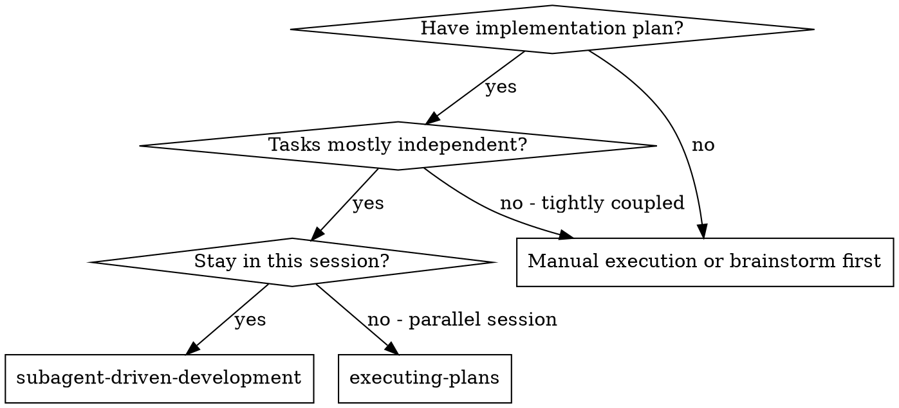
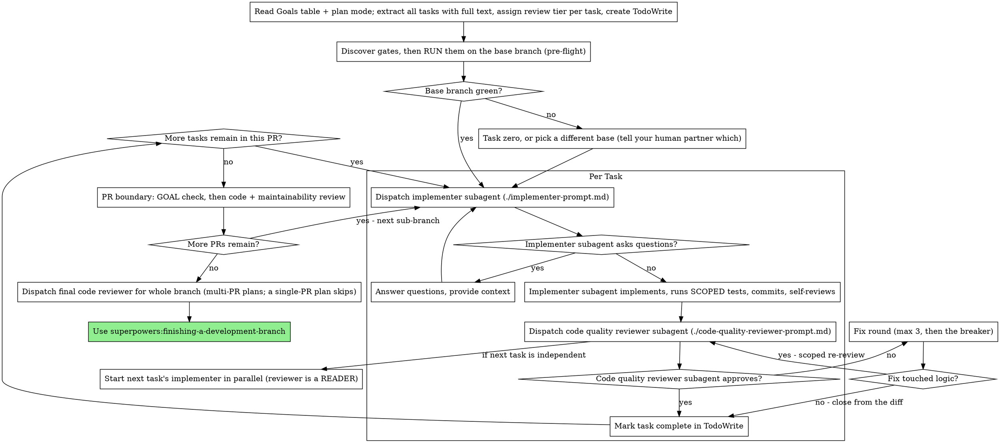

# Subagent-Driven Development

Execute plan by dispatching a fresh subagent per task, with **one** code-quality review after each, and the binding gates run once at the PR boundary.

**Why subagents:** You delegate tasks to specialized agents with isolated context. By precisely crafting their instructions and context, you ensure they stay focused and succeed at their task. They should never inherit your session's context or history — you construct exactly what they need. This also preserves your own context for coordination work.

**Core principle:** Fresh subagent per task + one code-quality review + gates measured once per SHA = high quality without paying for the same measurement three times.

**Continuous execution:** Do not pause to check in with your human partner between tasks. Execute all tasks from the plan without stopping. "Should I continue?" prompts and progress summaries waste their time — they asked you to execute the plan, so execute it.

**The four sanctioned stops**, and only these:
1. BLOCKED you cannot resolve, or ambiguity that genuinely prevents progress
2. The fix-loop **breaker** ruling that a finding is real and load-bearing
3. A **base branch that is red** on a gate — task zero or a different base is their call
4. The **goal check** at a PR boundary, where the surface is user-visible

🔴 **Stop 4 is a real stop and it is easy to skip.** It needs a human in a browser;
"don't pause between tasks" will tempt you to skip it or to report it from a green
test run instead. A goal check reported without someone having used the thing is a
false claim, and it is the specific false claim this whole pipeline exists to
prevent.

## When to Use



**vs. Executing Plans (parallel session):**
- Same session (no context switch)
- Fresh subagent per task (no context pollution)
- One code-quality review after each task, tiered to what the task risks
- Faster iteration (no human-in-loop between tasks)

## The Process



## Discover the project's quality gates BEFORE the first dispatch

Do this once per plan, and put the result in every implementer prompt (there is
a slot for it in `implementer-prompt.md`).

Read the project's linter config, pre-commit hook and CI workflows, and write
down the gates **concretely**: complexity cap and its tool, lint command and
whether warnings block, typecheck command, and the exact test command including
any landmine (Foundry: never bare `npx vitest`).

**Why the controller, not the implementer:** an implementer that discovers a
gate by failing it has already shaped the change around the wrong constraint,
and the rewrite costs more than the original. Measured 2026-07-29: a fix hit an
undisclosed complexity cap twice — once at pre-commit, once in CI — and both
round trips were avoidable by one sentence in the dispatch.

⚠ **State the number, never "follow the project's conventions".** A cap the
implementer has to go looking for is a cap it will discover at commit time.

⚠ **A linter's exit code is not its verdict — measured 2026-08-13.** The repo's
biome wrapper exits **0 on warnings** and non-zero only on errors. So `echo $?`
proves "no errors", never "clean". In one session an implementer that *knew
this and warned me about it* still recorded "0 errors, 0 warnings" for a run
that had **2 warnings**, and the change had added one of them. Worse, the added
warning was `noExcessiveLinesPerFunction`, which the complexity ratchet does not
count — so the extraction traded a **counted** violation for an **uncounted**
one and every gate reported an improvement.
**Put in every dispatch: read `Found N errors` AND `Found N warnings`, and the
processed file count. Three numbers, not an exit code.**

🔴 **AND TAKE THE NUMBERS FROM A MACHINE REPORTER, NOT THE HUMAN SUMMARY.**
Measured 2026-08-13, same repo, next day: biome's human output printed
**`Found 1 warning`** while its JSON reporter for the identical run reported
**`errors: 2`** — a format error and an `a11y/useKeyWithClickEvents`
violation. An implementer following the three-numbers rule on the human output
alone *would have shipped a lint error believing the run was clean*; it caught
both only because it asked for `--reporter=json`.

So the rule is: **`--reporter=json` (or the tool's equivalent) and read the
counts out of the structured output.** A summary line is a claim the tool makes
about itself, and this one under-reported errors as warnings.

⚠ **A count ratchet is not a cap.** Where a project enforces the repo-wide
violation COUNT (it may only fall), say so explicitly — the implementer needs
to know it may leave an existing over-cap function alone but must not add to
it. Otherwise it will either refuse to touch legacy code or try to refactor
the whole file.

### Then RUN them on the base branch, before task 1 (the pre-flight)

Reading the gates tells you what they are. **Running them tells you whether the
branch you are about to build on already passes.** These are different questions
and only the second one predicts your day.

Check out the base branch clean and run **every** gate — typecheck (each config,
not just the default one), lint, the ratchet or coverage floor, the test suite.
Write the numbers into the ledger as the starting line:

```
Base <branch> @ <sha>: tsc 0 · tsc -p tsconfig.test.json 0 · complexity 239/239 · tests 251 green
```

**Why this pays for itself immediately.** Measured 2026-07-29, Foundry: the base
branch carried 3 complexity violations over the ratchet and a red second
typecheck config. Neither was discovered by the pre-flight, because there wasn't
one — the first was found by a merge blocking a commit, the second by an
implementer minutes into task 1. Fixing them mid-flight meant a refactor of three
untested functions (27 characterization tests written first) wedged between the
plan and its first task. **Two minutes of pre-flight would have surfaced both
before anything was dispatched**, where they are a scoped task instead of an
interruption.

A red gate on the base branch is not a nuisance to route around. It is either
**task zero** or a reason to pick a different base — decide that deliberately,
in the open, before task 1, and tell your human partner which you chose.

⚠ **Run every typecheck config the CI runs.** A project with `tsc --noEmit` and
`tsc --noEmit -p tsconfig.test.json` has two gates; checking one and reporting
"typecheck green" is a false claim, and it is the easiest one to make by
accident.

## One working tree, one mutating agent

**Readers may share a checkout. Mutators may not.** A reviewer running alongside
an implementer is fine. Two agents that both *write* to the tree — two
implementers, or an implementer and a code-quality reviewer running its own
mutation harness — cannot both produce trustworthy measurements.

Mutation testing is the discipline this skill asks for, and it is exactly what
makes concurrency unsafe: a mutation check deliberately breaks a file, runs the
suite, and restores it. Two of those interleaved in one checkout give each other
a broken file at the moment they measure.

**The failure mode is not a merge conflict. Nothing errors.**
- Your gate run measures the *other* agent's deliberately-broken file and reports
  it as your green. A "tests pass" claimed in that window is a false claim made in
  good faith — the claim-vs-measurement failure with no visible tell.
- A `git add -A` at the wrong instant commits their broken code under your message.
- Contention also produces phantom red, which trains everyone to ignore red.

**Measured 2026-07-29, Foundry:** two implementers shared one worktree. One
watched the shared file change under it three times in ~90 seconds — an `isNull`
predicate swapped for the `= NULL` bug its AC existed to prevent, a `DELETE`
injected before an append-only insert, an ordering tiebreak dropped. All were the
other agent's mutations, correctly restored, and all were live in the first
agent's `git diff`. One agent's uncommitted fix was swept into the other's commit;
six unrelated tests went red and vanished on a quiet re-run.

**How to comply: give each mutating task its own `git worktree`** (symlink
`node_modules`).

🔴 **Do NOT serialise independent tasks. Ruled by Heiko, 2026-08-13: "never do this."**
Earlier wording offered serialising as an equal alternative, and it is not — it is the expensive
one. A worktree costs seconds to create; queueing an independent task behind another agent's
review costs its whole duration, and a plan of five independent tasks run in sequence costs the
sum of five instead of the longest one.

**Independence is read off the plan, not guessed:** the depends-on column and the per-PR file
lists already say which tasks share files. Tasks that touch disjoint files run **at the same
time, in separate worktrees**. Serialise only what genuinely shares a file or consumes another
task's contract.

*(Measured 2026-08-13: a five-task PR ran almost entirely in sequence because the one-mutator
rule was read as "queue them". Two of those tasks touched entirely disjoint directories and could
have run together from the first minute.)*

If you inherit contention: back the work up
outside the tree, wait for zero test processes **and** a clean target file, stage
by explicit path — never `git add -A` — and re-verify restoration after every
mutation. Then **verify the shared file at HEAD by grepping for the specific
mutation shapes** before trusting any gate output from that window. Do not assume
they were restored.

## Match the review to the task (proportionality)

**The per-task spec-compliance review is CUT.** One code-quality review per task
is the default. Scale the rest to what the task actually risks, and decide the
tier when you extract the task — not after the implementer reports.

| Task shape | Per-task review |
|---|---|
| **Declarative / mechanical** — a schema table, a config entry, a generated migration, a mechanical rename. Little to interpret; the diff is checkable by reading. | One code-quality review. |
| **Logic / contract** — branches, thresholds, ordering, a public contract others consume, or a rule the spec argues about. | One code-quality review. The implementer **positive-controls its gates** and mutates **the one property the task exists to protect** — one or two, never a sweep. **The REVIEWER runs the sweep** (see below). |
| **User-visible surface** | One code-quality review **plus the render gate** against the scaffold. Never reduce this one. |

### Who mutates — the author is the wrong person, and it is measurable

🔴 **An implementer mutating its own fresh code picks the mutations it already thought
of — which is the same set it wrote tests for.** It is self-review wearing a lab coat,
and it costs a full edit/run/revert/verify cycle per mutant.

**Measured 2026-08-24, Foundry asset-drawer PR-1** — seven tasks, one PR:

| who mutated | mutations | holes found |
|---|---|---|
| **implementers**, on code they had just written | **~45** | **0** |
| **a reviewer**, on someone else's code | **2** | **1** |

The one hole was real and would have been counted as coverage: a re-review deleted a
`both-null → 0` branch and swept fixture sizes 3–24 — **the mutant survived at every
size**, because an earlier guard already produced the same observed order. The test
traced to nothing. A different mind chose that mutation; the author never would have.

Note that the paragraph below already argues this — the "four surviving mutations in
an already-green suite" it credits were found by the **code-quality review**. The
evidence was always reviewer-side; the mandate had drifted to the author.

**So, three things get called "mutation testing" and only one is expensive:**

1. **Positive-control a gate** — break what it checks, watch it go red, restore. One or
   two, seconds each. **Always, at every tier.** This is *a claim is not a measurement*
   applied, and it catches the gate that cannot fail. *(Same run: a token scanner caught
   a false positive of its own — a URL path segment `/h-20` — only because it was
   controlled.)*
2. **Prove a CARRIED or RETARGETED test still guards.** When a test is moved onto a new
   component, break the behaviour it guards and watch it redden **against the new
   target**. Non-negotiable: a carried test that cannot fail is theatre, and proving it
   can is the entire justification for carrying it rather than deleting it.
3. **A sweep of N mutants over fresh code** — the expensive one, and the one with the
   0-for-45 return. **This belongs to the reviewer, not the author**, and only at
   logic/contract tier.

**If quality drops after this change, put the sweep back and say so** — this is a trade
made on one PR's evidence, not a law.

**Why the spec review went, and where spec fidelity actually lives now.** Measured
2026-07-29, Foundry: across a whole PR the **code-quality** reviews found nearly
everything of consequence — a type narrowing that would have forced casts through
two later tasks, four surviving mutations in an already-green suite, a suggested
test that would have passed while proving nothing. The **spec** reviews came back
compliant or near-compliant *every single time*. A 52-line Drizzle table
declaration went through implementer + spec review + code-quality review + fix
round + scoped re-review — five subagents to confirm a table matched its spec.

Spec fidelity is now proved by three things that were already binding and already
paid for:

1. **AC-named tests** — every AC has a test carrying its ID verbatim, asserted at
   promise altitude. A missing or mis-levelled AC test is a code-quality finding.
2. **The PR-boundary code review**, which checks plan/spec alignment and AC
   coverage across the whole PR — where cross-task drift actually shows up.
3. **The goal check**, which asks the only question a spec review never did:
   can the beneficiary use it?

A per-task spec review was a fourth measurement of the same property, taken at the
altitude where drift is least visible.

⚠ **This is not a licence to touch the boundary.** Per-task review prevents drift
inside a task; the boundary catches what only appears across tasks. Cutting
per-task ceremony makes the boundary review **more** load-bearing, not less.

## When to run what — the gate ladder

Most of the elapsed time in a plan is not thinking. It is the same suite run by
three agents on the same unchanged code. Four rules remove that without weakening
a single binding check.

### Rule 1 — a gate result belongs to a SHA, not to an agent

🔴 **Never re-run a gate on a SHA that already has a result.** The implementer
runs its gates and reports the command **and its output**; you record it in the
ledger against the commit:

```
Task 4 @ a7c31f9: tsc 0 · lint 0 · touched-suite 43 green · mutation 0 survivors
```

The reviewer reads that line. It does not re-run the suite — it is reviewing a
diff, not re-measuring the code. The **PR boundary re-runs everything once**, and
that run is the binding one.

This is not trust replacing measurement. The boundary run is unconditional, and it
is what "green" means. What it removes is re-measuring unchanged code to produce a
result you already have. If the boundary run ever disagrees with a recorded
per-task line, that is a finding **about the implementer** — treat it as seriously
as a code defect, because a fabricated gate result poisons every decision after it.

### Rule 2 — cheapest gate first, and stop at the first red

Order by seconds-to-signal, not by importance: **typecheck → lint the diff → the
named test → the touched test files → the full suite.** A typecheck failure found
in 4 seconds costs nothing; the same failure found after a 6-minute suite costs
6 minutes, every time it happens.

### Rule 3 — 🔴 THE FULL SUITE IS CI'S JOB. NOBODY RUNS IT LOCALLY.

| When | What runs | Typical cost |
|---|---|---|
| TDD inner loop (every RED → GREEN) | the **single named test** | seconds — this is the loop you run twenty times |
| Task reported DONE | typecheck · lint the diff · **the test files this task touched** · and **at most** the project's SMOKE set | tens of seconds |
| **PR boundary** | typecheck · lint · ratchet — then **push and let CI run the suite** | CI's minutes, not yours |
| **Never, by anyone, for any reason** | the full suite on a developer machine | see below |

**The implementer's ceiling is: the tests it wrote, plus the smoke set. That is enough to
merge**, because CI re-runs everything before anything lands. An implementer running the whole
suite is buying a result CI is about to produce anyway, on worse hardware, while other agents
are working.

🔴 **Name the smoke command in the dispatch — and read the runner script before you name it.**
Measured 2026-08-13, Foundry: the tier called `gate`, which `npm test` runs, is *the whole suite
minus a handful of `.extended` files* — ~890 files. The real smoke set was a different tier,
`test:core`, a curated manifest of **21**. A dispatch saying "run the smoke tests" would have
bought nearly nothing. **Do not trust the name.**

**Why a local full-suite run is worse than useless — measured, one session, one repo:**
- Two suites in one checkout fight over the same worker databases. One run produced **184
  failures — every one a hook timeout or deadlock, zero assertion failures**, all passing in
  isolation. Hours of diagnosing an artefact of your own parallelism.
- A contended run took **2,069s** against a normal ~200s, blew past the harness timeout and was
  killed with nothing to show. A third attempt was killed by memory pressure.
- **CI ran the same suite clean in 5m56s** while all of that was happening.

**If a distant break matters, push — do not run it locally.** CI is the per-branch environment:
clean machine, fresh database, full set, nothing to tear down. Gate the merge on it.

⚠ **Never report a suite result you did not see.** Three failed local attempts are three
non-measurements, and "tests pass" from any of them is exactly the false green this skill exists
to prevent.

### Rule 4 — reviews are READERS: pipeline them with the next implementer

A code-quality review mutates nothing. The one-mutator rule permits **one mutator
plus any number of readers** in a tree. So:

- Dispatch task N's review and **immediately start task N+1's implementer**, when
  the plan's depends-on column says N+1 does not consume N's artifact.
- **Fix rounds for N wait** until N+1's implementer finishes — a fix is a mutator,
  and two mutators in one tree is the silent-false-green failure above.
- Never pipeline across a contract boundary: if N produces a contract N+1 consumes,
  N's review completes first.

Review latency leaves the critical path entirely. This is the single largest
wall-clock saving available, and it costs nothing in rigour because the reviewer
is looking at a frozen diff either way.

## Screens: the scaffold is the basis, always

If any task renders a user-visible surface, an approved **mock scaffold** is the binding implementation spec (RULE 0 — an approved mock IS the real React scaffold, not HTML that looks like it). The implementer prompt carries this, but the controller owns it:

- **Name the scaffold in the dispatch.** Do not rely on the implementer finding it. If the plan does not name one for a UI task, that is a **plan gap** — fix the plan before dispatching, rather than letting an implementer invent a screen.
- **A vague spec is never a licence to design.** An implementer reporting "the spec was unclear about the screen" gets the scaffold path, not a free hand.
- **Render-gate at the PR boundary — mechanically.** `render-gate.mjs` (in the
  `creating-screen-mocks` skill) joins build to mock on `data-testid` and exits 1
  on any difference; the implementer runs it before reporting DONE. Then the real
  screen beside the scaffold for what a fingerprint cannot see. A difference is a bug in the build *or* a change the scaffold needs — the second is an upstream finding, not something to diverge over quietly.

## Branch overlay for multi-PR plans (do this first, if the repo is Prism-indexed)

Before dispatching any subagent, count the PRs in the plan's decomposition. A single-PR
plan has no decomposition and is single-PR by definition — skip this section. If there is
**more than one PR**, the feature branch is long-lived — register a Prism branch overlay
ONCE on the feature branch so every subagent's `prism search` / `find-refs` / `prepare-edit`
reflects branch-only changes, not just the default-branch index plus each subagent's own
local dirty files (subagents have isolated working trees; without the overlay one subagent
can't see another's merged-to-feature work):

```bash
prism branch create <feature-branch>   # one-time, while the feature branch is checked out
prism branch wait <feature-branch>      # block until the overlay is `active`
```

The CLI auto-resolves this overlay for every subagent read (sub-branches resolve to it via
ancestry walk) — no per-subagent config. Delete it once the feature merges or is abandoned:
`prism branch delete <feature-branch>`. Single-PR plans skip this. (Tool exists on both CLI
`prism branch create` and MCP `create_branch_index`; use the CLI — it's a lifecycle op.
Non-Prism repos: skip.)

## Model Selection

Use the least powerful model that can handle each role to conserve cost and increase speed.

**Mechanical implementation tasks** (isolated functions, clear specs, 1-2 files): use a fast, cheap model. Most implementation tasks are mechanical when the plan is well-specified.

**Integration and judgment tasks** (multi-file coordination, pattern matching, debugging): use a standard model.

**Architecture, design, and review tasks**: use the most capable available model.

**Task complexity signals:**
- Touches 1-2 files with a complete spec → cheap model
- Touches multiple files with integration concerns → standard model
- Requires design judgment or broad codebase understanding → most capable model

## Handling Implementer Status

Implementer subagents report one of four statuses. Handle each appropriately:

**DONE:** Record the gate line against the SHA, then proceed to the code-quality review.

**DONE_WITH_CONCERNS:** The implementer completed the work but flagged doubts. Read the concerns before proceeding. If the concerns are about correctness or scope, address them before review. If they're observations (e.g., "this file is getting large"), note them and proceed to review.

**NEEDS_CONTEXT:** The implementer needs information that wasn't provided. Provide the missing context and re-dispatch.

**BLOCKED:** The implementer cannot complete the task. Assess the blocker:
1. If it's a context problem, provide more context and re-dispatch with the same model
2. If the task requires more reasoning, re-dispatch with a more capable model
3. If the task is too large, break it into smaller pieces
4. If the plan itself is wrong, escalate to the human

**Never** ignore an escalation or force the same model to retry without changes. If the implementer said it's stuck, something needs to change.

## The fix loop — bounded, with a breaker (adopted from upstream 6.2.0)

A review that finds problems starts a fix loop, and **a fix loop with no cap does not terminate** — the same failure the spec/plan reviews had before `review-termination.md`. Two routes leave the loop immediately:

- **Minor findings never enter it.** Record them in the progress ledger as you go (`Task <N>: minor (deferred): <one-liner>`) and point the final whole-branch review at that list. A roll-up nobody reads is a silent discard.
- **A plan-mandated finding is the human's call.** If a finding conflicts with what the plan requires, present the finding *and* the plan text and ask which governs. Do not dismiss the finding because the plan mandates it, and do not dispatch a fix that contradicts the plan without asking. *(This is the spec-defect route: a plan-time discovery that the SPEC is wrong is a spec bug — take it upstream, don't patch it downstream.)*

Everything else enters. One round = one fix dispatch + at most one scoped re-review. **Three rounds maximum per task.**

- **Rounds 1–2 — resume the original implementer.** Send the open findings verbatim; its context is intact. If your harness cannot message a live subagent, dispatch a fresh one carrying the brief path, the report-file path and the findings — the report file is the persistent memory either way.
- **Round 3 — fresh implementer on a more capable model**, framed: *"A prior implementer attempted this task twice; you own it now. Read the report file for what was tried."* A loop surviving two resumes means the implementer cannot see its own problem — fresh eyes plus a capability bump in one move.
- **Every round:** the implementer fixes, re-runs **the tests covering the amended code** (not the full suite — see the gate ladder), appends its fix report to the same report file, and returns the short contract. Confirm the report carries the covering tests, the command run, **and its output** — all three, or it is a claim rather than a measurement.
- **After each round**, append: `Task <N>: fix round <R>/3 (<X> addressed, <Y> open — <one-liners>; commits <a7>..<b7>)`.

**The cap came down from five.** Rounds 4–5 were already "fresh implementer on a
better model" — an escalation wearing a fix round's clothes. Naming it as such
saves two dispatch pairs per stuck task, and stuck tasks are where the schedule
actually goes.

### Not every fix earns a re-review dispatch

A scoped re-review is a subagent. Spending one to confirm a renamed constant is
the same mis-ratio as the spec review was.

- **Fix touched logic, control flow, a contract, or a test's assertions** →
  dispatch the scoped re-review. [`re-review-prompt.md`](re-review-prompt.md).
- **Fix was textual** — a rename, an extracted constant, a comment, an import
  reorder, a type annotation with no narrowing change → **verify it yourself from
  the diff and the covering-test output, and close it in the ledger.** You are
  reading three lines; a subagent would read the same three lines.
- **Unsure which** → dispatch. The doubt is the signal.

**The re-review, when dispatched, is SCOPED** — verdict each finding ADDRESSED /
NOT ADDRESSED and flag new breakage **in the fix diff only**. New Critical/Important
breakage joins the open list; out-of-scope observations become deferred minors and
never extend the loop.

**Never fix findings yourself in the controller session** — your context stays clean for coordination, and controller fixes skip review entirely.

### The breaker

When round 3's re-review still leaves findings open, **stop dispatching** and adjudicate each one yourself — you hold the plan and the cross-task context the reviewer lacks:

- **Reviewer is wrong, or the point is contestable** → park it: `Task <N>: parked — <finding> — ruling: <why the code stands>`.
- **Real, but nothing downstream builds on it** → park it the same way, ruling that it is real and deferred.
- **Real and load-bearing** (a later task builds on it, or it reveals a plan defect) → **STOP.** Append `Task <N>: BLOCKED — <reason>` and report to your human partner with the finding, the plan text it collides with, and the fix history. Parking a structural failure lets every dependent task build on it.

**Adjudicate only at the cap.** Adjudicating earlier to end a loop is pre-judging with a different name. Every adjudication is a ledger entry — a silent discard is forbidden.

## Prompt Templates

- `./implementer-prompt.md` - Dispatch implementer subagent
- `./code-quality-reviewer-prompt.md` - Dispatch code quality reviewer subagent (the only per-task review)
- `./re-review-prompt.md` - Scoped re-review after a fix round that touched logic (NOT a fresh full review, and not for textual fixes)

*(`spec-reviewer-prompt.md` was deleted with the per-task spec review. Spec fidelity is proved by AC-named tests, the PR-boundary code review and the goal check — see "Match the review to the task".)*

## Read the plan's Goals table FIRST — it is what "done" means

A plan produced under the current `superpowers:writing-plans` opens with a **Goals
table lifted from spec §0**: per goal, the named **beneficiary**, the **Value**
they get, the **Proof** (`UBER-AC-n`), and **First delivered in**.

Read it before extracting a single task, and carry it forward:

- **Put the goal a task serves into that task's dispatch.** An implementer that
  knows who benefits and how makes better calls at every ambiguity than one
  holding only a task body. It costs one line.
- **Note which PR is the first delivery of each goal.** That PR owes a goal check
  at its boundary, below.
- **If the plan has no Goals table**, it predates this discipline. Say so, lift
  the goals from spec §0 yourself, and tell your human partner — do not execute a
  plan whose definition of done you cannot state.

🔴 **An AC passing is not a goal delivered.** ACs prove mechanisms; a goal is
someone being able to do something. Every gate in this skill measures the former.
Exactly one place measures the latter — the goal check at the PR boundary — and
it is the reason a plan can go ten PRs deep, all green, with nobody able to use
anything.

## Per-PR boundary (multi-PR plans)

A multi-PR plan includes a **PR decomposition table** with one row per PR
(sub-branch, scope, ACs verified, contracts produced/consumed, frontend-touched
flag) and a **per-PR merge gate**.

🔴 **A Sketch-class plan has none of that, by design** — a Sketch spec is one PR, one
phase. Do not report the absent PR table as a plan gap and do not invent one.
Run the per-task loop, then go straight to the boundary review below, treating
the whole branch as the single PR. If a plan is written as one PR but the work is
visibly multi-PR, that is a **plan defect** — take it back to the plan, don't
improvise a decomposition.

For a multi-PR plan, organize the per-task loop above by PR:

1. **Before starting a PR:** create the sub-branch named in the PR decomposition row (branch from the feature branch, not from `main`).
2. **Within the PR:** dispatch the per-task loop (implementer → spec review → code-quality review → mark task complete) for every task the PR claims to cover.
3. **After all the PR's tasks are complete and individually reviewed:** run the **PR-boundary review** before suggesting merge.

### PR-boundary review (mandatory — a single-PR plan runs this once, for the whole branch)

**First, if this PR is the first delivery of a goal, check the GOAL — not its ACs.**

Take the goal's row from the Goals table and answer one question: **can the named
beneficiary now do the thing, in the running system?** Not "does `UBER-AC-1`
pass" — actually exercise it: drive the UI, call the endpoint as that role, read
the screen. For anything user-visible this is a browser check, not a test run.

- ✅ delivered → record it against the goal's row and continue
- ❌ not delivered, though the ACs are green → **STOP.** The ACs are proving a
  mechanism rather than the outcome. That is a finding for the plan and possibly
  for spec §0's Proof line, and it goes upstream — do not add tasks to route
  around it.

This is the only check in the whole pipeline that measures value rather than
correctness, and it is cheap: one PR, one goal, a few minutes.

Then dispatch TWO subagents in sequence (not in parallel — maintainability review benefits from seeing code-review findings):

1. **Code review** using `superpowers:requesting-code-review/code-reviewer.md`. Reviewer checks: plan/spec alignment, AC coverage with AC-named tests, contract integrity (exercised across consumer boundary), code quality, architecture, production readiness, frontend Playwright if applicable, no new `// @ts-ignore` / `// eslint-disable` in diff.
2. **Maintainability review** using `superpowers:requesting-code-review/maintainability-reviewer.md`. Reviewer checks: structural consistency (size/complexity caps), public/internal API discipline, naming consistency, dead code / debt markers, ADR debt, cross-component drift.

Apply each review's Critical / High / Important findings before proceeding. Then:

- Update the plan's PR decomposition table to mark the PR complete
- **Suggest merge into the feature branch — do NOT auto-merge**
- After human / reviewer / project tooling approval, merge the sub-branch into the feature branch
- Move to the next PR

Per-task review (code quality) and per-PR review (goal check + code + maintainability) are BOTH mandatory; they catch different things. Per-task review prevents in-PR drift; per-PR review catches whole-PR concerns — cross-task consistency, contract integrity at the boundary, debt accumulated across the PR's tasks, and whether the goal was actually delivered.

### Final code review (multi-PR plans, after all PRs)

Once every PR in the decomposition has been merged into the feature branch, dispatch one **final code reviewer** subagent for the whole feature-branch diff (not just the last PR). This catches drift that survived per-PR review — typically end-to-end contract behavior, accumulated debt, integration concerns spanning multiple PRs.

**A single-PR plan skips this** — its PR-boundary review already covered the whole branch, and a second whole-branch pass over the same diff is a re-review with no delta. Before proceeding, confirm every goal in the Goals table is recorded as delivered.

Then proceed to `superpowers:finishing-a-development-branch`.

## Example Workflow

```
You: I'm using Subagent-Driven Development to execute this plan.

[Read plan file once: docs/superpowers/plans/feature-plan.md]
[Extract all 5 tasks with full text and context]
[Create TodoWrite with all tasks]

Task 1: Hook installation script

[Get Task 1 text and context (already extracted)]
[Dispatch implementation subagent with full task text + context]

Implementer: "Before I begin - should the hook be installed at user or system level?"

You: "User level (~/.config/superpowers/hooks/)"

Implementer: "Got it. Implementing now..."
[Later] Implementer:
  - Implemented install-hook command
  - Added tests, 5/5 passing
  - Self-review: Found I missed --force flag, added it
  - Committed

[Ledger] Task 1 @ a7c31f9: tsc 0 · lint 0 · touched-suite 5 green

[Dispatch code quality reviewer — and START TASK 2's implementer at the same time;
 the reviewer is a reader, task 2 doesn't consume task 1's artifact]
Code reviewer: Strengths: Good test coverage, clean. Issues: None. Approved.

[Mark Task 1 complete]

Task 2: Recovery modes  (already running, in parallel with task 1's review)

Implementer: [No questions, proceeds]
Implementer:
  - Added verify/repair modes
  - Ran only the touched test files: 8/8 passing (full suite NOT run — leaf module)
  - Self-review: All good
  - Committed

[Ledger] Task 2 @ 3fd0e14: tsc 0 · lint 0 · touched-suite 8 green

[Dispatch code quality reviewer]
Code reviewer: Issues (Important): Magic number (100). Missing: progress reporting
  — spec says "report every 100 items", no AC-named test covers it.

[Fix round 1/3 — resume the same implementer]
Implementer: Extracted PROGRESS_INTERVAL, added T-AC-4 progress test, 9/9 green

[Fix touched logic → scoped re-review]
Code reviewer: Both ADDRESSED, no new breakage in the fix diff. ✅

[Mark Task 2 complete]

...

[PR boundary]
GOAL CHECK — G-1: ran the CLI as an operator, saw progress reported every 100
  items on a 1,000-item repair. Beneficiary can do the thing. ✅
[Full suite + every gate, once — this is the binding run]
  tsc 0 · tsc -p tsconfig.test.json 0 · lint 0 · 251 green · complexity 239/239
[Dispatch PR code review, then maintainability review]
Reviewers: All ACs covered by AC-named tests, contracts exercised by a consumer.
  Ready to merge.

Done!
```

## Advantages

**vs. Manual execution:**
- Subagents follow TDD naturally
- Fresh context per task (no confusion)
- Subagent can ask questions (before AND during work)

⚠ **Not parallel-safe by default.** An earlier version of this list claimed
"subagents don't interfere". They do: two MUTATING agents in one working tree
produce silent false greens, not conflicts — see "One working tree, one mutating
agent". Parallelism is safe only across separate worktrees, or between readers.

**vs. Executing Plans:**
- Same session (no handoff)
- Continuous progress (no waiting)
- Review checkpoints automatic

**Efficiency gains:**
- No file reading overhead (controller provides full text)
- Controller curates exactly what context is needed
- Subagent gets complete information upfront
- Questions surfaced before work begins (not after)

**Quality gates:**
- Self-review catches issues before handoff
- One code-quality review per task, tiered to what the task risks
- Bounded fix loop (3 rounds, then adjudication) — loops terminate
- Binding gates measured once per SHA, and once more at the PR boundary
- The goal check measures value, not just correctness

**Cost:**
- More subagent invocations (implementer + one or two reviewers per task, by tier)
- Controller does more prep work (extracting all tasks upfront)
- Review loops add iterations
- But catches issues early (cheaper than debugging later)

## Red Flags

**Never:**
- Start implementation on main/master branch without explicit user consent
- Drop a task's review tier BELOW what "Match the review to the task" assigns — and never reduce a user-visible surface below both reviews plus the render gate. (Dropping the spec review on a declarative task is not "skipping review", it is the assigned tier; decide it when you extract the task, never after the implementer reports.)
- Proceed with unfixed issues
- Dispatch two MUTATING subagents into the same working tree (see below — the
  failure is silent false greens, not conflicts)
- Make subagent read plan file (provide full text instead)
- Skip scene-setting context (subagent needs to understand where task fits)
- Ignore subagent questions (answer before letting them proceed)
- Accept "close enough" on an AC (a missing or mis-levelled AC-named test IS the spec-compliance failure now — treat it as blocking, not as a nit)
- Skip review loops (reviewer found issues = implementer fixes = review again)
- Let implementer self-review replace actual review (both are needed)
- Move to next task while any assigned review has open issues

**If subagent asks questions:**
- Answer clearly and completely
- Provide additional context if needed
- Don't rush them into implementation

**If reviewer finds issues:**
- Implementer (same subagent) fixes them
- Reviewer reviews again
- Repeat until approved
- Don't skip the re-review

**If subagent fails task:**
- Dispatch fix subagent with specific instructions
- Don't try to fix manually (context pollution)

## Integration

**Required workflow skills:**
- **superpowers:using-git-worktrees** - Ensures isolated workspace (creates one or verifies existing)
- **superpowers:writing-plans** - Creates the plan this skill executes
- **superpowers:requesting-code-review** - Code review template for reviewer subagents
- **superpowers:finishing-a-development-branch** - Complete development after all tasks

**Subagents should use:**
- **superpowers:test-driven-development** - Subagents follow TDD for each task

**Alternative workflow:**
- **superpowers:executing-plans** - Use for parallel session instead of same-session execution
