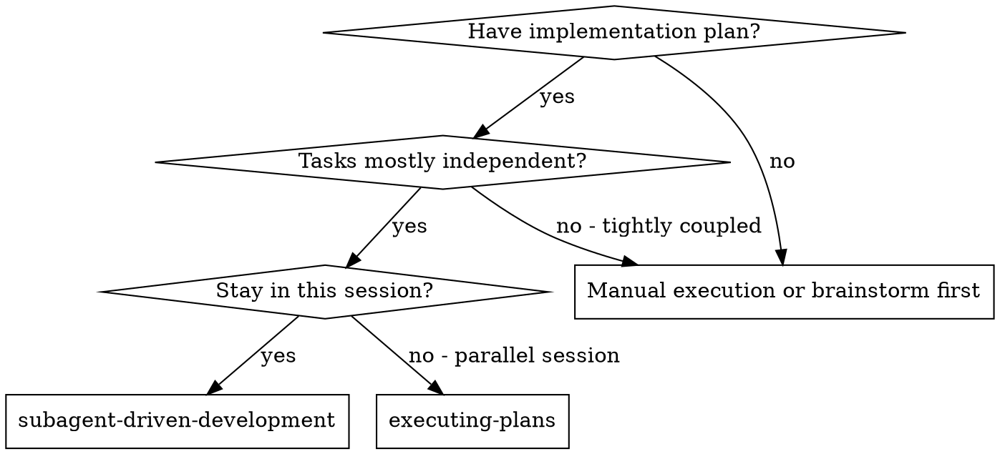
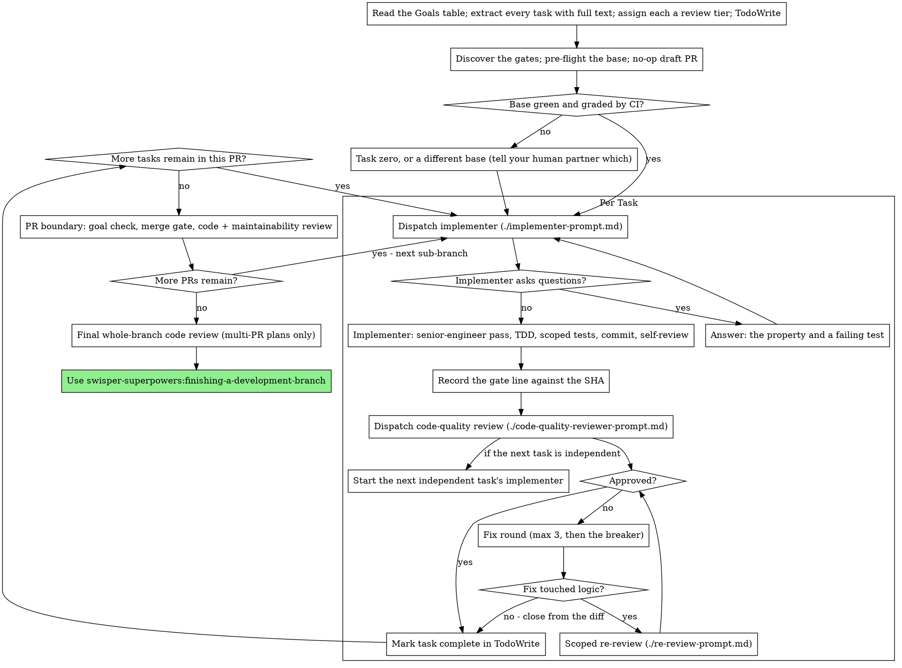

# Subagent-Driven Development

Execute a plan by dispatching a fresh subagent per task, with **one** code-quality review after each, and the binding gates measured once per SHA at the PR boundary.

Subagents never inherit your session's context or history. You construct exactly what each one needs (the full task text, its goal, the gates, its test list), which keeps it focused and keeps your own context free for coordination.

**Continuous execution.** Don't pause to check in with your human partner between tasks, and don't send "should I continue?" prompts or progress summaries. Stop only for:
1. A BLOCKED you cannot resolve, or ambiguity that genuinely prevents progress.
2. The fix-loop **breaker** ruling that a finding is real and load-bearing.
3. A **base branch that is red** on a gate: task zero or a different base is their call.
4. The **goal check** at a PR boundary, where the surface is user-visible. It needs a person using the thing in a browser, so it is easy to skip; never skip it and never report it from a green test run.

## When to Use


```dot
digraph when_to_use {
    "Have implementation plan?" [shape=diamond];
    "Tasks mostly independent?" [shape=diamond];
    "Stay in this session?" [shape=diamond];
    "subagent-driven-development" [shape=box];
    "executing-plans" [shape=box];
    "Manual execution or brainstorm first" [shape=box];

    "Have implementation plan?" -> "Tasks mostly independent?" [label="yes"];
    "Have implementation plan?" -> "Manual execution or brainstorm first" [label="no"];
    "Tasks mostly independent?" -> "Stay in this session?" [label="yes"];
    "Tasks mostly independent?" -> "Manual execution or brainstorm first" [label="no - tightly coupled"];
    "Stay in this session?" -> "subagent-driven-development" [label="yes"];
    "Stay in this session?" -> "executing-plans" [label="no - parallel session"];
}
```

Compared with `executing-plans`: same session, a fresh subagent per task, one review per task tiered to what the task risks, no human in the loop between tasks.

## The Process


```dot
digraph process {
    rankdir=TB;

    subgraph cluster_per_task {
        label="Per Task";
        "Dispatch implementer (./implementer-prompt.md)" [shape=box];
        "Implementer asks questions?" [shape=diamond];
        "Answer: the property and a failing test" [shape=box];
        "Implementer: senior-engineer pass, TDD, scoped tests, commit, self-review" [shape=box];
        "Record the gate line against the SHA" [shape=box];
        "Dispatch code-quality review (./code-quality-reviewer-prompt.md)" [shape=box];
        "Start the next independent task's implementer" [shape=box];
        "Approved?" [shape=diamond];
        "Fix round (max 3, then the breaker)" [shape=box];
        "Fix touched logic?" [shape=diamond];
        "Scoped re-review (./re-review-prompt.md)" [shape=box];
        "Mark task complete in TodoWrite" [shape=box];
    }

    "Read the Goals table; extract every task with full text; assign each a review tier; TodoWrite" [shape=box];
    "Discover the gates; pre-flight the base; no-op draft PR" [shape=box];
    "Base green and graded by CI?" [shape=diamond];
    "Task zero, or a different base (tell your human partner which)" [shape=box];
    "More tasks remain in this PR?" [shape=diamond];
    "PR boundary: goal check, merge gate, code + maintainability review" [shape=box];
    "More PRs remain?" [shape=diamond];
    "Final whole-branch code review (multi-PR plans only)" [shape=box];
    "Use swisper-superpowers:finishing-a-development-branch" [shape=box style=filled fillcolor=lightgreen];

    "Read the Goals table; extract every task with full text; assign each a review tier; TodoWrite" -> "Discover the gates; pre-flight the base; no-op draft PR";
    "Discover the gates; pre-flight the base; no-op draft PR" -> "Base green and graded by CI?";
    "Base green and graded by CI?" -> "Task zero, or a different base (tell your human partner which)" [label="no"];
    "Task zero, or a different base (tell your human partner which)" -> "Dispatch implementer (./implementer-prompt.md)";
    "Base green and graded by CI?" -> "Dispatch implementer (./implementer-prompt.md)" [label="yes"];
    "Dispatch implementer (./implementer-prompt.md)" -> "Implementer asks questions?";
    "Implementer asks questions?" -> "Answer: the property and a failing test" [label="yes"];
    "Answer: the property and a failing test" -> "Dispatch implementer (./implementer-prompt.md)";
    "Implementer asks questions?" -> "Implementer: senior-engineer pass, TDD, scoped tests, commit, self-review" [label="no"];
    "Implementer: senior-engineer pass, TDD, scoped tests, commit, self-review" -> "Record the gate line against the SHA";
    "Record the gate line against the SHA" -> "Dispatch code-quality review (./code-quality-reviewer-prompt.md)";
    "Dispatch code-quality review (./code-quality-reviewer-prompt.md)" -> "Start the next independent task's implementer" [label="if the next task is independent"];
    "Dispatch code-quality review (./code-quality-reviewer-prompt.md)" -> "Approved?";
    "Approved?" -> "Mark task complete in TodoWrite" [label="yes"];
    "Approved?" -> "Fix round (max 3, then the breaker)" [label="no"];
    "Fix round (max 3, then the breaker)" -> "Fix touched logic?";
    "Fix touched logic?" -> "Scoped re-review (./re-review-prompt.md)" [label="yes"];
    "Fix touched logic?" -> "Mark task complete in TodoWrite" [label="no - close from the diff"];
    "Scoped re-review (./re-review-prompt.md)" -> "Approved?";
    "Mark task complete in TodoWrite" -> "More tasks remain in this PR?";
    "More tasks remain in this PR?" -> "Dispatch implementer (./implementer-prompt.md)" [label="yes"];
    "More tasks remain in this PR?" -> "PR boundary: goal check, merge gate, code + maintainability review" [label="no"];
    "PR boundary: goal check, merge gate, code + maintainability review" -> "More PRs remain?";
    "More PRs remain?" -> "Dispatch implementer (./implementer-prompt.md)" [label="yes - next sub-branch"];
    "More PRs remain?" -> "Final whole-branch code review (multi-PR plans only)" [label="no"];
    "Final whole-branch code review (multi-PR plans only)" -> "Use swisper-superpowers:finishing-a-development-branch";
}
```

## Before task 1

### Read the plan's Goals table: it is what "done" means

A plan from `swisper-superpowers:writing-plans` opens with a **Goals table lifted from spec §0**: per goal, the named **beneficiary**, the **Value** they get, the **Proof** (`UBER-AC-n`), and **First delivered in**.

- **Put the goal a task serves into that task's dispatch** (one line), so the implementer resolves small ambiguities toward the outcome.
- **Note which PR first delivers each goal.** That PR owes a goal check at its boundary.
- **If the plan has no Goals table**, say so, lift the goals from spec §0 yourself, and tell your human partner. Don't execute a plan whose definition of done you cannot state.

An AC passing is not a goal delivered: ACs prove mechanisms, and the goal check at the PR boundary is the one place that measures whether someone can use the result.

### The workspace and the ledger

`scripts/sdd-workspace PLAN_FILE` prints the plan's workspace (`.superpowers/sdd/<plan>/`, git-ignored). Keep there the progress ledger, each task's brief (the text you dispatched), each implementer's report (fix reports appended to it), and the review packages `scripts/review-package` writes. Fix rounds and re-reviews read these files.

### Discover the project's quality gates

Do this once per plan and put the result in every implementer prompt (`implementer-prompt.md` has the slot), because an implementer that finds a gate by failing it has already shaped the change around the wrong constraint.

Read the linter config, pre-commit hook and CI workflows, and write the gates down **concretely**:
- the complexity cap and its tool, and whether the project runs a **count ratchet** (the repo-wide violation count may only fall: the implementer may leave an existing over-cap function alone but must not add to it);
- the lint command, and whether warnings block;
- every typecheck config CI runs (`tsc --noEmit` and `tsc --noEmit -p tsconfig.test.json` are two gates);
- the exact test command, including any landmine (e.g. "never bare `npx vitest`");
- the smoke command (see Rule 3).

**State the number, never "follow the project's conventions".**

Lint counts come from the tool's machine reporter (`--reporter=json` or equivalent): errors, warnings and the processed-file count. Put that instruction in every dispatch. An exit code proves only "no errors", and a human summary line can report an error as a warning.

### Pre-flight the base branch

Check out the base branch clean and run its local gates: each typecheck config, lint, the ratchet or coverage floor. The base's suite result comes from CI (the no-op draft PR below). Write the starting line into the ledger:

```
Base <branch> @ <sha>: tsc 0 · tsc -p tsconfig.test.json 0 · complexity 239/239 · CI suite green (run 1234)
```

A red gate on the base is either **task zero** or a reason to pick a different base. Decide which before task 1, in the open, and tell your human partner.

### Confirm CI grades the integration branch: one no-op draft PR

Before task 1, open one no-op draft PR into the integration branch: a comment-only change in a path your tasks will touch, so `paths:` filters see it. Confirm the workflows run for PRs into that branch (their `branches:` and `paths:` filters) and come back green, then close it. Not graded, or red, is task zero, like a red local gate.

### Branch overlay (multi-PR plans in a Prism-indexed repo)

A single-PR plan, or a repo without Prism, skips this. With more than one PR the feature branch is long-lived, so register a Prism branch overlay once, on the feature branch, before any dispatch. Every subagent's `prism search` / `find-refs` / `prepare-edit` then sees branch-only changes, including other subagents' work merged into the feature branch:

```bash
prism branch create <feature-branch>   # one-time, while the feature branch is checked out
prism branch wait <feature-branch>      # block until the overlay is `active`
```

Sub-branches resolve to it automatically; no per-subagent config. Use the CLI (it is a lifecycle operation). Delete it once the feature merges or is abandoned: `prism branch delete <feature-branch>`.

## One working tree, one mutating agent

**Readers may share a checkout. Mutators may not.** A mutator is anything that writes to the tree: an implementer, a fix round, a reviewer running mutations. Two mutators in one tree produce silent false greens, not merge conflicts: a gate run measures the other agent's deliberately broken file and reports it as your green, and a `git add -A` at the wrong instant commits their code under your message.

- **Give each mutating task its own `git worktree`** (symlink `node_modules`).
- **Don't serialise independent tasks**, because a worktree costs seconds and a queued task costs its whole duration. Read independence off the plan (the depends-on column and the per-PR file lists): tasks on disjoint files run at the same time, in separate worktrees. Serialise only what shares a file or consumes another task's contract.
- **Helpers stay inside their own worktree** and scratch space. Every implementer and reviewer dispatch carries the sandbox rules (`implementer-prompt.md`, `requesting-code-review/code-reviewer.md`): own worktree and own scratch subdirectory only; never install into or write through shared tool installs (a uv-managed Python, shared venvs, global caches); never delete files they did not create; never print environment variables.

If you inherit contention: back the work up outside the tree; wait for zero test processes and a clean target file; stage by explicit path, never `git add -A`; re-verify restoration after every mutation; and grep the shared file at HEAD for the specific mutation shapes before trusting any gate output from that window.

## Match the review to the task (proportionality)

One code-quality review per task is the default; there is no per-task spec review. Decide the tier when you extract the task, not after the implementer reports.

| Task shape | Per-task review |
|---|---|
| **Declarative / mechanical**: a schema table, a config entry, a generated migration, a mechanical rename. The diff is checkable by reading. | One code-quality review. |
| **Logic / contract**: branches, thresholds, ordering, a public contract others consume, or a rule the spec argues about. | One code-quality review. The implementer positive-controls its gates and mutates **the one property the task exists to protect** (one or two mutations, not a sweep). **The reviewer runs the sweep** (below). |
| **User-visible surface** | One code-quality review **plus the render gate** against the scaffold. Never reduce this one. |

### Who mutates

Three things get called "mutation testing":

1. **Positive-control a gate**: break what it checks, watch it go red, restore. One or two, seconds each, at every tier. It catches the gate that cannot fail.
2. **Prove a carried or retargeted test still guards**: when a test moves onto a new component, break the behaviour it guards and watch it redden against the new target. A carried test that cannot fail is not worth carrying.
3. **A sweep of N mutants over fresh code**: the reviewer's job, at logic/contract tier only, because an author mutating its own code picks the mutations it already wrote tests for. The reviewer runs it in its own worktree checked out at the task's HEAD, so it stays a reader of the implementer's tree. A survivor is reported as "strengthen `<existing test>` so this mutant dies", never "add a test".

If quality drops after this split, put the sweep back on the implementer and say so.

**Where spec fidelity is proved:** by AC-named tests asserted at promise altitude (a missing or mis-levelled AC test is a code-quality finding), by the PR-boundary review (plan/spec alignment and AC coverage across the PR, where cross-task drift shows), and by the goal check. With no per-task spec review the boundary review carries more weight, so never thin it.

## Tests: the plan's list, strengthened before added, deleted when covered

Review loops are where a suite inflates: each finding and surviving mutant answered with a new test, and nothing deleted. The rules are `test-driven-development` R1–R8; this is where the controller enforces them.

- **The dispatch carries the plan's named test list**: one per AC, plus the listed invariants and failure modes (`implementer-prompt.md` has the slot). A test beyond the list is allowed only with its AC/INV/FM id named in the commit and the report.
- **Fix rounds strengthen first.** Send a finding or a survivor as *"make `<test>` fail on this"*. A new test only when no existing test sits at the right altitude, and it carries an id.
- **The reviewer treats untraced or mechanism-only tests as Important findings**, disposition *strengthen* or *delete*, never "keep for coverage". It never requests a test without naming the id it proves.
- **Every report and ledger line counts tests added, strengthened and deleted**, from `trace-check.sh` (in `test-driven-development`), not from memory. At the PR boundary, net growth is explained: which promises the new tests prove, and which lower tests a new higher one made redundant and were deleted.

## Senior-engineer pass: before the first line of code

Right before its first test, every implementer reasons in a ≤12-line note (template and the list of junior anti-patterns are in `implementer-prompt.md`): **J**, what a junior would most likely do in THIS task; **S**, the senior design instead: existing pieces reused (`path::symbol`), failure modes, limits, compatibility, observability, and what it will NOT build; **I**, the invariants it protects and the test proving each.

- **It is a reasoning step, not a gate.** Nobody approves it, nothing waits on it, no extra dispatch. The note goes in the implementer's report; the code-quality reviewer may read it as context.
- **The dispatch carries the spec's §1 `seam`, `mechanism` and `senior` lines**, so the pass starts from the designer's answer instead of re-deriving it.

## When to run what: the gate ladder

Most elapsed time in a plan is the same suite run by several agents on unchanged code. Four rules remove that without dropping a binding check.

### Rule 1: a gate result belongs to a SHA, not to an agent

Don't re-run a gate on a SHA that already has a result. The implementer runs its gates and reports the command **and its output**; you record it in the ledger against the commit:

```
Task 4 @ a7c31f9: tsc 0 · lint 0 · touched-suite 43 green · tests +2 ~1 −3 · trace-check PASS
```

The reviewer reads that line instead of re-running the suite. At the PR boundary you run the local gates once and CI runs the full suite; **CI's run on the head SHA is the binding result.** If it disagrees with a recorded per-task line, that is a finding about the implementer, as serious as a code defect, because every later decision rested on that line.

### Rule 2: cheapest gate first, and stop at the first red

Order by seconds-to-signal: **typecheck → lint the diff → the named test → the touched test files → push, and CI runs the full suite.**

### Rule 3: the full suite is CI's job

| When | What runs |
|---|---|
| TDD inner loop (every RED → GREEN) | the **single named test**: seconds, run twenty times |
| Task reported DONE | typecheck · lint the diff · **the test files this task touched** · at most the project's smoke set |
| PR boundary | typecheck · lint · ratchet locally, then **push; CI runs the full suite** |

By default nobody runs the full suite locally: CI runs it on a clean machine before anything lands, and a local run on a shared machine fights other agents' suites for worker databases and produces timeouts that look like failures. **Exception:** when CI cannot run the suite for this branch, name a local full run in the dispatch and write why in the ledger; one suite per checkout at a time.

The implementer's ceiling is the tests it wrote plus the smoke set, and that is enough to merge, because CI re-runs everything. **Name the smoke command in the dispatch, and read the runner script before you name it**: a tier called `gate` or `test` is often the whole suite under a reassuring name. If the project has no smoke set, say so.

If a distant break matters, push and let CI answer it; gate the merge on CI. Never report a suite result you did not see.

### Rule 4: reviews are readers, so pipeline them with the next implementer

- Dispatch task N's review and **immediately start task N+1's implementer**, when the plan's depends-on column says N+1 does not consume N's artifact.
- A fix round is a mutator. If N and N+1 share a tree, N's fix round waits until N+1's implementer finishes; in separate worktrees it runs at once.
- Never pipeline across a contract boundary: if N produces a contract N+1 consumes, N's review completes first.

Review latency leaves the critical path, at no cost in rigour: the reviewer reads a frozen diff either way.

## Screens: the scaffold is the basis, always

If any task renders a user-visible surface, an approved **mock scaffold** is the binding implementation spec (RULE 0: an approved mock is the real React scaffold, not HTML that looks like it). The implementer prompt carries this, but the controller owns it:

- **Name the scaffold in the dispatch.** If the plan names none for a UI task, that is a plan gap: fix the plan before dispatching, rather than letting an implementer invent a screen.
- **A vague spec is never a licence to design.** An implementer reporting "the spec was unclear about the screen" gets the scaffold path, not a free hand.
- **Render-gate mechanically.** `render-gate.mjs` (in the `creating-screen-mocks` skill) joins build to mock on `data-testid` and exits 1 on any difference; the implementer runs it before reporting DONE, and you check it again at the PR boundary. Then look at the real screen beside the scaffold for what a fingerprint cannot see. A difference is a bug in the build *or* a change the scaffold needs; the second is an upstream finding, not a quiet divergence.

## Model Selection

Use the least powerful model that can handle each role, to save cost and time.

- **Mechanical implementation** (isolated functions, clear spec, 1–2 files): a fast, cheap model. Most tasks are mechanical when the plan is well specified.
- **Integration and judgment** (multi-file coordination, pattern matching, debugging): a standard model.
- **Architecture, design, review, or anything needing broad codebase understanding**: the most capable model available.

## Handling Implementer Status

- **DONE:** record the gate line against the SHA, then dispatch the code-quality review.
- **DONE_WITH_CONCERNS:** read the concerns first. Correctness or scope concerns are addressed before review; observations ("this file is getting large") are noted, then review.
- **NEEDS_CONTEXT:** provide the missing context and re-dispatch.
- **BLOCKED:** a context problem → more context, same model; needs more reasoning → a more capable model; too large → split the task; the plan is wrong → escalate to the human.

Never ignore an escalation or make the same model retry without a change.

## The fix loop: bounded, with a breaker

Two routes leave the loop immediately:

- **Minor findings never enter it.** Record them in the ledger as you go (`Task <N>: minor (deferred): <one-liner>`) and point the final whole-branch review at that list.
- **A plan-mandated finding is the human's call.** If a finding conflicts with what the plan requires, present the finding *and* the plan text and ask which governs. Don't dismiss the finding because the plan mandates it, and don't dispatch a fix that contradicts the plan without asking. A discovery that the spec is wrong is a spec bug: take it upstream.

Everything else enters. One round = one fix dispatch + at most one scoped re-review. **Three rounds maximum per task.**

- **Rounds 1–2: resume the original implementer.** Send the open findings verbatim, plus one line: *"Fix a test gap by strengthening the test that claims the behaviour; a new test only if none sits at the right altitude, with its id; report tests +a ~s −d."* If your harness cannot message a live subagent, dispatch a fresh one with the brief path, the report-file path and the findings; the report file is the memory either way.
- **Round 3: a fresh implementer on a more capable model**, framed: *"A prior implementer attempted this task twice; you own it now. Read the report file for what was tried."*
- **Every round:** the implementer fixes, re-runs **the tests covering the amended code** (Rule 3), appends its fix report to the report file, and returns the short contract. Confirm the report carries the covering tests, the command **and its output**.
- **After each round**, append: `Task <N>: fix round <R>/3 (<X> addressed, <Y> open — <one-liners>; commits <a7>..<b7>)`.

### Not every fix earns a re-review dispatch

- **Fix touched logic, control flow, a contract, or a test's assertions** → dispatch the scoped re-review ([`re-review-prompt.md`](re-review-prompt.md)).
- **Fix was textual** (a rename, an extracted constant, a comment, an import reorder, a type annotation with no narrowing change) → verify it yourself from the diff and the covering-test output, and close it in the ledger.
- **Unsure which** → dispatch.

The re-review is **scoped**: it verdicts each finding ADDRESSED / NOT ADDRESSED and flags new breakage **in the fix diff only**. New Critical/Important breakage joins the open list; out-of-scope observations become deferred minors and never extend the loop.

**Don't fix findings yourself in the controller session**, because your context stays clean for coordination and a controller fix skips review. The exception is a one-line textual fix (a typo, a single rename): make it and note it in the ledger (`Task <N>: controller fix — <what> @ <sha>`).

### Rule on the property, not the mechanism

In a fix round, and when answering an implementer's question, **state what must be true and add or name a test that fails today; the implementer chooses how.** If you must name a mechanism, probe it first (≤5 minutes, a scratch script or a failing test), because an unprobed mechanism ruling that turns out wrong costs a fix round plus a re-review.

### The breaker

When round 3's re-review still leaves findings open, **stop dispatching** and adjudicate each one yourself; you hold the plan and the cross-task context the reviewer lacks:

- **Reviewer is wrong, or the point is contestable** → park it: `Task <N>: parked — <finding> — ruling: <why the code stands>`.
- **Real, but nothing downstream builds on it** → park it the same way, ruling that it is real and deferred.
- **Real and load-bearing** (a later task builds on it, or it reveals a plan defect) → **stop.** Append `Task <N>: BLOCKED — <reason>` and report to your human partner with the finding, the plan text it collides with, and the fix history.

Adjudicate only at the cap; adjudicating earlier to end a loop is pre-judging. Every adjudication is a ledger entry.

## Prompt Templates

- `./implementer-prompt.md`: dispatch an implementer
- `./code-quality-reviewer-prompt.md`: the per-task code-quality review
- `./re-review-prompt.md`: the scoped re-review after a fix round that touched logic

## Per-PR boundary

A Standard or Programme plan has a **PR decomposition table** (sub-branch, scope, ACs verified, contracts produced/consumed, frontend-touched flag) and a **per-PR merge gate**.

**A Sketch-class plan has neither, by design**: a Sketch spec is one PR. Don't report the absent table as a plan gap and don't invent one. Run the per-task loop, then the boundary review below once, treating the whole branch as the single PR. If a plan is written as one PR but the work is visibly multi-PR, that is a plan defect: take it back to the plan.

For a multi-PR plan, organise the per-task loop by PR:

1. **Before starting a PR:** create the sub-branch named in its decomposition row, from the feature branch, not from `main`.
2. **Within the PR:** run the per-task loop for every task the PR covers.
   **One PR per wave** (`writing-plans`): the wave's tasks run in parallel, each in its own worktree off the wave branch; once a task's review passes, `git merge --no-ff` it into the wave branch locally, so the reviewed history is kept. Push once, so CI runs once per wave, not once per task.
   **Generated and shared files: once, at the end of the wave PR**: the regenerated OpenAPI spec and its changelog, package CHANGELOGs, version bumps, and the architecture pages (`update-documentation`). Put them under `must_not_edit` in every task dispatch; never per task, per fix round, or in parallel branches.
3. **After every task in the PR is complete and reviewed:** run the PR-boundary review before suggesting merge.

### PR-boundary review (a single-PR plan runs this once, for the whole branch)

**First, if this PR is the first delivery of a goal, check the goal, not its ACs.** Take the goal's row and answer one question: **can the named beneficiary now do the thing, in the running system?** Exercise it: drive the UI, call the endpoint as that role, read the screen. For anything user-visible this is a browser check, not a test run.

- Delivered → record it against the goal's row and continue.
- Not delivered, though the ACs are green → **stop.** The ACs prove a mechanism rather than the outcome. That is a finding for the plan, and possibly for spec §0's Proof line; take it upstream rather than adding tasks to route around it.

**Then the merge gate.** Run the local gates once and push; CI's run on the head SHA is the binding suite result (Rule 1). Walk the plan's merge gate for this PR; every box is green before you suggest merge.

**Then two reviews, in sequence** (maintainability benefits from seeing the code-review findings):

1. **Code review** with `swisper-superpowers:requesting-code-review` (`code-reviewer.md`) over the PR range. It checks plan/spec alignment, AC coverage at promise altitude, the test list (`trace-check.sh` over the range quoted, net growth explained), contracts exercised across the consumer boundary, and front-to-back browser tests where frontend was touched.
2. **Maintainability review** with `requesting-code-review/maintainability-reviewer.md`: structure against the caps, API discipline, naming, dead code and debt markers, decision debt (the architecture page's "Why it is like this" block), cross-component drift.

Apply both reviews' Critical and Important findings before proceeding; Minor findings go to the ledger for the final review. Then:

- Regenerate the shared files once, now (step 2 above). If the repo has `architecture/tools/impact.py`, run `swisper-superpowers:update-documentation` on the PR's diff, so no PR leaves the boundary with its architecture pages stale.
- Mark the PR complete in the plan's decomposition table.
- **Suggest merge into the feature branch; don't auto-merge.** Merge after human / reviewer / project-tooling approval, then move to the next PR.

The per-task review and the per-PR boundary review are both required: the first prevents drift inside a task; the second catches cross-task consistency, contract integrity at the boundary, debt accumulated across tasks, and whether the goal was delivered.

### Final code review (multi-PR plans, after all PRs)

Once every PR has merged into the feature branch, dispatch one **final code reviewer** for the whole feature-branch diff, pointed at the ledger's deferred minors. It catches what survived per-PR review: end-to-end contract behaviour, accumulated debt, concerns spanning PRs.

**A single-PR plan skips this**: its boundary review already covered the whole branch.

Before proceeding, confirm every goal in the Goals table is recorded as delivered. Then use `swisper-superpowers:finishing-a-development-branch`.

## Example Workflow

```
You: I'm using Subagent-Driven Development to execute this plan.

[Read the plan once: plans/<product>/2026-10-05-feature-plan.md in Swisper_Documentation]
[Extract all 5 tasks with full text; assign tiers; create TodoWrite]

Task 1: Hook installation script
[Dispatch implementer with full task text, goal, gates, test list]

Implementer: "Before I begin - should the hook be installed at user or system level?"
You: "User level (~/.config/superpowers/hooks/)"

Implementer:
  - Implemented install-hook command
  - Tests +2 (B-AC-1 install at user level, FM-1 existing hook refused) ~0 −0;
    trace-check PASS; 2/2 passing
  - Self-review: found I missed --force flag, added it
  - Committed

[Ledger] Task 1 @ a7c31f9: tsc 0 · lint 0 · touched-suite 2 green · tests +2 ~0 −0

[Dispatch code-quality review, and start task 2's implementer at the same time:
 the reviewer is a reader, and task 2 doesn't consume task 1's artifact]
Reviewer: Strengths: each AC proved at the CLI boundary. Issues: none. Approved.
[Mark Task 1 complete]

Task 2: Recovery modes (already running)
Implementer:
  - Added verify/repair modes
  - Ran the touched test files: 8/8 passing
  - Committed

[Ledger] Task 2 @ 3fd0e14: tsc 0 · lint 0 · touched-suite 8 green

Reviewer: Important: magic number (100). T-AC-4 ("report every 100 items") is
  asserted on 50 items only, so the test cannot fail on the interval.
  Important: `verify calls repair once` is a mock-call count naming no id: delete.

[Fix round 1/3, resume the same implementer]
Implementer: Extracted PROGRESS_INTERVAL; strengthened T-AC-4 to repair 250 items and
  assert reports at 100 and 200; deleted the mock-count test. Tests +0 ~1 −1, 7/7 green

[Fix touched logic → scoped re-review]
Re-reviewer: Both ADDRESSED, no new breakage in the fix diff.
[Mark Task 2 complete]

...

[PR boundary]
GOAL CHECK — G-1: ran the CLI as an operator, saw progress every 100 items on a
  1,000-item repair. The beneficiary can do the thing.
[Local gates once, then push] tsc 0 · tsc -p tsconfig.test.json 0 · lint 0 · complexity 239/239
[CI on 9c2e1a4, the binding run] 251 green
[Merge gate walked; dispatch PR code review, then maintainability review]
trace-check origin/feature...HEAD: 9 added, 4 removed (net +5) · 9 traced · 0 untraced
Reviewers: all ACs covered by AC-named tests at the boundary, contracts exercised by
  a consumer, net +5 explained (5 ACs, no shadows). Ready to merge.
```

## Red Flags

- Starting implementation on main/master without your human partner's explicit consent.
- Making a subagent read the plan file instead of pasting the full task text.
- Skipping scene-setting context, or letting a subagent proceed with an unanswered question. Answer clearly and completely, with the property and its failing test rather than a mechanism, and don't rush it into implementation.
- Accepting "close enough" on an AC: a missing or mis-levelled AC-named test is blocking, not a nit.
- Letting the implementer's self-review stand in for the review.
- Marking a task complete while its review has open Critical or Important findings that were not parked at the breaker.
- Dropping a task's review tier below what was assigned at extraction; a user-visible surface never goes below the code-quality review plus the render gate.

## Integration

**Required workflow skills:**
- **swisper-superpowers:using-git-worktrees**: the isolated workspace
- **swisper-superpowers:writing-plans**: creates the plan this skill executes
- **swisper-superpowers:requesting-code-review**: the reviewer templates
- **swisper-superpowers:finishing-a-development-branch**: completes the work after all tasks

**Subagents use:**
- **swisper-superpowers:test-driven-development**: TDD for each task

**Alternative workflow:**
- **swisper-superpowers:executing-plans**: execution in a parallel session
