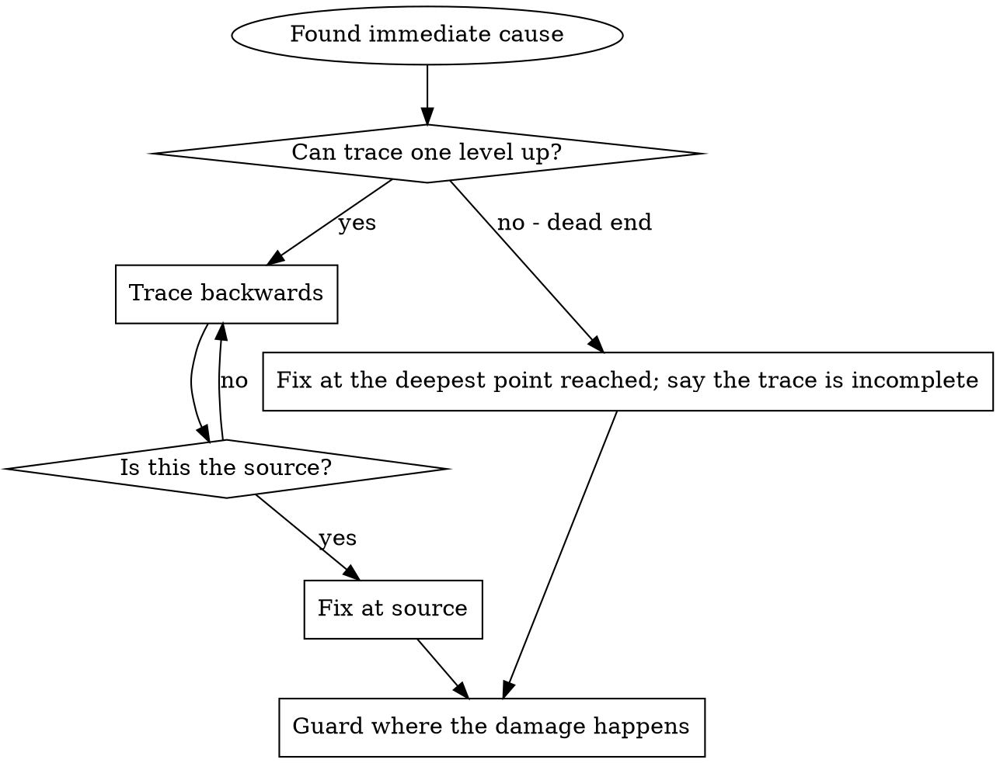

# Root Cause Tracing

Bugs often surface deep in the call stack: `git init` in the wrong directory, a file
created in the wrong place, a database opened with the wrong path. Fixing it where the
error appears treats a symptom.

**Trace backward through the call chain to the original trigger, and fix it there.**
Then add a guard where the damage happens (`defense-in-depth.md`).



Use it when the error is far from the entry point, the stack is long, it is unclear
where the bad data came from, or you need to find which test or caller triggers it.

## The process

1. **Observe the symptom.**
   ```
   Error: git init failed in ~/project/packages/core
   ```
2. **Find the immediate cause.**
   ```typescript
   await execFileAsync('git', ['init'], { cwd: projectDir });
   ```
3. **Ask what called it.**
   ```
   WorktreeManager.createSessionWorktree(projectDir, sessionId)
     ← Session.initializeWorkspace()
     ← Session.create()
     ← test at Project.create()
   ```
4. **Ask what value was passed.** `projectDir = ''`, and an empty `cwd` resolves to
   `process.cwd()`: the source directory.
5. **Find the original trigger.**
   ```typescript
   const context = setupCoreTest(); // { tempDir: '' } until beforeEach runs
   Project.create('name', context.tempDir);
   ```
   Fix: make `tempDir` a getter that throws when read before `beforeEach`.

## When you can't trace by reading

Log the context and the stack **before** the dangerous operation, not after it fails:

```typescript
async function gitInit(directory: string) {
  console.error('DEBUG git init:', {
    directory,
    cwd: process.cwd(),
    stack: new Error().stack,
  });
  await execFileAsync('git', ['init'], { cwd: directory });
}
```

```bash
npm test 2>&1 | grep 'DEBUG git init'
```

- In tests use `console.error`: a logger may be suppressed.
- Log what the decision depends on (arguments, cwd, the relevant config value, a
  timestamp). For a secret, log whether it is set, never its value, and never dump the
  environment.
- In the stacks, look for test file names, the triggering line, and a pattern (same
  test? same argument?).

## Which test causes the pollution?

When something appears during a test run and you don't know which test made it, bisect
with `find-polluter.sh` in this directory:

```bash
./find-polluter.sh '.git' 'src/**/*.test.ts'
```

It runs the test files one at a time and stops at the first that creates the path.
