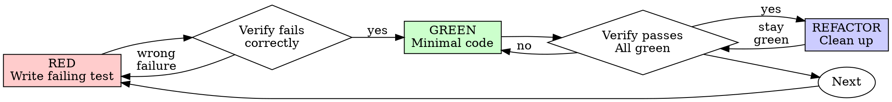

# Test-Driven Development (TDD)

## Overview

Write the test first. Watch it fail. Write minimal code to pass.

**Core principle:** If you didn't watch the test fail, you don't know if it tests the right thing.

**Violating the letter of the rules is violating the spirit of the rules.**

## When to Use

**Always:**
- New features
- Bug fixes
- Refactoring
- Behavior changes

**Exceptions (ask your human partner):**
- Throwaway prototypes
- Generated code
- Configuration files

Thinking "skip TDD just this once"? Stop. That's rationalization.

## The Iron Law

```
NO PRODUCTION CODE WITHOUT A FAILING TEST FIRST
```

Write code before the test? Delete it. Start over.

**No exceptions:**
- Don't keep it as "reference"
- Don't "adapt" it while writing tests
- Don't look at it
- Delete means delete

Implement fresh from tests. Period.

## TDD Evidence (binding when working from a plan)

When working from a plan with per-PR merge gates, TDD is verified by **commit history**, not by claim:

- The failing-test commit MUST precede the passing-test commit
- `git log -p` over the PR's diff must show this order
- A reviewer or merge-gate check that finds tests added in the same commit as (or after) the implementation flags it as a TDD violation

This is non-negotiable. Pre-PR tooling can audit it (`git log --diff-filter=A` for new test files; verify each test's first-passing commit was preceded by a first-failing commit). At minimum, the implementer reports the failing-commit SHA + passing-commit SHA in their handoff report.

## AC-ID test naming (binding when verifying spec ACs)

If the task verifies any acceptance criterion with an ID (B-AC-N for business / T-AC-N for technical, per `superpowers:brainstorming` and `superpowers:writing-plans` discipline), the test name MUST include the AC ID verbatim:

```typescript
// ✅ correct — AC ID in name; review tooling can grep for coverage
test('T-AC-9: healthz returns 200 with body { status: "ok" }', () => { ... });
test('B-AC-1: existing chat workflow still works after Polis loaded', () => { ... });

// ❌ wrong — descriptive but disconnected from the spec
test('healthz responds with the right body', () => { ... });
test('chat works', () => { ... });
```

Each AC gets at least one test. The test asserts the AC's Then-clause condition with real data, not against mocks of the system under test.

⚠ **The AC ID in the name is a LABEL, NOT PROOF — read [`proving-acs.md`](proving-acs.md) before writing any AC-mapped test.**

Measured, Foundry 2026-07-29: a feature shipped with **7,800 tests green** and a UAT session found **four bugs by clicking**. Every one was *the code doing exactly what it said while saying something false to the user* — `billedTo` announced "the instance API key" for a plan paid by a personal subscription; a real Max session was reported as an API key; a consent dialog rendered off the bottom of the viewport with its instruction pointing off-screen. The tests asserted the **mechanism**. The ACs promised something to a **person**. Nobody tested the promise.

The rule that follows: **a B-AC's assertion belongs on the artefact the user receives** — rendered text, the response a client actually consumes, the state the next screen reads — never on the function that computes it. And the expected value is derived from **arranged ground truth**, never from the string the code produces; asserting the code's own claim freezes the bug (it would go green on the break and red on the fix).

The gate question, which would have caught all four: **could this test pass while the user is told something false?** If yes, the test is one altitude too low.

## Test value: traceability over volume (anti-bloat)

More tests is not better. The goal is the **minimum set of high-signal tests** that proves the ACs and their important edge/failure cases. Every test must trace to one of:

- an **AC** (B-AC-N / T-AC-N) — proves a specified slice of business/technical value,
- a **spec invariant** (property test), or
- a **documented failure mode** (one negative-path test per documented error).

A test that traces to none of these is bloat — don't write it; if it already exists, delete it. Trivial getter/setter tests, tests that assert the framework/library works, and N near-identical tests for one behavior all fail this rule. (Coverage is an *outcome* of this set, never a target — see "Coverage as outcome" below. AC leanness is enforced upstream by `superpowers:brainstorming`; this is the implementation-side counterpart.)

**Before writing a test, check it doesn't already exist.** The AC-ID naming convention makes existing coverage searchable. In prism-indexed repos:
- `prism search "T-AC-9"` — is this AC already tested?
- `prism find-refs "<functionUnderTest>"` — existing tests that exercise this symbol (test files show up in the refs).
- `prism search "<behavior phrase>"` — semantically similar existing tests.

If a test already covers the behavior, **extend/strengthen it rather than add a near-duplicate**. (Non-prism repos: Grep/Read.)

## Choosing the test level (the test pyramid)

The test pyramid still holds in 2026: many fast unit tests at the base, fewer integration tests in the middle, a small number of E2E / browser tests at the top. Speed and isolation buy fast feedback; coverage of integration concerns buys confidence.

| Level | What it tests | When to use | Example |
|---|---|---|---|
| **Unit** | One function / class in isolation; no I/O | Pure logic, branch coverage, edge cases. Most technical ACs. | A capability resolver maps `(model, params)` → compatible params. |
| **Property** | An invariant across generated inputs | Domain invariants (Polis-bar I1–I5). Code that must hold across input space. | "Every `delegate(Task)` produces exactly one `Result`" — proven across 100+ generated Tasks. |
| **Contract** | A producer / consumer agree on a wire format | Wherever components communicate (HTTP, SSE, MQ, plugin hooks, DB schema) | Polis SDK calls `/healthz`; response matches `HealthzResponse` shape. |
| **Integration** | A flow through 2+ real components, external systems faked or containerized | Business ACs that don't need a browser; cross-component glue | Lead session calls `delegate` → child OpenCode session spawns → typed Result returned. |
| **E2E** | A user flow through the full stack including the GUI | Business ACs with a UI; "Playwright touched" merge-gate items | User opens the Foundry chat, sends a message, sees a reply, DB record persisted. |

Mapping for our PDLC:

- **Business ACs (B-AC-N)** → integration or E2E. If frontend is touched, the merge gate **requires** Playwright E2E. Frontend unit tests against a mocked backend do NOT satisfy a business AC.
- **Technical ACs (T-AC-N)** → unit, contract, or CI-step tests.
- **Invariants (I1–I5 in Polis-bar)** → property-based tests via fast-check.
- **Performance non-functional requirements** → benchmark tests compared to a committed baseline (regression check, not assertion).

If you cannot place the test cleanly at one level, the design is probably mixing concerns. Apply Functional Core / Imperative Shell (below).

## Test tiers and the fast inner loop

A suite that runs slowly gets run rarely — the opposite of TDD. Two rules keep the inner loop fast without losing coverage.

**1. During the loop, run targeted tests — never the whole suite.** After each RED→GREEN cycle run exactly:
- **every new test you are writing this task** — pass their paths explicitly, AND
- **the relevant previous tests** — the existing tests that cover the module you're changing. **You know which these are** (the tests for that module/feature); pass their paths too, AND
- **the fast core smoke set** (the "is the app fundamentally broken" safety net — the runner appends it automatically).

So the everyday command is `test:dev <the test files relevant to this task>` → those + core, in seconds.

**Do not lean on `vitest related` to compute relevance in a well-connected codebase.** `related` walks the *transitive* import graph, so in a codebase where most code transitively imports a shared service/resolver layer, `related <a core file>` selects most of the suite (measured: a module with 2 direct importers pulled 257 files). Treat `related` as a "show me the blast radius before I push" check, not an every-cycle tool — for the loop, name the handful of test files you actually care about. The full suite is a merge-gate concern (CI), not an every-task concern; running everything after every task is the single most common cause of a slow, resented TDD loop. Use the project's inner-loop runner (a persistent-shared-services dev script that brings the DB up once and stays up), not one that boots/tears down containers each invocation.

**2. Assign every test a tier at creation time.** Tiers let the inner loop, the required CI gate, and a non-blocking slow lane each select the right subset:

| Tier | What goes here | Runs |
|---|---|---|
| **core** | A *small* set of fast, behavioral tests guarding fundamental invariants ("is the app fundamentally broken"). | Inner loop, constantly. |
| **gate** | Default. Unit + critical integration proving the ACs. Must be green to merge. | Required CI check + local default. |
| **extended** | Genuinely slow AND not needed on every PR (full boot-to-e2e, long multi-step flows). Coverage preserved, off the PR critical path. | Non-blocking lane (push-to-main / nightly / manual). |

**Classification decision, made when you create the test:**
1. Is it **behavioral** (asserts the OUTPUT of a function/route/flow)? If no — a shape check, a `toBeDefined`-only structural check, or a regex over a static prompt/config constant — **don't write it** (see anti-bloat above + `testing-anti-patterns.md`).
2. Is it **genuinely slow** (real browser, real subprocess, long multi-step flow)? → **extended**.
3. Otherwise → **gate** (the default).
4. Additionally, if it's **fast AND guards a fundamental invariant everything depends on** → also add it to the **core** smoke set.

Keep core small — if everything is core, nothing is. The concrete selector is project-defined — follow the project's convention (e.g. Foundry: `extended` = `*.extended.test.ts` filename suffix; `core` = the `tests/core.txt` manifest; `gate` = everything else — see `backend/tests/TIERS.md`). This tiering is the runtime counterpart to the anti-bloat rule above: anti-bloat controls *how many* tests exist; tiering controls *which run when*.

## Functional Core, Imperative Shell — design for testability

**This is the design pattern that makes TDD viable in real codebases.** If you find yourself fighting to test something, the architecture is wrong, not the test.

```
┌──────────────────────────────────────────────────────────────┐
│ Imperative Shell                                             │
│ I/O, side effects, non-determinism                           │
│ - HTTP calls, DB queries, file system, time, randomness      │
│ - Adapters / repositories / providers                         │
│ - Tested with INTEGRATION tests (real I/O, faked external)    │
└─────────────────────────┬────────────────────────────────────┘
                          │ data in / data out
                          ▼
┌──────────────────────────────────────────────────────────────┐
│ Functional Core                                              │
│ Pure logic — input → output, no I/O, no state                │
│ - Domain rules, validation, transformation, decisions         │
│ - Tested with UNIT tests, no mocks needed                     │
│ - Property-tested for invariants                              │
└──────────────────────────────────────────────────────────────┘
```

Examples:

- A capability resolver `(model, params) → compatible params` — pure function, unit-testable
- A reducer `(state, event) → newState` for a lifecycle FSM — pure, property-testable for invariants
- An auth header parser `string → { user, scopes } | error` — pure, unit-testable
- An HTTP server route `(request) → response` that delegates to a pure handler — the route is shell, the handler is core

**Heuristic:** if a unit test must mock more than one collaborator, the function under test is in the wrong layer. Push pure logic into the core; thin the shell.

## Red-Green-Refactor



### RED — Write Failing Test

**Before writing the body, name the break.** What production change should make this test fail — and is that change a *bug* or a *decision*? Cannot name one → the test proves nothing; redesign it around an observable behavior. "The constant changed" / "the wording changed" → that is a **change detector**: it fires on every intentional redesign and sleeps through real bugs. Test the behavior that depends on the decision — not `expect(MAX_RETRIES).toBe(5)`, but "a failing call is retried 5 times and the 6th never happens."

**Derive the expected value independently.** An expectation computed by the code under test — or by its helpers — passes no matter what that code does:

```typescript
// ❌ Mirror assertion: the same builder computes both sides — always true
const expected = buildSearchQuery({ tag: 'urgent' });
expect(buildSearchQuery({ tag: 'urgent' })).toBe(expected);

// ✅ Hand-derived literal
expect(buildSearchQuery({ tag: 'urgent' })).toBe('tag:"urgent"');
```

**Test your code, not the framework.** Assert the contract your code makes at its boundaries — the route you register, the query you emit, the payload you produce. Upstream mechanics are their maintainers' tests (the classic: asserting your router invokes a registered handler). Where upstream behavior genuinely surprised you, write one narrow characterization test that names the assumption.

Write one minimal test showing what should happen. **Use Arrange-Act-Assert (AAA) structure** for readability — three sections separated by blank lines:

```typescript
test('T-AC-9: healthz returns 200 with body { status: "ok" }', async () => {
  // Arrange
  process.env.POLIS_SHARED_SECRET = 'test-secret';
  const app = createApp();

  // Act
  const res = await app.request('/api/polis/v1/healthz');

  // Assert
  expect(res.status).toBe(200);
  const body = await res.json();
  expect(body).toMatchObject({ status: 'ok', version: expect.any(String) });
});
```

**Requirements:**
- One behavior per test
- Clear name (AC ID if applicable)
- Real code, not mocks of the system under test
- AAA structure (visible in code, not necessarily commented)

<Bad>
```typescript
test('retry works', async () => {
  const mock = jest.fn()
    .mockRejectedValueOnce(new Error())
    .mockRejectedValueOnce(new Error())
    .mockResolvedValueOnce('success');
  await retryOperation(mock);
  expect(mock).toHaveBeenCalledTimes(3);
});
```
Vague name, tests mock not code, no AC traceability.
</Bad>

### Verify RED — Watch It Fail

**MANDATORY. Never skip.**

```bash
bun test path/to/test.test.ts        # or npm/pnpm/yarn test
```

Confirm:
- Test fails (does not error)
- Failure message is the expected one
- Fails because the feature is missing, not because of a typo, missing import, or bad fixture

**Test passes immediately?** You're testing existing behavior. Fix the test or you have nothing.

**Test errors (not fails)?** Fix the error and re-run until it fails for the right reason.

**When the error is "the thing doesn't exist yet" — stub it, don't implement it.**

The common case: your test imports a module that isn't written, so the file won't even load. That is an *error*, not a RED, and the usual escapes are both wrong — deleting the import tests nothing, and writing enough implementation to make it load has already left RED behind.

Write a **minimal stub from the declared interface** — typed signature, and a body that does nothing but announce itself:

```ts
export function resolvePhase(id: string): PhaseRef {
  throw new Error("NotImplemented: resolve-phase");   // no logic. none.
}
```

Now the file loads and the test fails **on its assertion**, which is the only failure that proves anything. Two rules keep the stub honest:

- **The body is the throw and nothing else.** One `if`, one default return, one early guard — and you have started implementing during RED, with no failing test to justify it.
- **Name what is missing.** `NotImplemented: <interface-id>` is greppable and tells the next reader exactly which contract is unbuilt. An accepted RED outcome is *either* an assertion failure *or* this — never a load, syntax or import error, which always means your test is broken rather than the feature missing.

*Adopted from Foundry's QA-lock discipline, where the same rule is enforced on an agent that authors acceptance tests implementation-blind: a test that passes before the implementation exists is testing existing behaviour or nothing.*

### GREEN — Minimal Code

Write the simplest code that makes the test pass.

```typescript
app.get('/api/polis/v1/healthz', (c) => {
  return c.json({ status: 'ok', version: VERSION, uptime_seconds: 0 }, 200);
});
```

Don't add features, refactor other code, or "improve" beyond the test. YAGNI.

### Verify GREEN — Watch It Pass

**MANDATORY.**

```bash
# Run the tests for the code you changed + the fast core set — NOT the whole
# suite (see "Test tiers and the fast inner loop"). Use the project's
# persistent-DB inner-loop runner where one exists.
bun test path/to/test.test.ts   # or: npm run test:dev path/to/test.test.ts
```

Confirm:
- Target test passes
- Related tests + core set still pass (the full gate suite runs in CI, not every task)
- Output pristine (no errors, warnings, deprecation notices)

**Test fails?** Fix the code, not the test.

**Other tests fail?** Fix now. A new feature that breaks an existing test is a regression.

### REFACTOR — Clean Up

After green only:
- Remove duplication
- Improve names
- Extract helpers (especially: pure logic out of the imperative shell)
- Clean up debt the GREEN phase introduced

Keep tests green. Don't add behavior. Re-run the test suite after each refactor step.

### Repeat

Next failing test for the next behavior or AC.

## Toolchain & pipeline — which tools, which stage

Tests are one part of quality. A complete pipeline also runs **format, lint, type-check, SAST (static app-security), dependency scanning, and secrets scanning** — and *where* each runs matters as much as *what* runs. The organizing principle is the same as test tiers: **each stage is a strictly cheaper filter than the next; a check runs as early as it possibly can.**

**Which tool for which language:** see the bundled **[`toolchain-matrix.md`](toolchain-matrix.md)** — a per-language table (Java · TypeScript/Node · React · Python) of the current best-practice defaults for testing, lint/format, type-check, SAST, dependency-scan, secrets, and mutation. Look up the row for the stack you're working in; don't guess a tool.

**Which stage runs what** (language-agnostic — substitute the matrix's tools per stack):

| Stage | Blocks? | Runs (cheapest-first) |
|---|---|---|
| **TDD inner loop** (on save / each red-green) | no | format-on-save · lint changed file · incremental type-check · your test files + core smoke |
| **Pre-commit hook** (task done) | local | format `--write` · lint changed · **secrets scan** · type-check |
| **Task gate** — PR to the integration branch | **yes** | format `--check` → lint → type-check → **secrets** → SAST *on the diff* → dep-scan *if deps changed* → **fast test tier** (unit + critical integration) |
| **Feature gate** — PR to the main/release branch | **yes** | everything above, re-run, **+ extended/slow tests + full integration + full SAST + full dependency audit + human feature & security review** |
| **Nightly / scheduled** (on main) | no | full E2E matrix · full mutation sweep · full SAST · full dependency audit |
| **Deploy** | **yes** | green CI + contract gate (e.g. Pact `can-i-deploy`) where contracts exist |

**Two-gate rule (when a repo uses an integration branch + a main branch):** the **task gate** is cheap and **diff-scoped** — it runs often, so keep it fast (diff-only SAST, changed-file lint, the fast test tier). The **feature gate** is expensive and **whole-feature** — it runs once per feature and is the last thing before prod, so the **full security review + extended tests land here**, not on every task. Don't run a full OWASP review or the slow E2E matrix on every task; do run them once before a feature ships.

**Security review** (SAST + dependency-scan + secrets, checked against OWASP Top-10 / ASVS) is a distinct layer that sits *alongside* tests, weighted to the feature gate. Where a `security-review` capability exists (e.g. the `/security-review` command), the matrix tells it which SAST/SCA/secrets tool to use per language.

**Rollout onto an existing codebase:** turning lint/SAST on against never-linted code produces a flood of pre-existing findings. Baseline, then ratchet — format-write once, lint warn-only, SAST diff-aware (gate only *new* findings), tighten to blocking over time. Never wall the team off on day one.

## Property-based testing (for invariants)

When the requirement is "X must hold across all valid inputs" rather than "X works for these examples," property-based testing is the right tool. In TS, use [fast-check](https://fast-check.dev/).

```typescript
import { fc } from 'fast-check';
import { test } from 'vitest';

// Invariant I1 (Polis): every delegate(Task) produces exactly one Result.
test('I1: delegate produces exactly one Result for any valid Task', () => {
  fc.assert(
    fc.property(arbitraryValidTask(), async (task) => {
      const results = await collectResults(() => delegate(task));
      return results.length === 1;
    }),
    { numRuns: 100 },
  );
});
```

Property tests find edge cases that example-based tests miss. fast-check's shrinking minimizes failing inputs to a small reproducible counter-example — when you find one, **commit a regular example test for the shrunk input** in addition to keeping the property test. The example test is a regression guard; the property test is the ongoing invariant proof.

CI runs property tests at default 100 iterations; nightly extends to 10,000. Failure of a property test blocks merge.

## Frontend testing

For any PR that touches a UI / page / route / asset file, the merge gate requires a Playwright (or equivalent E2E) test that drives the browser AND asserts the back-end effect. **Frontend unit tests against a mocked backend do NOT satisfy this.** A green frontend unit test against a mocked backend can co-exist with a broken contract; the bug only surfaces when frontend and backend run together. We test contracts, not mocks.

The frontend testing stack maps to the test pyramid:

| Layer | Tool (TS / React) | What it covers |
|---|---|---|
| Unit | Vitest + Testing Library | Pure component logic, hooks |
| Component | Vitest + Testing Library | Rendered component behavior with realistic props |
| Accessibility | `@axe-core/react` or `axe-playwright` | a11y violations (semantic HTML, ARIA, keyboard) |
| Visual regression | Chromatic / Percy / Playwright `toHaveScreenshot()` | Layout / color regressions (use sparingly — flake-prone unless deterministic) |
| Contract | fetch-mock + types from `polis-types` (or Pact for microservices) | Frontend ↔ backend wire shapes |
| E2E (front-to-back, **mandatory for frontend touch**) | Playwright | User-visible flow + back-end effect |

Playwright E2E test shape:

```typescript
import { test, expect } from '@playwright/test';

test('B-AC-1: existing chat workflow still works after Polis loaded', async ({ page, request }) => {
  // Arrange — boot the full stack via docker-compose (handled by playwright.config.ts global-setup)
  await page.goto('/epics/EPC_001/vision');

  // Act — drive the UI from the user's perspective
  await page.getByRole('textbox', { name: 'message' }).fill('Test message');
  await page.getByRole('button', { name: 'Send' }).click();

  // Assert — UI side
  await expect(page.getByTestId('chat-messages')).toContainText('Test message');
  await expect(page.getByTestId('chat-messages').locator('[data-role="assistant"]')).toBeVisible({ timeout: 30_000 });

  // Assert — back-end effect (front-to-back is the binding requirement)
  const response = await request.get(`/api/epics/EPC_001/messages`);
  expect(response.status()).toBe(200);
  const messages = await response.json();
  expect(messages).toEqual(expect.arrayContaining([expect.objectContaining({ content: 'Test message' })]));
});
```

Inside-out vs outside-in:

- **Outside-in TDD** suits UI work. Start with the Playwright E2E (the user-facing acceptance criterion); let it fail; then drive inward — write component tests, then unit tests for the helpers each component needs. Match each layer with a passing test before moving inward. The E2E is your North Star.
- **Inside-out TDD** suits pure-logic work. Start with a unit test for the smallest pure function; build outward to integration. Suits when the domain is well-understood and the API surface is clear.

## Negative-path / failure-mode testing

Per Polis-bar #10: every public function documents what it throws, when, and how to recover. **Tests verify each documented failure mode.** A function with three documented errors gets at least four tests: one happy path, three negative paths.

```typescript
// happy path
test('T-AC-3: parses valid Bearer header', () => {
  expect(parseBearer('Bearer abc')).toEqual({ ok: true, token: 'abc' });
});

// negative paths — one per documented failure mode
test('T-AC-3.1: missing header → MISSING_AUTH error', () => {
  expect(parseBearer(undefined)).toEqual({ ok: false, code: 'AUTH_001' });
});
test('T-AC-3.2: wrong scheme → INVALID_SCHEME error', () => {
  expect(parseBearer('Basic abc')).toEqual({ ok: false, code: 'AUTH_002' });
});
test('T-AC-3.3: empty token → INVALID_TOKEN error', () => {
  expect(parseBearer('Bearer ')).toEqual({ ok: false, code: 'AUTH_003' });
});
```

Negative paths often discover ambiguity in the spec. That's a feature — surface the ambiguity to the spec author rather than silently making a choice in the implementation.

## Test isolation (binding)

- **No shared state between tests.** Module-level mutable variables, singletons, environment leakage — all forbidden across test files. A test failing because a previous test changed state is a flake-amplifier.
- **Random execution order must still pass.** Configure your runner to randomize order (`vitest --shuffle`, jest `--randomize`) at least nightly in CI. If random-order fails but sequential passes, you have hidden coupling.
- **Lifecycle hooks reset, not accumulate.** `beforeEach` resets state; `afterEach` cleans up resources. Avoid `beforeAll` / `afterAll` for state that mutates during tests — they're fine for read-only fixtures.
- **No test-only methods on production classes** (per testing-anti-patterns.md). Cleanup goes in test utilities, not production code.

## Test data management (fixtures and factories)

- **Factories** for test data — a function that returns a valid object with sensible defaults, accepting overrides for the fields a specific test cares about. Lives in `test-fixtures/factories.ts` (or your project's equivalent). Each factory has one responsibility (`makeTask({ ... })`, `makeRoleConfig({ ... })`).
- **Builders** when factories need fluent construction — `aTask().withSubagent('engineer').build()`.
- **Fixtures committed to the repo** — JSON/YAML files for HTTP cassettes, DB seed data, large input examples. Never random literals strewn across tests; never inline 200-line JSON in a test file.
- **Property-test arbitraries** — `fc.record({ ... })` builders for use across property tests; lives in `test-fixtures/property-test-arbitraries.ts`.

## Flake handling — flakes are bugs

A flaky test (passes sometimes, fails sometimes, no code change) is a **bug**, not a tooling annoyance. Treat it accordingly:

1. **First flake:** investigate. Common causes: order coupling, time / random / clock leakage, real race condition in the system under test, network non-determinism in tests that hit external services they shouldn't.
2. **Identify root cause** via `superpowers:systematic-debugging`.
3. **Fix the root cause.** Pure logic + deterministic time + isolated state usually eliminates flakes.
4. **If it cannot be fixed:** delete the test. A flaky test is worse than no test — it trains the team to ignore failures.

**Forbidden:**
- Retry-on-flake configuration (`jest.retryTimes`, Playwright `retries: N`) for the merge gate. CI should run with retries: 0. If a test is flaky enough to need retries, fix it.
- `test.skip` / `test.only` committed to main (CI lint should reject)
- `sleep(N)` to avoid race conditions (use condition-based waiting from `superpowers:systematic-debugging`)
- "Pass on second attempt" CI configurations

## Coverage as outcome, not target

If you do TDD properly, coverage falls out at 80–90% naturally on most code. **Don't game the number** — coverage is a downstream signal, not a goal:

- Aiming for "100% coverage" produces tests for trivial getters / setters that catch nothing.
- Aiming for "raise coverage from 70% to 80%" produces low-quality tests bolted on after the fact (anti-pattern: tests as afterthought).
- A project's quality bar may set a coverage **floor** (e.g., Polis-bar: 90% statements / 85% branches) — that's a regression gate, not a target.

If your TDD-driven coverage is far below the project's floor, that's a signal: either you're skipping tests, or the codebase has hard-to-reach branches that suggest design problems.

## The mutation check (cheap, every test file, no tooling)

Before finishing a test file, mentally mutate the production code. **At least one test should fail for each realistic mutation:**

- wrong constant or argument
- wrong branch handler
- missing state change or side effect
- empty or default return
- missing validation for zero, empty, null, unauthorized, or malformed input

A mutation that nothing catches marks that behavior as unprotected — or the test as tautological. This is the 30-second version of the tooling below; run it always, run Stryker selectively.

### Warning signs — a test that is not earning its keep

- setup and assertion share the same object, guaranteeing equality
- the test can fail only through a crash or a missing selector
- it fails on every intentional change and never on accidental breakage
- expected values are hidden behind loops, builders, or helpers
- it greps source text, or asserts that a removed symbol stays removed
- it would still pass if only the framework remained
- it exists for coverage, checking no side effect or outcome
- an assertion checks a `*-mock` test id, or fails if you remove the mock
- a production method is called only from test files
- mock setup is more than half the test, or you cannot explain why the mock is needed

## Mutation testing (advanced — for high-criticality code)

Mutation testing is the gold standard for measuring **whether your tests would actually catch bugs**. The tool (Stryker for JS/TS) introduces small mutations to your code (flip `<` to `<=`, drop a `return`, etc.) and verifies your test suite catches them. Coverage tells you what executed; mutation testing tells you what your tests notice.

When to use:

- **Always for invariant-critical code** (Polis I1–I5 invariants, security boundaries, billing / cost calculation, FSM transitions). The cost (slow run; minutes) is worth the assurance.
- **Optional for new packages** — once a package is mature, add mutation testing to a CI nightly job.
- **Skip for trivial CRUD** — mutation testing on glue code returns mostly noise.

Configure for changed-files-only via `git diff` for fast feedback in PR CI.

## Contract testing (across consumer boundaries)

When two components communicate (frontend ↔ backend, plugin ↔ host, service ↔ service), contract tests prove they agree on the wire shape. **Our merge gate requires every contract a PR produces to be exercised by a consumer test, not just the producer's unit test.**

Patterns:

- **Producer-side fixture-based contract test** — the producer tests against a frozen example payload. Cheap, no extra tools. Sufficient when the consumer is in the same repo and imports the producer's types.
- **Consumer-side type-driven contract test** — the consumer imports the type from the producer's types package (`@swisper/polis-types`) and uses it in a typed assertion. If the producer's type changes, the consumer's compile fails. Strong for monorepos.
- **Pact (consumer-driven contract testing)** — the consumer writes a test specifying its expectations; Pact records the contract; the producer's CI verifies the contract on its side. Strong for cross-repo / cross-team microservices. Combined with Playwright on the consumer side, it's the 2026 idiom.

For most monorepo work, type-driven contract tests + a single integration test that exercises the producer-consumer boundary suffices. For cross-repo or external-integration boundaries, consider Pact.

## Bug-fix TDD (regression)

When fixing a bug:

1. Write a failing test that reproduces the bug. The test name encodes the bug: `test('regression #234: empty email accepted as valid', ...)`.
2. Verify the test fails for the right reason (the bug actually reproduces).
3. Fix the bug. Test passes.
4. The test stays — it's a regression guard.

Never fix a bug without a regression test. The bug existed because no test caught it; the fix isn't durable until a test does.

If the bug was discovered by a property test's shrinking, also commit the shrunk failing input as an example test — the property test stays as the ongoing invariant proof, the example test is the explicit regression guard against that exact case.

## Good Tests

| Quality | Good | Bad |
|---------|------|-----|
| **Minimal** | One thing. "and" in name? Split it. | `test('validates email and domain and whitespace')` |
| **Clear** | Name describes behavior; AC ID prefix when applicable | `test('test1')`, `test('it works')` |
| **Shows intent** | Demonstrates desired API at the test boundary | Obscures what code should do |
| **AAA structure** | Arrange / Act / Assert visible in three sections | Setup interleaved with assertions |
| **Real behavior** | Tests the system under test directly | Tests mock behavior |
| **Isolated** | Passes regardless of execution order | Depends on previous test's state |
| **Deterministic** | Same input → same result, every run | Flaky; depends on time / random / network |

## Why Order Matters

**"I'll write tests after to verify it works"**

Tests written after code pass immediately. Passing immediately proves nothing:
- Might test wrong thing
- Might test implementation, not behavior
- Might miss edge cases you forgot
- You never saw it catch the bug

Test-first forces you to see the test fail, proving it actually tests something.

**"I already manually tested all the edge cases"**

Manual testing is ad-hoc. You think you tested everything but:
- No record of what you tested
- Can't re-run when code changes
- Easy to forget cases under pressure
- "It worked when I tried it" ≠ comprehensive

Automated tests are systematic. They run the same way every time.

**"Deleting X hours of work is wasteful"**

Sunk cost fallacy. The time is already gone. Your choice now:
- Delete and rewrite with TDD (X more hours, high confidence)
- Keep it and add tests after (30 min, low confidence, likely bugs)

The "waste" is keeping code you can't trust. Working code without real tests is technical debt.

**"TDD is dogmatic, being pragmatic means adapting"**

TDD IS pragmatic:
- Finds bugs before commit (faster than debugging after)
- Prevents regressions (tests catch breaks immediately)
- Documents behavior (tests show how to use code)
- Enables refactoring (change freely, tests catch breaks)

"Pragmatic" shortcuts = debugging in production = slower.

## Common Rationalizations

| Excuse | Reality |
|--------|---------|
| "Too simple to test" | Simple code breaks. Test takes 30 seconds. |
| "I'll test after" | Tests passing immediately prove nothing. |
| "Tests after achieve same goals" | Tests-after = "what does this do?" Tests-first = "what should this do?" |
| "Already manually tested" | Ad-hoc ≠ systematic. No record, can't re-run. |
| "Deleting X hours is wasteful" | Sunk cost fallacy. Keeping unverified code is technical debt. |
| "Keep as reference, write tests first" | You'll adapt it. That's testing after. Delete means delete. |
| "Need to explore first" | Fine. Throw away exploration, start with TDD. |
| "Test hard = design unclear" | Listen to test. Hard to test = hard to use. |
| "TDD will slow me down" | TDD faster than debugging. Pragmatic = test-first. |
| "Manual test faster" | Manual doesn't prove edge cases. You'll re-test every change. |
| "Existing code has no tests" | You're improving it. Add tests for existing code. |
| "Just retry the flaky test, it's fine" | Flake = bug. Retry hides it. Fix or delete. |
| "I'll add property tests later" | Invariants without property tests aren't proven. Add them now or weaken the spec. |
| "Frontend unit test against mocked backend is enough" | No — the bug is at the contract boundary. Playwright front-to-back is the gate. |
| "Coverage is at 91%, we're done" | Coverage is outcome not target. Mutation test the critical paths. |

## Red Flags — STOP and Start Over

- Code before test
- Test after implementation
- Test passes immediately
- Can't explain why test failed
- Tests added "later"
- Rationalizing "just this once"
- "I already manually tested it"
- "Tests after achieve the same purpose"
- "It's about spirit not ritual"
- "Keep as reference" or "adapt existing code"
- "Already spent X hours, deleting is wasteful"
- "TDD is dogmatic, I'm being pragmatic"
- "This is different because..."
- **"Adding `// @ts-ignore` to make the test compile"** — fix the design instead
- **"Adding `retries: 3` to make the flaky test pass"** — fix the flake instead
- **"Test file is 800 lines, hard to read"** — split tests by concern; extract fixtures
- **"Mock setup is longer than the test logic"** — wrong mock level, or wrong design
- **"This AC has no test, the impl is obvious"** — every AC has a named test, no exceptions

**All of these mean: Delete code. Start over with TDD.**

## Example: Bug Fix

**Bug:** Empty email accepted

**RED**
```typescript
test('regression: rejects empty email', async () => {
  const result = await submitForm({ email: '' });
  expect(result.error).toBe('Email required');
});
```

**Verify RED**
```bash
$ bun test
FAIL: expected 'Email required', got undefined
```

**GREEN**
```typescript
function submitForm(data: FormData) {
  if (!data.email?.trim()) {
    return { error: 'Email required' };
  }
  // ...
}
```

**Verify GREEN**
```bash
$ bun test
PASS
```

**REFACTOR**
Extract validation for multiple fields if needed.

## Verification Checklist

Before marking work complete:

- [ ] Every new function/method has a test
- [ ] Every B-AC-N / T-AC-N the work claims to verify has a test whose name includes the AC ID
- [ ] Watched each test fail before implementing
- [ ] Each test failed for expected reason (feature missing, not typo / import error)
- [ ] Wrote minimal code to pass each test
- [ ] All tests pass
- [ ] Output pristine (no errors, warnings, deprecation notices)
- [ ] Tests use real code (mocks only at appropriate level, never on the system under test)
- [ ] Edge cases AND documented failure modes covered (one negative-path test per documented error)
- [ ] Property tests added for any invariants the work touches
- [ ] If frontend touched: Playwright front-to-back E2E test in place
- [ ] Test isolation: no shared state, random order passes, no `test.skip` / `test.only` / `sleep()`
- [ ] No new `// @ts-ignore`, `// eslint-disable`, `as any` to silence the test machinery
- [ ] No retry-on-flake configuration (`retries`, `retryTimes`, etc.)
- [ ] TDD evidence in commit history: failing-test commit precedes passing-test commit (`git log -p`)

Can't check all boxes? You skipped TDD. Start over.

## When Stuck

| Problem | Solution |
|---------|----------|
| Don't know how to test | Write wished-for API. Write assertion first. Ask your human partner. |
| Test too complicated | Design too complicated. Push pure logic into the functional core. |
| Must mock everything | Code too coupled. Apply Functional Core / Imperative Shell. |
| Test setup huge | Extract factories / builders. Still complex? Simplify design. |
| Property test fails on weird input | Read the shrunk counter-example. It's a real bug. Add the shrunk input as an example regression test alongside the property test. |
| E2E test flakes on timing | Replace `sleep()` with condition-based waiting. Use Playwright's auto-waiting matchers (`toBeVisible`, `toHaveText`). If still flaky, the system has a real race condition — fix it. |
| Frontend unit tests pass but Playwright fails | The contract is broken. The frontend unit test was passing against a mock that doesn't match reality. Fix the contract test, then the impl. |

## Debugging Integration

Bug found? Write failing test reproducing it. Follow TDD cycle. Test proves fix and prevents regression.

Never fix bugs without a test. See `superpowers:systematic-debugging` Phase 4 for the full bug-fix flow that integrates TDD.

## Testing Anti-Patterns

Two bundled references carry the detail:

- [`proving-acs.md`](proving-acs.md) — **read before writing any AC-mapped test.** Promise vs mechanism altitude, the ground-truth rule, the 5-step gate, and why a grep for an AC ID proves nothing.
- [`testing-anti-patterns.md`](./testing-anti-patterns.md) — mocks and test utilities. Key entries:

- Testing mock behavior instead of real behavior
- Adding test-only methods to production classes
- Mocking without understanding dependencies
- Incomplete mocks
- Integration tests as afterthought
- Shared global state between tests
- Retry-as-flake-mitigation
- Test-only env vars in production code
- "Pass on retry" CI configurations
- Frontend unit test as substitute for E2E

## Final Rule

```
Production code → test exists and failed first
ACs in spec → tests named after AC IDs
B-AC → asserted at PROMISE altitude (what the user receives), against arranged ground truth
Frontend touched → Playwright front-to-back E2E exists
Invariants in spec → property tests prove them
Otherwise → not TDD; not ready to merge
```

No exceptions without your human partner's permission.

## Integration with other skills

- `superpowers:writing-plans` — produces the AC list and PR decomposition this skill's tests trace to
- `superpowers:executing-plans` / `superpowers:subagent-driven-development` — invoke this skill per task; merge gate verifies TDD evidence
- `superpowers:systematic-debugging` — invoke when a test fails for an unclear reason; the regression test uses TDD discipline
- `superpowers:verification-before-completion` — the bridge between "tests pass on my machine" and "tests pass for real"; invoke before reporting DONE
- `superpowers:requesting-code-review` — the code reviewer checks AC-name-mapped tests, contract-tested-by-consumer, no escape hatches; the maintainability reviewer checks no debt markers in test files
