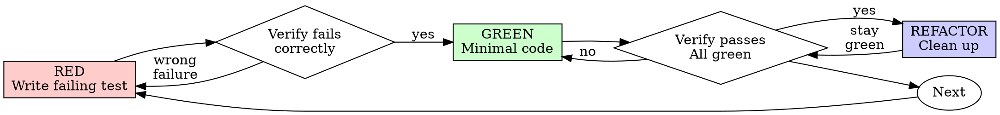

# Test-Driven Development (TDD)

## Overview

Write the test first. Watch it fail. Write minimal code to pass.

**Core principle:** If you didn't watch the test fail, you don't know if it tests the right thing.

**And the test you watch fail must prove a promise.** A test that proves no acceptance criterion, invariant or documented failure mode is not written — however fast, however green.

**Violating the letter of the rules is violating the spirit of the rules.**

## When to Use

**Always:** new features, bug fixes, refactoring, behaviour changes.

**Exceptions (ask your human partner):** throwaway prototypes, generated code, configuration files.

Thinking "skip TDD just this once"? Stop. That's rationalization.

## The Iron Law

```
NO PRODUCTION CODE WITHOUT A FAILING TEST FIRST
```

Write code before the test? Delete it. Start over.

**No exceptions:** don't keep it as "reference", don't "adapt" it while writing tests, don't look at it. Delete means delete. Implement fresh from tests.

## Tests prove promises — the rules that decide WHICH tests exist

*Measured 2026-10-05, Foundry main: **~21,500 test cases** (backend 15,624, frontend 5,669 + 227 Playwright), and **only ~18% name the AC they prove**. Every merge to main runs ~18,000 backend tests. Earlier, 2026-07-29: **7,800 tests green and four user-visible bugs found by clicking** — the tests asserted the mechanism, nobody asserted the promise. Volume bought neither speed nor safety. The CTO's ruling: tests prove that the business value is delivered and that the system works; no useless unit tests.*

**R1 — A test proves a promise, at the altitude where it is received.** The default test asserts an acceptance criterion where the user or client receives it: the route/API response, the rendered UI, the persisted state the next step reads. Never on the function that computes it. **Read [`proving-acs.md`](proving-acs.md) before writing any test** — it is the method, not an appendix.

**R2 — The title names what the test proves** (this is the **AC-ID test naming** rule, widened): an AC id (`B-AC-n`, `T-AC-n`, `UBER-AC-n`), an invariant id (`INV-x`, `I-n`), or a documented failure mode (`FM-x`, or the spec's own error id; a bug is `FM-<ticket>`). **A test that can name none is not written. If it exists, delete it.** "spec §4", "pricing:", "edge case", "coverage" are not ids.

```typescript
test('B-AC-1: a gold customer is charged 108 for a 120 CHF order, and reads 108 back', …);  // ✅ promise, route
test('FM-1: an unknown coupon is refused with 422 COUPON_UNKNOWN and nothing is stored', …); // ✅ failure mode
test('INV-1: 0 <= total <= subtotal for 500 generated orders', …);                            // ✅ invariant
test('loyaltyDiscount returns GOLD10 above threshold', …);  // ❌ names no promise; B-AC-1 already proves it
```

**R3 — Unit tests are the exception.** A test below the boundary is allowed only for:
- **(a)** a pure functional core with real branching, where proving it from the boundary would need many combinations — then **one table-driven or property test**, titled with the AC it serves, never N copies;
- **(b)** an invariant — a property test (`INV-x`);
- **(c)** a documented failure mode that is hard to reach from the boundary (`FM-x`).

**Never for:** getters, glue, wiring, mock-call counts, "it calls X", framework behaviour, re-asserting a value the code just computed, constants, source-text greps, "removed symbol stays removed", shape-only checks (`'code' in d`, `typeof f === 'function'`).

**R4 — Value-first, not a pyramid.** Few, high-signal tests. **Write the AC test at the boundary first. Descend a level only when the boundary cannot reach the case** — and then only under R3. The old pyramid ("many fast unit tests at the base", "most technical ACs are unit tests") **does not apply here**: measured 2026-10-05, it is how one pricing route arrived with 18 tests: 7 at the route, 11 unit tests naming no promise, at least 5 of them re-proving what the route tests already proved.

**Choosing where a test goes:**

1. Which promise is this — AC, invariant or failure mode? None → stop; do not write it.
2. Does an existing test already prove it? → **strengthen that test** (R6). Check first: `prism search "B-AC-1"` / `prism find-refs "<symbol>"` in indexed repos, otherwise grep.
3. Can the boundary (route, rendered UI, persisted state) reach the case? → write it there. A business AC touching the frontend needs a real-browser, front-to-back test (see `proving-acs.md`).
4. The boundary cannot reach it, or would need dozens of combinations → one table or property test under R3, titled with its id.

**R5 — The plan names the tests.** One per AC, plus the invariants and failure modes the plan lists. You may add a test beyond the plan's list only by naming what it proves (R2) in the commit message and in your report.

**R6 — Strengthen before you add.** A review finding or a surviving mutant is fixed by **strengthening an existing test's assertion first** — add the boundary value as a row of the AC's table, add the missing assertion to the AC test. A new test only when no existing test sits at the right altitude, and it still carries an R2 id.

**R7 — Deletion is part of the job.** When a higher-altitude test now covers a behaviour, delete the lower tests for it **in the same PR**. Every report lists tests **added, strengthened and deleted**; net growth is explained per PR.

**R8 — `trace-check.sh` is the mechanical half of R2.** Bundled here: `trace-check.sh <range>` lists every NEW test case (vitest/jest/node:test/Playwright `it(`/`test(`, pytest `def test_`) whose title carries no AC/INV/FM id, prints added/removed/net, and exits 1 when any is untraced. The escape is a `trace-allow: <reason>` comment on or above the test (≥10 characters; printed in the output, so review sees it). `trace-check.sh --self-test` is its positive control. Run it before reporting DONE; quote its summary line in the report.

```bash
bash skills/test-driven-development/trace-check.sh origin/main...HEAD   # in a project: copy it to scripts/
```

**Wiring it into a project's CI** (one job, on pull requests): check out with `fetch-depth: 0`, then `bash scripts/trace-check.sh "origin/${{ github.base_ref }}...HEAD"`. It needs bash, git and awk — nothing to install. Extra id shapes for one project: `TRACE_CHECK_ID_RE='SA-[0-9]+'`. It reads **new** tests only, so a legacy suite does not block day one; existing untraced tests are deleted or renamed as PRs touch them (R7).

## Senior-engineer pass — it decides which tests matter, before the first RED

Right before the first failing test, think through the senior-engineer pass: what a junior would do here, what the senior design does instead, and the invariants it protects (template: `subagent-driven-development/implementer-prompt.md`). It is a reasoning step, not a gate — nobody approves it. Its test half is this table:

| | A junior tests | A senior tests |
|---|---|---|
| **Altitude** | the function that computes the answer | the promise, where it is received — [`proving-acs.md`](proving-acs.md) |
| **Paths** | the happy path | the happy path **and** the negative path: refused, and nothing stored |
| **Edges** | — | the boundary or limit the pass named: the cap and cap + 1, the timeout |
| **Dependencies** | mocked to succeed | each dependency failing: down, slower than the timeout, malformed |

**This adds no tests beyond R5 — it picks them.** Each row maps to an R2 id: an `I` line is an `INV` test, a failure mode is an `FM` test, a limit is **a row in the AC's table** (R6), not a new test. A limit or failure mode the pass names that the plan has no id for is a plan gap — ask; never write it untraced.

## TDD Evidence (binding when working from a plan)

TDD is verified by **commit history**, not by claim: the failing-test commit precedes the passing-test commit, and `git log -p` over the PR shows it. Tests added in the same commit as the implementation, or after it, are a TDD violation. The implementer reports both SHAs.

## Red-Green-Refactor


```dot
digraph tdd_cycle {
    rankdir=LR;
    red [label="RED\nWrite failing test", shape=box, style=filled, fillcolor="#ffcccc"];
    verify_red [label="Verify fails\ncorrectly", shape=diamond];
    green [label="GREEN\nMinimal code", shape=box, style=filled, fillcolor="#ccffcc"];
    verify_green [label="Verify passes\nAll green", shape=diamond];
    refactor [label="REFACTOR\nClean up", shape=box, style=filled, fillcolor="#ccccff"];
    next [label="Next", shape=ellipse];

    red -> verify_red;
    verify_red -> green [label="yes"];
    verify_red -> red [label="wrong\nfailure"];
    green -> verify_green;
    verify_green -> refactor [label="yes"];
    verify_green -> green [label="no"];
    refactor -> verify_green [label="stay\ngreen"];
    verify_green -> next;
    next -> red;
}
```

### RED — Write Failing Test

**Before writing the body, name the break.** What production change should make this test fail — and is that change a *bug* or a *decision*? Cannot name one → the test proves nothing. "The constant changed" / "the wording changed" → a **change detector**: it fires on every intentional redesign and sleeps through real bugs. Not `expect(MAX_RETRIES).toBe(5)`, but "a failing call is retried 5 times and the 6th never happens."

**Derive the expected value independently** — a literal, or ground truth the test arranged. An expectation computed by the code under test, or by its helpers, passes no matter what that code does:

```typescript
// ❌ Mirror: the same builder computes both sides — always true
expect(buildSearchQuery({ tag: 'urgent' })).toBe(buildSearchQuery({ tag: 'urgent' }));
// ✅ Hand-derived literal
expect(buildSearchQuery({ tag: 'urgent' })).toBe('tag:"urgent"');
```

**Test your code, not the framework.** Assert the contract your code makes at its boundary. Where upstream behaviour genuinely surprised you, one narrow characterization test that names the assumption — with a `trace-allow:` reason.

One behaviour per test, Arrange-Act-Assert visible, real code rather than mocks of the system under test:

```typescript
test('B-AC-2: an expired coupon is refused with 422 COUPON_EXPIRED and nothing is stored', async () => {
  const store = createStore();
  const handle = createApp({ store, clock: () => new Date('2026-10-05T12:00:00Z') });

  const res = await handle({ method: 'POST', path: '/orders',
    body: { customerId: 'c_plain', items: [{ sku: 'A', qty: 1, unitPrice: 50 }], coupon: 'SUMMER20' } });

  assert.equal(res.status, 422);
  assert.deepEqual(res.body, { error: 'COUPON_EXPIRED' });
  assert.equal(store.count(), 0);   // the promise includes "nothing is stored"
});
```

<Bad>
```typescript
test('retry works', async () => {
  const mock = jest.fn().mockRejectedValueOnce(new Error()).mockResolvedValueOnce('ok');
  await retryOperation(mock);
  expect(mock).toHaveBeenCalledTimes(2);
});
```
Names no promise, asserts the mock's call count, not what the caller receives.
</Bad>

### Verify RED — Watch It Fail

**MANDATORY. Never skip.** Run the single test. Confirm it **fails** (does not error), with the expected message, because the feature is missing.

**Test passes immediately?** You're testing existing behaviour — or the behaviour is already proved, and this test should be a strengthened assertion on the existing one (R6).

**When the error is "the thing doesn't exist yet" — stub it, don't implement it.** A test whose import fails is an *error*, not a RED. Write a minimal stub from the declared interface whose body only announces itself:

```ts
export function resolvePhase(id: string): PhaseRef {
  throw new Error("NotImplemented: resolve-phase");   // no logic. none.
}
```

The body is the throw and nothing else — one `if` or default return and you are implementing during RED. An accepted RED is an assertion failure or this `NotImplemented`, never a load, syntax or import error. *(Adopted from Foundry's QA-lock discipline: a test that passes before the implementation exists is testing existing behaviour or nothing.)*

### GREEN — Minimal Code

The simplest code that makes the test pass. Don't add features, refactor other code, or "improve" beyond the test. YAGNI.

### Verify GREEN — Watch It Pass

**MANDATORY.** Run the test you wrote, the existing tests for the module you changed, and the project's core smoke set — **not the whole suite** (see "test tiers" below). Output pristine. **Test fails?** Fix the code, not the test. **Other tests fail?** Fix now — that is a regression.

### REFACTOR — Clean Up

After green only: remove duplication, improve names, extract pure logic out of the shell. Keep tests green. Don't add behaviour.

Then check every docstring and comment you added against [`clean-code.md`](clean-code.md): a docstring states the contract, a comment states a non-obvious *why*, and history, spec ids, line numbers and alarm markers stay out of the code. **Do not copy the comment style of the file around you** — most over-commented code got that way by imitation.

## Functional Core, Imperative Shell — design for testability

**This is the design that makes TDD viable.** If you are fighting to test something, the architecture is wrong, not the test.

```
Imperative Shell — I/O, side effects, time, randomness (routes, adapters, repositories)
      │  data in / data out        ← the AC test enters HERE, at the boundary
      ▼
Functional Core — pure input → output (rules, validation, decisions)
                                   ← unit-tested ONLY under R3: one table or property test
```

- A route `(request) → response` that delegates to a pure `priceOrder` — the route is shell, `priceOrder` is core. The AC test drives the route; a pricing table test exists only if the rules need more combinations than the route tests carry.
- **Heuristic:** if a unit test must mock more than one collaborator, the function is in the wrong layer. Push pure logic into the core; thin the shell.

## Property-based testing (invariants)

When the requirement is "X holds for all valid inputs", use a property test (fast-check / Hypothesis / jqwik), titled with its invariant id:

```typescript
test('INV-1: delegate produces exactly one Result for any valid Task', () => {
  fc.assert(fc.property(arbitraryValidTask(), async (task) =>
    (await collectResults(() => delegate(task))).length === 1), { numRuns: 100 });
});
```

When shrinking finds a counter-example, **add the shrunk input to the property's examples or to the AC test's table** — not a separate test. CI runs 100 iterations; nightly may run 10,000. A failing property blocks merge.

🔴 **Never make a property pass by narrowing its generator or loosening its bound.** A counter-example is either a bug (fix the code) or a spec conflict (take it upstream, and keep the property red or `trace-allow`-documented until it is ruled). *Measured 2026-10-05, both runs of one scenario: rounding pushed `total` above `subtotal`, violating `INV-1`. One agent asserted `total <= subtotal + 0.025`; the other generated only prices in 0.05 steps "so the rounding cannot push it over". Both went green. Without the tolerance, the first suite's own generator breaks the invariant on 157 of its 500 orders.*

## Documented failure modes

**One test per documented failure mode, at the boundary, titled with its id** (`FM-x` or the spec's error code). It asserts what the caller receives *and* what did not happen (nothing stored, nothing charged). A failure mode the spec does not document is a spec question — surface it, don't silently test a choice you made.

## Bug-fix TDD (regression)

1. Write a failing test that reproduces the bug **at the altitude where the user met it**, titled `FM-<ticket>: <what went wrong>`. If an existing test should have caught it, **strengthen that test** instead (R6).
2. Verify it fails because the bug reproduces.
3. Fix. Test passes. The test stays — it is the regression guard.

Never fix a bug without a test. See `superpowers:systematic-debugging` Phase 4.

## Test tiers and the fast inner loop

A suite that runs slowly gets run rarely. Fewer, higher-altitude tests (R1–R4) are the first fix; test tiers are the second.

**During the loop, run targeted tests — never the whole suite:** the tests you are writing, the existing tests for the module you change (pass their paths — you know which they are), and the core smoke set. Don't lean on `vitest related` in a well-connected codebase — it walks the transitive import graph (measured: a module with 2 direct importers pulled 257 files). The full suite is CI's job.

**Assign every test a tier when you create it** (the selector is project-defined — Foundry: `*.extended.test.ts` suffix, `tests/core.txt` manifest; see `backend/tests/TIERS.md`):

| Tier | What goes here | Runs |
|---|---|---|
| **core** | A *small* set of fast tests guarding "is the app fundamentally broken" | Inner loop, constantly |
| **gate** | Default. The AC, invariant and failure-mode tests | Required CI check |
| **extended** | Genuinely slow and not needed on every PR (long boot-to-e2e flows) | Non-blocking lane (main / nightly) |

Keep core small — if everything is core, nothing is.

## Test isolation and flakes (binding)

- **No shared state between tests**; random order must pass (`vitest --shuffle`, jest `--randomize`) at least nightly.
- `beforeEach` resets; `afterEach` cleans up; `beforeAll` only for read-only fixtures. No test-only methods on production classes.
- Test data comes from factories with sensible defaults and per-test overrides, and from committed fixture files — never 200-line inline JSON.
- **A flaky test is a bug.** Find the root cause (`superpowers:systematic-debugging`): order coupling, clock or randomness leakage, a real race. Cannot fix it → delete it. **Forbidden:** retries in the merge gate (`retries`, `retryTimes`, "pass on second attempt"), `sleep(N)` for races (condition-based waiting instead), committed `test.skip` / `test.only`.

## The mutation check (every test file, no tooling)

Before finishing, mentally mutate the production code — a wrong constant, the wrong branch, a missing state change, an empty return, a missing validation. **At least one test should fail for each.** A mutation nothing catches means the behaviour is unprotected — **strengthen the test that claims it** (R6): add the boundary value to the AC's table, add the missing assertion. Warning signs of a test not earning its keep: setup and assertion share the object; it fails only through a crash; it fails on every intentional change and never on a bug; it would pass if only the framework remained; its mock setup is over half the test. Tooling (Stryker, PIT, mutmut) and when to run it: [`toolchain-matrix.md`](toolchain-matrix.md).

## Coverage is an outcome, never a target

Coverage tells you what executed, not what is proved. A project's coverage **floor** is a regression gate; never write a test to raise the number. Far below the floor → you skipped an AC or a failure mode, or the code has branches no promise needs (delete them).

## Toolchain and pipeline

Which tool per language (Vitest, Playwright, pytest, fast-check, Stryker, Pact, Semgrep…), which stage runs what (inner loop → pre-commit → task gate → feature gate → nightly), contract testing patterns, and rolling lint/SAST onto an existing codebase: **[`toolchain-matrix.md`](toolchain-matrix.md)**. Look up the row; don't guess a tool.

## Common Rationalizations

| Excuse | Reality |
|--------|---------|
| "Too simple to test" | Simple code breaks. If it carries a promise, its AC test covers it. If it carries none, it needs no test. |
| "I'll test after" | Tests passing immediately prove nothing. |
| "Already manually tested" | Ad-hoc ≠ systematic. No record, can't re-run. |
| "Deleting X hours is wasteful" | Sunk cost. Keeping unverified code is debt. |
| "The route test carries the AC; the unit tests are functional-core support" | Support for what? Name the id. If B-AC-1 already proves the gold threshold, a unit test of the gold threshold proves it twice. Delete it. |
| "Each traces to a §4 rule" / "spec §4: …" in the title | A spec section is not an id. Which AC, invariant or failure mode? If the rule has no AC, that is a spec gap — take it upstream. |
| "The reviewer said coverage was thin" | Thin coverage means an AC, invariant or failure mode is unproved. Name which one, and prove it at the boundary. Count is not coverage. |
| "The mutant survived, so I added a test for it" | Which existing test claims that behaviour? Strengthen it — add the boundary row. A new test is the last resort and still needs an id. |
| "Unit tests are faster" | The fast inner loop runs one test. A suite of 18,000 fast tests on every merge is not fast. |
| "It's just one more test" | That is how 21,500 happened. Every test costs a run on every merge, forever. |
| "Keep the old unit test too, belt and braces" | Two tests for one promise is one test plus maintenance. The higher one stays; the lower one goes in this PR. |
| "The pyramid says most tests are unit tests" | Not here. Value first: boundary first, descend only when the boundary can't reach the case. |
| "Frontend unit test against a mocked backend is enough" | The bug lives at the contract. A business AC with a UI is proved in a real browser, front to back. |
| "I'll quantise the generator / add a tolerance so the property holds" | Then it proves a weaker invariant than its id claims. The counter-example is a bug or a spec question — fix the code or ask. |
| "Just retry the flaky test" | Flake = bug. Fix or delete. |

## Red Flags — STOP

- Code before test; test passes immediately; can't explain why it failed
- **A test title with no AC, INV or FM id** — "pricing:", "spec §4", "handles X", "works"
- **A unit test for a rule a boundary test already proves**
- **A fix round or a mutant answered with a NEW test while an existing test claims the behaviour**
- **A report that lists tests added but none deleted after a higher test landed**
- **Test count rising faster than the AC count**
- Mock-call counts, `typeof … === 'function'`, constant equality, source greps, "stays removed"
- `// @ts-ignore`, `retries: 3`, `sleep()` to get a test green
- "I already manually tested it" · "this is different because…" · "keep as reference"

**All of these mean: stop. Delete the test or the code, and start from the promise.**

## Verification Checklist

- [ ] Senior-engineer pass done before the first RED; its negative path, limits, dependency failures and invariants each map to a test or a table row on the list
- [ ] Every test I added or changed names an AC, INV or FM id; `trace-check.sh` summary line quoted
- [ ] Every AC the task claims has a test at promise altitude (`proving-acs.md` gate passed)
- [ ] Every unit test is an R3 exception — table or property, never N copies
- [ ] Findings and mutants fixed by strengthening first; new tests only where no test sat at the right altitude
- [ ] Lower tests made redundant by this change are deleted; report states added / strengthened / deleted / net
- [ ] Watched each test fail for the expected reason; failing-test commit precedes passing-test commit
- [ ] Every documented failure mode has one boundary test; every listed invariant a property test
- [ ] Frontend touched → real-browser front-to-back test for the business AC
- [ ] No shared state, no `skip`/`only`/`sleep`/retries, no new `@ts-ignore` / `as any` / `eslint-disable`
- [ ] Every docstring and comment I added passes the `clean-code.md` self-check: contract or why only; no PR/review history, spec ids as explanation, line numbers, 🔴/⚠️
- [ ] Output pristine

Can't check all boxes? You skipped TDD. Start over.

## When Stuck

| Problem | Solution |
|---------|----------|
| Don't know how to test | Write the AC's Then-clause as the assertion first, at the boundary. Ask your human partner. |
| The boundary needs dozens of cases | One table-driven or property test of the pure core, titled with its AC (R3a). |
| Must mock everything | Code too coupled. Apply Functional Core / Imperative Shell. |
| A rule has no AC to name | Spec gap. Ask; don't invent an id and don't write an untraced test. |
| Frontend unit passes, Playwright fails | The contract is broken; the unit test was passing against a mock. Fix the contract, then the impl — and delete the mocked test if the browser test now proves the AC. |

## Final Rule

```
Production code       → a test exists and failed first
Every test            → names its AC / INV / FM, or does not exist
B-AC                  → asserted where the user receives it, against arranged ground truth
Unit test             → only a pure core table/property, an invariant, or a hard-to-reach FM
Finding / mutant      → strengthen first; add last; delete what a higher test now covers
Every PR              → tests added / strengthened / deleted / net, from trace-check
```

No exceptions without your human partner's permission.

## Bundled references

- [`proving-acs.md`](proving-acs.md) — **read before writing any test.** Promise vs mechanism altitude, the ground-truth rule, the gate, front-to-back browser tests, and why a grep for an AC id proves nothing.
- [`testing-anti-patterns.md`](testing-anti-patterns.md) — mocks, test-only production code, shared state, retries, the untraced unit test.
- [`toolchain-matrix.md`](toolchain-matrix.md) — tools per language, pipeline stages, contract and mutation testing.
- `trace-check.sh` — R8, the mechanical R2 check.
- [`clean-code.md`](clean-code.md) — **read before REFACTOR.** Where each kind of information belongs (docstring, comment, code, git, architecture page, test), what never goes in code, and why not to match an over-commented neighbour.

## Integration with other skills

- `superpowers:writing-plans` — produces the AC list and the named test list this skill's tests trace to
- `superpowers:subagent-driven-development` / `superpowers:executing-plans` — invoke this skill per task; the per-PR report carries the trace-check line
- `superpowers:systematic-debugging` — a test failing for an unclear reason; the regression test follows Bug-fix TDD
- `superpowers:verification-before-completion` — before reporting DONE
- `superpowers:requesting-code-review` — the reviewer checks the test list against the plan and flags untraced or mechanism-only tests
